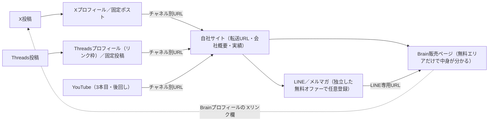

# Brainマネタイズ実践ガイド — 検証済みノウハウ × PDCA運用マニュアル

- 対象: Brain（brain-market.com）で自社コンテンツを販売する一人社長（法人）
- 調査日: 2026-09-26／次回見直し: 2026-12（四半期ごと）＋ガイドライン原本は月1回確認
- 作り方: 公式情報・法令・ブログ・note・YouTube・X・Threads・出品者の運用記録から主張約245件を収集 → 140項目に統合 → 公式情報・投稿ガイドライン（2025/12/11版）・景表法/特商法と突き合わせ → 反証レビュー → 本書
- 注意: 調査環境の制約で Brain公式サイト・note・X・YouTube・Threads の本文は直接読めず、検索要約・第三者転載・GitHub上の記録で確認した項目が多い。数値・ルールは第8章のチェックリストで実機確認してから使うこと

## 目次

- 0. このガイドの使い方
- 1. 公式ファクトシート（数字とルール）
- 2. 絶対ルール（禁止事項・法令）— 攻めの施策より先に守る
- 3. 市場理解・商品企画・価格設定
- 4. 販売ページ・ローンチ・購入後の運用
- 5. 紹介（アフィリエイト）機能の設計と活用
- 6. 集客・SNS導線（X / Threads / YouTube / リスト）
- 7. KPI・計測・PDCA運用システム
- 8. 実機で確認すべき未確認事項チェックリスト
- 付録

---

## 0. このガイドの使い方

- 目的: Brainで自社コンテンツを売る一人社長（法人）が、規約・法令違反を避けて検証済みノウハウを優先度順に実行し、自社の数字でPDCAを回すための手順書
- 前提: 2026-09-26時点。根拠の多くは二次情報で、Brainの仕様は一次資料では確認できていない。数値は第8章で実機確認する（調査方法と限界は付録A）

### 最短実行版（1ページ要約）

1. 出品前: 8-Aを問い合わせフォームで照会し回答を保存。名義・本人確認・口座・特商法表記はローンチ7日前までに（1-2）
2. 採算: 手取り＝価格×(0.88−紹介率)。課税事業者は税抜で見る。初回明細で確定（1-1）
3. 禁止の除外: 申請・改訂のたびに第2章のチェックリストを通す（2-22）
4. 商品: 本業の一次情報でテーマを選び（3-8）、作る前にX/Threadsで需要を試す（3-6）。初作は980〜1,980円で固定（3-15）
5. 公開: 告知日の2日以上前に申請し、通過確認後に告知（1-3）。告知は公開直後に集中（4-9）
6. 計測: チャネル×置き場所別のURLでクリックを測り（7-4）、紹介経由を分ける（5-3）
7. 運用: 週次約45分・月次約60分の定例（7-E）。SNS作業は週3時間以内（7章冒頭）。1回1変数、判定は7-6の最小サンプル到達後
8. お金: 出金は月1回・月末の3〜5営業日前（1-4）。明細はデータ保存、2割特例後の消費税は今期決算前に税理士と決める（1-8）
9. 期待値: 初作は「3か月で1桁の件数」が基準（3-2）。ゲートは公開後8週で見込み部数（なければ10部）、届かなければ1要素だけ直して16週で再判定（7-7）
10. 絶対NG: 金額入りの「稼げる」表現、条件付き配布（LINE登録・RT等）、外部高額商品への誘導、サクラ・見返り付きレビュー、日時も部数もない値上げ予告、PR表記なしの紹介投稿、「Brainで売る方法」系の商品化（第2章）

### 読む順番

①最短実行版 → ②第2章のチェックリスト → ③7-F 90日ロードマップ → ④必要な項目だけ第3〜6章 → ⑤第8章（出品前・初回販売後に実機で確定）。第1章は数字・法令・税務の参照用

### ラベルの定義

**判定**

| 判定 | 意味 | 扱い |
|---|---|---|
| 採用 | 根拠が十分で実行コストが低い | まずやる。KPIがあれば記録 |
| 仮説 | 効果が未確定 | PDCAで検証し、合格ラインで継続・中止 |
| 非推奨 | 違反ではないが、リスク・逆効果が効果を上回る | 原則やらない |
| 禁止 | ガイドライン・法令に違反、または違反リスクが高い | やらない（第2章） |

**信頼度**

| 信頼度 | 基準 |
|---|---|
| A | 公式・法令で裏付け、または公式と整合＋独立3ソース以上 |
| B | 公式と矛盾せず、独立2ソース以上 |
| C | 単一ソース・体験談・一般論 |
| D | 宣伝目的・根拠薄弱 |

- 信頼度は、非推奨の項目では元の主張（施策の効果）の根拠の強さ、禁止の項目では禁止判定の根拠の強さを示す。非推奨の判定根拠（法令・ガイドライン）は根拠欄の「公式確認」で示す

**公式確認（根拠欄の末尾）**

| 表記 | 意味 |
|---|---|
| 整合（一部が整合） | 公式情報・ガイドライン・法令と矛盾しない（一部のみ一致）。転載・検索要約経由を含み、原文照合済みではない |
| 公式に記載なし | 該当する公式記述なし（二次情報・実測のみ） |
| 公式ガイドライン・法令で禁止またはリスク | 公式ガイドラインか法令で禁止、またはリスクありとされる |
| 矛盾 | 公式の発言・情報と食い違う |

**出典タグと確度**

| 表記 | 意味 |
|---|---|
| (二次) | 第三者のブログ・記事・運用記録・体験談 |
| (転載) | 第三者による原文の写し（原本と未照合） |
| (要約) | 検索要約・スニペットのみ確認、本文未読 |
| (原本・未読) | 一次資料の所在。調査環境から取得できず |
| 確度 高 | 法令条文など、写しで本文を確認 |
| 確度 中 | 公式メディア・公式告知の要約、または二次情報の複数一致 |
| 確度 低 | 単一ソース、情報の食い違い、UIの観察のみ |

### 更新ルール

- 月1回と出品・再申請のたび: ガイドライン原本（Notion）の最終更新日を確認。2025/12/11から変わっていれば差分を読み、第2章と関係項目を見直す
- 第8章の項目を確認したら: 第1章の該当行の内容・確度を書き換え、確認日と場所を記録
- 四半期に1回: 本書を改訂（Brainの仕様変更、法令・税制改正、自社実測による判定更新）

## 1. 公式ファクトシート（数字とルール）

- Brainの仕様は一次資料で未確認のため確度「高」はなし（定義は第0章）。「中」「低」の行は第8章で実機確認してから前提にする。年表は付録B

### 仕様一覧（2026-09-26時点）

| 項目 | 内容 | 確度 | 出典 |
|---|---|---|---|
| 販売手数料 | 2024-08-18以降、紹介の有無に関係なく一律12%（決済手数料込みとされる）。2026年の独立した二次情報3件（crenavi・powerpost-ai・X投稿）で一致。紹介経由24%（12%＋紹介制度利用料12%）は2024-08-17以前の旧仕様。2026-07-19に販売者規約PDFで「紹介あり24%」と読んだ出品者記録が1件あるが、旧記載の残存か読み違いと判断する。計画は12%で立て、初回の紹介経由明細で実額を確認する（8-B）。24%は感度分析（価格×(0.76−紹介率)）にだけ使う | 中 | [代表X 2024-08-18](https://x.com/sako_brain/status/1825041635899535606)(要約)、[crenavi 2026](https://crenavi.com/compare/note-vs-brain)(二次)、[doboku-note運用記録](https://raw.githubusercontent.com/uruhayato373/doboku-note/main/.claude/knowledge/reference/brain-operations.md)(二次) |
| 紹介料の計算基準 | 「販売価格×紹介率」（手数料控除前）が有力（公式メディア要約で紹介率50%なら販売者38%、販売ページの還元額表示も価格×率）。「(価格−12%)×紹介率」説もあり未確定 | 中 | [公式メディア 仕組み解説](https://media.brain-market.com/brain_sikumi_kaisetu-brain/)(要約) |
| 紹介率 | 販売者が10〜50%で設定（10%刻み5段階説あり）。観察値は0/30/50%。刻み幅・0%の可否は未確認 | 中 | [公式メディア 仕組み解説](https://media.brain-market.com/brain_sikumi_kaisetu-brain/)(要約) |
| 紹介できる人 | 商品ごとに「誰でも」か「購入者のみ」を選択 | 中 | [旧運営お知らせ](https://skill-hacks.co.jp/brain-info/)(要約) |
| 紹介報酬の計上 | 購入時に即時計上、出金は30日経過後。Cookieが外れると報酬なし・補填なしとされる。Cookie期間・帰属ルールは不明 | 低 | [公式メディア 仕組み解説](https://media.brain-market.com/brain_sikumi_kaisetu-brain/)(要約)、[yuka001](https://yuka001.com/affiliate/brain/)(二次) |
| 価格 | 100〜100,000円（上限引き上げの情報なし）。記事全体の0円公開は不可とする二次情報あり（食い違い） | 中 | [公式メディア 仕組み解説](https://media.brain-market.com/brain_sikumi_kaisetu-brain/)(要約)、[irohani-pc](https://irohani-pc.com/brain-kaisetu/)(二次) |
| 無料／有料エリア | プレビューの境界線で「ここから有料記事に設定する」を押して開始位置を指定。以降は購入者のみ閲覧 | 低 | [stand-4u](https://stand-4u.com/service/brain.html)(二次) |
| クイック編集 | 価格・販売部数・紹介設定・カテゴリを再審査なしで変更可とされる。2026-07の出品者実測ではカテゴリ変更は再審査 | 低 | [hayato0606](https://www.hayato0606.com/brain-first/)(二次)、[doboku-note運用記録](https://raw.githubusercontent.com/uruhayato373/doboku-note/main/.claude/knowledge/reference/brain-operations.md)(二次) |
| 販売部数 | 「制限なし」か「〇〇部」 | 低 | [junpei-sugiyama](https://junpei-sugiyama.com/how-to-use-brain/)(二次) |
| 割引URL | 管理画面で割引額を設定して専用URLを発行し、その経由の人だけ割引。2024-11頃登場（推定）。紹介者ごとのクーポンは不可とされる | 低 | [利用者のX投稿 2024-11-11](https://x.com/ykNetDiviner/status/1855915448501706978)(二次) |
| 審査 | 全コンテンツが公開前審査、本文更新も再審査。所要は数時間〜1日の例が多く、土日祝は長め。公式の目安は未確認 | 中（審査制）／低（所要時間） | [ガイドライン](https://raw.githubusercontent.com/yasu0805-netizen/2nd-brain/main/00_%E3%82%B7%E3%82%B9%E3%83%86%E3%83%A0/01_Prompts/Brain%E6%95%99%E6%9D%90%E5%9F%B7%E7%AD%86/Brain%E3%82%AC%E3%82%A4%E3%83%89%E3%83%A9%E3%82%A4%E3%83%B3%E7%9B%A3%E6%9F%BB%E3%83%97%E3%83%AD%E3%83%B3%E3%83%97%E3%83%88_Master.md)(転載)、[体験談note](https://note.com/hirofine60296029/n/n26d761709c3d)(二次) |
| 公開日時 | 「即時公開する」か「公開日時を指定する」。2026-09時点のUIは未確認 | 低 | [applired](https://applired.net/brain-sale/)(二次) |
| 本人確認・口座 | 有料販売と売上・紹介報酬の受取に本人確認（写真付き身分証）と振込口座の登録が必要。法人名義の可否は未確認 | 中 | [旧運営お知らせ](https://skill-hacks.co.jp/brain-info/)(要約) |
| 出金 | 発生から30日経過 → 未振込合計1,000円以上で申請 → 振込手数料275円（税込）/回 → 申請の翌月末頃に振込（「約5営業日」「約4日」説もあり） | 低 | [chibahiro](https://www.chibahiro.com/24816.html)(二次)、[pronavi150](https://pronavi150.xsrv.jp/brain-basic)(二次) |
| 売上金の失効 | 発生から6か月（180日）で失効、1,000円未満の救済なしとの説（単一ソース） | 低 | [note m2web](https://note.com/m2web/n/ne6b9586ab12d)(二次) |
| 支払方法 | クレジットカード（Visa・Master・JCB・American Express）。PayPalの記述あり。コンビニ払い・銀行振込・PayPayは通常不可とされる | 低 | [brain-review](https://brain-review.net/brain-payment-method/)(二次) |
| SACOIN決済 | 2026-04に暗号資産SACOINでの決済を実装（購入画面に表示がある教材のみ）。販売者の受取方法・手数料は不明 | 中 | [代表X 2026-04-11](https://x.com/sako_brain/status/2042832710012682564)(要約) |
| レビュー | 購入者のみ、星5段階、販売ページに表示 | 中 | [公式メディア](https://media.brain-market.com/value-behavior-change-brain/)(要約) |
| 更新通知 | 更新すると購入者に通知（ベル型アイコン）。変更内容は出ない | 低 | [運営スタッフ取材記事](https://noriynt1103.substack.com/p/brainbrain)(二次) |
| ランキング | 公式メディアが月間売上TOP10を掲載（2024-11〜、2026-01掲載分まで確認）。月間・日間の売上ダッシュボードあり。算出方法は非公開 | 中 | [公式メディア ランキング](https://media.brain-market.com/category/ranking/)(要約)、[売上ダッシュボード](https://sales-board.brain-market.com/)(原本・未読) |
| 販売履歴・分析 | 流入元は出ない（出品者報告）。PV・アクセス解析の有無は未確認 | 低 | [earthkey](https://earthkey.substack.com/p/brain93)(二次) |
| カテゴリ | 15種（2026-07-23実測。2025-02の観察は11種） | 低 | [doboku-note運用記録](https://raw.githubusercontent.com/uruhayato373/doboku-note/main/.claude/knowledge/reference/brain-operations.md)(二次) |
| 投稿ガイドライン | 最終更新2025/12/11。番号付き22項目＋「その他、運営判断で禁止」。違反時はアカウント停止・売上没収・法的措置（第2章） | 中 | [ガイドライン原本](https://brain-market.notion.site/143e3ca353d780bcb242fdeb9aa04245)(原本・未読)、[ガイドライン](https://raw.githubusercontent.com/yasu0805-netizen/2nd-brain/main/00_%E3%82%B7%E3%82%B9%E3%83%86%E3%83%A0/01_Prompts/Brain%E6%95%99%E6%9D%90%E5%9F%B7%E7%AD%86/Brain%E3%82%AC%E3%82%A4%E3%83%89%E3%83%A9%E3%82%A4%E3%83%B3%E7%9B%A3%E6%9F%BB%E3%83%97%E3%83%AD%E3%83%B3%E3%83%97%E3%83%88_Master.md)(転載) |
| 自己アフィリ・複数アカウント | 自分の紹介リンクでの自己購入（別アカウント・家族・知人経由を含む）は禁止、アカウントは1人1つとされる。規約条文は未確認 | 低 | [proof0309](https://proof0309.com/brain/how-to-buy/)(二次) |
| 返金 | デジタルコンテンツのため原則返金なしとされる（教材ごとの返金保証は例外）。販売者の返金機能・紹介報酬の扱いは未確認 | 低 | [satimo 2026-04](https://satimo.org/2026/04/brain-kaikata-guide/)(二次) |
| 問い合わせ | フォームの返信は2営業日以内とされる | 低 | [問い合わせページ](https://brain-market.com/inquiry)(要約) |
| 規模 | 公式メディアの記事タイトルで「月1億円流通」。代表Xプロフィールでユーザー40万人（定義不明） | 中 | [公式メディア](https://media.brain-market.com/sakoyuki/)(要約) |
| 運営会社 | 株式会社ブレイン（東京都新宿区西新宿1丁目4-11 宝ビル8階、代表取締役 迫佑樹）。2026-07-17に株式会社ブレイン・ホールディングス設立（持株会社化とみられ、契約主体への影響は不明） | 中／低 | [公式メディア 運営者情報](https://media.brain-market.com/about-the-operator/)(要約)、[brain-holdings](https://brain-holdings.com/)(要約) |

### 手取り計算

#### 1-1. 【採用｜B】手取りは「販売価格×(0.88−紹介率)」で試算し、初回明細で確定する

- **やること**:
  - 直販＝価格×0.88、紹介経由＝価格×(0.88−紹介率)。紹介料は手数料控除前の価格に掛かる（1万円・紹介率50%→手数料1,200円／紹介者5,000円／販売者3,800円）
  - 課税事業者はさらに価格×10/110（預かり消費税）を引き、手数料・紹介料のうち仕入税額控除できる分を足し戻す（適格請求書が出るかは未確認）。例: 9,800円の直販・原則課税・控除なし→8,624円−891円＝7,733円
  - 感度分析として1行だけ添える: 旧仕様の24%が残っていた場合は価格×(0.76−紹介率)（1万円・50%なら2,600円。計画・価格決めには使わない）
  - 売上台帳の列: 日付／商品／価格／直販か紹介経由か／紹介率／手数料／紹介料／手取り／預かり消費税。振込手数料275円/回は月ごとに別計上
  - 初回の直販・紹介経由それぞれの明細で実額を照合。合わなければ規約PDFを読み、問い合わせの書面回答を保存
- **根拠**: 一律12%は代表のX告知と、2026年の独立した二次情報3件で一致。紹介料の基準は公式メディア要約・販売ページ表示が「価格×率」、一部の二次情報は「(価格−12%)×率」。[代表X 2024-08-18](https://x.com/sako_brain/status/1825041635899535606)(要約)／[公式メディア 仕組み解説](https://media.brain-market.com/brain_sikumi_kaisetu-brain/)(要約)／[crenavi 2026](https://crenavi.com/compare/note-vs-brain)(二次)／公式確認: 整合（規約PDF原文は未読）
- **PDCA**: 仮説: 台帳の式で月次の手取りを誤差なく予測できる → KPI: 実効手取り率（手取り合計÷売上合計）、紹介経由売上比率、台帳と明細の差額 → 検証: 月次で照合 → 合格: 差額0円
- **注意**: 方式A（(価格−12%)×紹介率）だと紹介率50%の手取りは44%で、方式Bの38%より約6pt高い（1,980円なら871円と752円）。楽観側で計画しない。決済手数料が12%に含まれるかは公式に明記なし。SACOIN決済分の受取方法は不明

**早見表**（方式B、税込価格ベース、1円未満四捨五入）

| 価格 | 直販（88%） | 紹介率20%（68%） | 紹介率30%（58%） | 紹介率50%（38%） | 参考: 預かり消費税相当（×10/110） |
|---|---|---|---|---|---|
| 980円 | 862円 | 666円 | 568円 | 372円 | 89円 |
| 1,980円 | 1,742円 | 1,346円 | 1,148円 | 752円 | 180円 |
| 2,980円 | 2,622円 | 2,026円 | 1,728円 | 1,132円 | 271円 |
| 4,980円 | 4,382円 | 3,386円 | 2,888円 | 1,892円 | 453円 |
| 9,800円 | 8,624円 | 6,664円 | 5,684円 | 3,724円 | 891円 |
| 19,800円 | 17,424円 | 13,464円 | 11,484円 | 7,524円 | 1,800円 |

- 課税事業者は各欄から右端の額を引く（仕入税額控除の足し戻しは別途）。振込手数料は含まない
- 紹介率50%の比較（9,800円）: 方式B 3,724円／方式A 4,312円／感度分析（24%）2,548円

### 出品・出金の基本動作

#### 1-2. 【採用｜B】出品前に名義・本人確認・口座・特商法表記をそろえる

- **やること**:
  - 登録前に問い合わせフォームで、法人名義の販売者登録・本人確認・振込口座登録の可否を確認し、回答を保存
  - できなければ、代表者個人の事業として売る（個人で申告）か、法人に帰属させる契約・経理処理にするかを出品前に税理士と決める。個人アカウントで売上を法人に帰属させるなら、代表者と法人の業務委託（または事業の帰属）契約書と、競業取引を承認した株主総会の議事録を作って保存。特商法表記の販売業者にBrain上の契約者と実際の契約主体のどちらを出すかは、税理士・運営と確認して決める
  - 本人確認は数時間〜3日の例。ローンチ7日前までに終え、「本人確認未登録」の表示が消えたか確認（プロフィール編集は未完了でも通る）
  - 特商法表記: 名称、代表者（または通信販売業務の責任者）の氏名、住所、電話番号、メールアドレス、価格、支払時期・方法、提供時期、返品特約（返金方針）、動作環境。販売業者名は実際の契約主体と一致させる
  - 購入者への表示を登録欄の実機で確認し、不足分は無料エリアか自社サイトで補う。「請求があれば遅滞なく開示」方式なら即日出せる体制を用意
- **根拠**: 販売・出金の前提条件は旧運営お知らせと二次情報が一致。表示義務は法令。[旧運営お知らせ](https://skill-hacks.co.jp/brain-info/)(要約)／[特商法施行規則](https://raw.githubusercontent.com/i4RP/japanese-law-data/27ef895d113f0bfcf5f24c67ab62498c6b9c3697/output/laws/markdown/351M50000400089_20230601_505M60000402002_%E7%89%B9%E5%AE%9A%E5%95%86%E5%8F%96%E5%BC%95%E3%81%AB%E9%96%A2%E3%81%99%E3%82%8B%E6%B3%95%E5%BE%8B%E6%96%BD%E8%A1%8C%E8%A6%8F%E5%89%87.md)(転載)／[特商法ガイド 通信販売](https://www.no-trouble.caa.go.jp/what/mailorder/rule.html)(要約)／公式確認: 整合（法人名義の可否は公式に記載なし）
- **PDCA**: 仮説: 7日前までに終えれば販売開始と初回出金が遅れない → KPI: 準備完了までの日数、表記必須項目の充足率 → 検証: 初回ローンチで各項目の完了日を記録 → 合格: 7日前に全項目完了
- **注意**: 名義がずれると、口座登録不可・売上の帰属の曖昧化（法人税・所得税・消費税に波及）・販売業者と契約主体の不一致が同時に起きる。表記の不備は特商法違反になり得る。「1人1アカウント」とされる（二次）ため、個人と法人のアカウント併用は事前に確認

#### 1-3. 【採用｜B】初回の公開申請は告知日の2日以上前に出し、通過確認後に告知する

- **やること**:
  - 告知日の3〜2日前に申請（「公開日時を指定する」が使えれば使う）。メイン画像は必須なので先に用意
  - 価格→有料ライン→公開申請は1回の操作で申請まで通す（販売設定が途中保存されない例あり）
  - 通過メール後、ログアウト状態で販売ページが開けるか確認してから告知を予約。販売開始時刻を書くのは通過後
  - 申請日時と通過日時を記録
- **根拠**: 全記事審査制はガイドラインの明文。所要時間は出品者記録（2026-07、2商品、原則24時間）と複数の体験談で一致。[ガイドライン](https://raw.githubusercontent.com/yasu0805-netizen/2nd-brain/main/00_%E3%82%B7%E3%82%B9%E3%83%86%E3%83%A0/01_Prompts/Brain%E6%95%99%E6%9D%90%E5%9F%B7%E7%AD%86/Brain%E3%82%AC%E3%82%A4%E3%83%89%E3%83%A9%E3%82%A4%E3%83%B3%E7%9B%A3%E6%9F%BB%E3%83%97%E3%83%AD%E3%83%B3%E3%83%97%E3%83%88_Master.md)(転載)／[doboku-note運用記録](https://raw.githubusercontent.com/uruhayato373/doboku-note/main/.claude/knowledge/reference/brain-operations.md)(二次)／[applired](https://applired.net/brain-sale/)(二次)／公式確認: 整合（公式の審査時間は記載なし）
- **PDCA**: 仮説: 2日前申請＋通過確認後の告知で「告知したのに買えない」事故がゼロ → KPI: 申請〜通過時間の中央値、予定告知日からの遅れ日数 → 検証: 最初の3回で記録し、自社のリードタイムを決める → 合格: 遅れ0回、審査待ち中の告知0件
- **注意**: 差し戻しで1〜2日延びる。UI・審査体制は変わり得る

#### 1-4. 【採用｜B】出金は月1回、月末の3〜5営業日前に申請し、残高を溜めない

- **やること**:
  - 自動振込はない。毎月25日前後（月末の3〜5営業日前）に出金可能額を確認し、1,000円以上なら振込申請。手数料が1回275円なので少額のうちは月1回にまとめる
  - 最初の2回で申請日・着金日を記録し、締めの仕組み（月末締め翌月末払いか数営業日か）が分かったら申請日を見直す
  - 1,000円未満のまま6か月たたないよう、失効ルールを実機・ヘルプで確認
  - 販売日（計上）と着金日のずれは売掛金で管理
- **根拠**: 30日・1,000円・275円・翌月末は二次情報3件以上で一致。振込時期は「約5営業日」「約4日」説もあり、失効6か月は単一ソース。[chibahiro](https://www.chibahiro.com/24816.html)(二次)／[pronavi150](https://pronavi150.xsrv.jp/brain-basic)(二次)／[note m2web](https://note.com/m2web/n/ne6b9586ab12d)(二次)／公式確認: 公式に記載なし
- **PDCA**: 仮説: 月1回の定例申請で失効ゼロ・手数料最小・入金時期が読める → KPI: 未申請残高の滞留日数、失効額、申請〜着金日数、振込手数料 → 検証: 最初の3か月、申請日と着金日を資金繰り表に反映 → 合格: 失効0円、着金予測のずれ±3日以内
- **注意**: 規約違反時の売上没収、退会時の残高没収（二次）があり得るので、出金可能額をBrain上に溜めない。資金繰りは最も遅い「翌月末」説で組む

#### 1-5. 【採用｜B】改訂はまとめて申請し、効果を測る改訂は1回1要素に絞る

- **やること**:
  - 本文更新は再審査。カテゴリ変更も再審査になった実測あり。カテゴリは最初に慎重に選ぶ
  - 改訂点をためて2〜4週に1回まとめて申請。ローンチ中や紹介者の告知期間中は大きく書き直さない
  - 効果を測る改訂は1回1要素。誤字・規約対応など測らない修正は同じ申請にまとめ、変更ログに「検証対象外」と書く
  - 価格・販売部数・紹介設定がクイック編集（再審査なしとされる）で変わるか実機で確認し、再審査が要る変更と分ける
  - 再審査中も旧版で販売が続くかは未確認（8-C）。告知ピークの直前は改訂を避ける。更新履歴は4-21の書式
- **根拠**: 本文更新の再審査はガイドラインの明文。カテゴリは二次情報（再審査なし）と出品者実測（再審査）が食い違い、慎重側を採用。[ガイドライン](https://raw.githubusercontent.com/yasu0805-netizen/2nd-brain/main/00_%E3%82%B7%E3%82%B9%E3%83%86%E3%83%A0/01_Prompts/Brain%E6%95%99%E6%9D%90%E5%9F%B7%E7%AD%86/Brain%E3%82%AC%E3%82%A4%E3%83%89%E3%83%A9%E3%82%A4%E3%83%B3%E7%9B%A3%E6%9F%BB%E3%83%97%E3%83%AD%E3%83%B3%E3%83%97%E3%83%88_Master.md)(転載)／[doboku-note運用記録](https://raw.githubusercontent.com/uruhayato373/doboku-note/main/.claude/knowledge/reference/brain-operations.md)(二次)／[hayato0606](https://www.hayato0606.com/brain-first/)(二次)／公式確認: 整合
- **PDCA**: 仮説: 1回1要素の改訂なら効果を切り分けられ、再審査の機会損失も抑えられる → KPI: 月の再審査回数、改訂前後の購入率（紹介経由を除く・上限値）＝直接の販売部数÷自前クリック（→7-5） → 検証: 公開14日以降に前後比較。最小サンプルは7-6 → 合格: 再審査月2回以下、全改訂で変更点と前後の購入率を記録
- **注意**: 公開直後の露出減少と少ないサンプルの影響を受ける。最小サンプル未満の比較は方向の参考

#### 1-6. 【採用｜B】配布ファイルは有料ライン以降に置き、未ログイン環境で中身を目視確認する

- 配布物は有料ラインより後に置き、未ログインのシークレットウィンドウで中身を目視確認する（URL管理・版の差し替え・流出対応 → 4-17）
- **根拠**: ガイドライン#6・#8。[ガイドライン](https://raw.githubusercontent.com/yasu0805-netizen/2nd-brain/main/00_%E3%82%B7%E3%82%B9%E3%83%86%E3%83%A0/01_Prompts/Brain%E6%95%99%E6%9D%90%E5%9F%B7%E7%AD%86/Brain%E3%82%AC%E3%82%A4%E3%83%89%E3%83%A9%E3%82%A4%E3%83%B3%E7%9B%A3%E6%9F%BB%E3%83%97%E3%83%AD%E3%83%B3%E3%83%97%E3%83%88_Master.md)(転載)

#### 1-7. 【採用｜C】メイン画像とプロフィールを出品前に整える

- **やること**:
  - メイン画像は必須。1200×630で作り、トリミング後に「適用」で確定（1280×670とする資料もあり。実機で確認）
  - 自己紹介は160字上限（超過分は切り捨て）。「誰の何を解決するか」と「確かめられる実績の範囲」を書く
  - アイコンはjpeg・pngのみ。プロフィールにXリンクを設定
- **根拠**: 出品者1人の2026-07実測。[doboku-note運用記録](https://raw.githubusercontent.com/uruhayato373/doboku-note/main/.claude/knowledge/reference/brain-operations.md)(二次)／公式確認: 公式に記載なし
- **PDCA**: 購入率では検証しない（効果が小さく他要因に埋もれる）。チェック: 設定済みか／160字以内か／Xリンクが有効か
- **注意**: UIは変わり得る

### 関連法令の要点（Brain販売者向け）

| 規制 | 要点 | Brain販売者への当てはめ | 違反時の主な措置 | 出典 |
|---|---|---|---|---|
| 景表法5条1号・2号（優良誤認・有利誤認） | 内容が実際・競合より著しく優良、価格・取引条件が著しく有利と誤認させる表示の禁止 | 「このノウハウで誰でも月100万」、根拠のない「通常価格」「特典総額◯万円相当」 | 措置命令、課徴金、直罰（100万円以下の罰金） | [景表法](https://raw.githubusercontent.com/i4RP/japanese-law-data/27ef895d113f0bfcf5f24c67ab62498c6b9c3697/output/laws/markdown/337AC0000000134_20250601_504AC0000000068_%E4%B8%8D%E5%BD%93%E6%99%AF%E5%93%81%E9%A1%9E%E5%8F%8A%E3%81%B3%E4%B8%8D%E5%BD%93%E8%A1%A8%E7%A4%BA%E9%98%B2%E6%AD%A2%E6%B3%95.md)(転載) |
| 景表法7条2項（不実証広告） | 根拠資料を求められて出せなければ優良誤認とみなす（提出期限15日は解説記事の記載） | 実績・成果・お客様の声・No.1の根拠を台帳で保存 | 優良誤認として扱う | [景表法](https://raw.githubusercontent.com/i4RP/japanese-law-data/27ef895d113f0bfcf5f24c67ab62498c6b9c3697/output/laws/markdown/337AC0000000134_20250601_504AC0000000068_%E4%B8%8D%E5%BD%93%E6%99%AF%E5%93%81%E9%A1%9E%E5%8F%8A%E3%81%B3%E4%B8%8D%E5%BD%93%E8%A1%A8%E7%A4%BA%E9%98%B2%E6%AD%A2%E6%B3%95.md)(転載) |
| 二重価格（価格表示ガイドライン） | 比較対照価格は「最近相当期間」（セール開始前8週間の過半）に販売した価格。将来価格との比較には、その価格で実際に売る根拠が要る。期間限定後も同価格で売り続けるのは不当表示のおそれ | 「19,800円→今だけ9,800円」には19,800円での販売実績が必要。値上げ予告は予告どおり実行し記録 | 有利誤認 | [価格表示ガイドライン](https://raw.githubusercontent.com/kitanotatsujin/kitanoadchecker/main/knowledge/common/%E6%B6%88%E8%B2%BB%E8%80%85%E5%BA%81_%E4%B8%8D%E5%BD%93%E3%81%AA%E4%BE%A1%E6%A0%BC%E8%A1%A8%E7%A4%BA%E3%81%AB%E3%81%A4%E3%81%84%E3%81%A6%E3%81%AE%E6%99%AF%E5%93%81%E8%A1%A8%E7%A4%BA%E6%B3%95%E3%81%AE%E8%80%83%E3%81%88%E6%96%B9_20160401.txt)(転載) |
| 打消し表示・No.1表示 | 「個人の感想です」等を付けても誤認はほぼ変わらない（約53%→約49%）。主観評価No.1は比較対象・調査対象・公平な方法・表示と結果の対応の4要件 | 「月100万達成者続出（※個人の実績）」は注記で免責されない。「ランキング1位」は集計期間・カテゴリを正確に併記（推測） | 優良誤認 | [打消し表示報告書](https://raw.githubusercontent.com/kitanotatsujin/kitanoadchecker/main/knowledge/common/%E6%B6%88%E8%B2%BB%E8%80%85%E5%BA%81_%E6%89%93%E6%B6%88%E3%81%97%E8%A1%A8%E7%A4%BA%E3%81%AB%E9%96%A2%E3%81%99%E3%82%8B%E5%AE%9F%E6%85%8B%E8%AA%BF%E6%9F%BB%E5%A0%B1%E5%91%8A%E6%9B%B8_00000000.txt)(転載)、[No.1報告書](https://raw.githubusercontent.com/kitanotatsujin/kitanoadchecker/main/knowledge/common/%E6%B6%88%E8%B2%BB%E8%80%85%E5%BA%81_No.1%20%E8%A1%A8%E7%A4%BA%E3%81%AB%E9%96%A2%E3%81%99%E3%82%8B%E5%AE%9F%E6%85%8B%E8%AA%BF%E6%9F%BB%E5%A0%B1%E5%91%8A%E6%9B%B8_20240926.txt)(転載) |
| ステマ告示（景表法5条3号、2023-10-01施行） | 事業者の表示と判別しにくい表示の禁止。規制対象は広告主（販売者）。アフィリエイターへの委託表示は事業者の表示 | 紹介者の投稿も販売者の表示になり得る。PRは親投稿の冒頭（リプ欄だけは不十分）。★5など評価を条件にした特典、好意的な声だけの抜粋、PR付き投稿の無表記転載は違反事例・類型 | 措置命令（ステマ単独は課徴金対象外。優良・有利誤認を含めば対象） | [運用基準](https://raw.githubusercontent.com/kitanotatsujin/kitanoadchecker/main/knowledge/common/%E6%B6%88%E8%B2%BB%E8%80%85%E5%BA%81_%E3%80%8C%E4%B8%80%E8%88%AC%E6%B6%88%E8%B2%BB%E8%80%85%E3%81%8C%E4%BA%8B%E6%A5%AD%E8%80%85%E3%81%AE%E8%A1%A8%E7%A4%BA%E3%81%A7%E3%81%82%E3%82%8B%E3%81%93%E3%81%A8%E3%82%92%E5%88%A4%E5%88%A5%E3%81%99%E3%82%8B%E3%81%93%E3%81%A8%E3%81%8C%E5%9B%B0%E9%9B%A3%E3%81%A7%E3%81%82%E3%82%8B%E8%A1%A8%E7%A4%BA%E3%80%8D%E3%81%AE%E9%81%8B%E7%94%A8%E5%9F%BA%E6%BA%96_20240328.txt)(転載)、[ステマQ&A](https://raw.githubusercontent.com/kitanotatsujin/kitanoadchecker/main/knowledge/common/%E6%B6%88%E8%B2%BB%E8%80%85%E5%BA%81_%E3%82%B9%E3%83%86%E3%83%AB%E3%82%B9%E3%83%9E%E3%83%BC%E3%82%B1%E3%83%86%E3%82%A3%E3%83%B3%E3%82%B0%E3%81%AB%E9%96%A2%E3%81%99%E3%82%8BQ%26A_20230328.txt)(転載)、[初の措置命令](https://www.caa.go.jp/notice/entry/038178/)(要約) |
| 景表法22条（管理措置指針、2022-06-29改正） | 広告主に表示内容の確認、アフィリエイターとのやり取りの記録保存、担当者の設置を求める | 紹介者向けルール・素材・やり取りを保存。紹介者任せの誇大表示でも広告主が表示主体とされた事例あり（課徴金1,086万円） | 広告主に措置命令・課徴金の事例 | [管理措置指針](https://www.caa.go.jp/notice/assets/representation_cms216_220629_04.pdf)(要約)、[ハハハラボ事案](https://www.caa.go.jp/notice/entry/035684/)(要約) |
| 課徴金・直罰・確約（2024-10-01施行の改正） | 課徴金は対象売上×3%（最長3年、算定額150万円未満は命じない、10年内再違反は4.5%）。確約計画の認定で措置命令・課徴金を回避 | 小規模販売者で現実的な制裁は、アカウント停止・売上没収、措置命令、直罰、特商法の指示 | — | [消費者庁 改正解説](https://www.caa.go.jp/policies/policy/representation/fair_labeling/movie_explanation/assets/representation_cms216_240917_02.pdf)(要約)、[景表法](https://raw.githubusercontent.com/i4RP/japanese-law-data/27ef895d113f0bfcf5f24c67ab62498c6b9c3697/output/laws/markdown/337AC0000000134_20250601_504AC0000000068_%E4%B8%8D%E5%BD%93%E6%99%AF%E5%93%81%E9%A1%9E%E5%8F%8A%E3%81%B3%E4%B8%8D%E5%BD%93%E8%A1%A8%E7%A4%BA%E9%98%B2%E6%AD%A2%E6%B3%95.md)(転載) |
| 総付景品 | 上限は取引価額1,000円以上なら20%、未満なら200円 | レビュー投稿など追加条件付きの特典は景品類として上限を確認 | — | [消費者庁 総付景品](https://www.caa.go.jp/policies/policy/representation/fair_labeling/faq/premium/not_lotteries)(要約) |
| 特商法11条・施行規則23条（表示義務） | 価格、支払時期・方法、提供時期、申込期間、撤回・解除（返品特約）、名称・住所・電話・代表者名など。請求時提供の表示で一部省略可（返品特約は不可） | 法人名・代表者（または責任者）名・本店住所・電話を表示。期間限定・部数限定は申込期間として明記 | — | [特商法](https://raw.githubusercontent.com/i4RP/japanese-law-data/27ef895d113f0bfcf5f24c67ab62498c6b9c3697/output/laws/markdown/351AC0000000057_20250601_504AC0000000068_%E7%89%B9%E5%AE%9A%E5%95%86%E5%8F%96%E5%BC%95%E3%81%AB%E9%96%A2%E3%81%99%E3%82%8B%E6%B3%95%E5%BE%8B.md)(転載)、[施行規則](https://raw.githubusercontent.com/i4RP/japanese-law-data/27ef895d113f0bfcf5f24c67ab62498c6b9c3697/output/laws/markdown/351M50000400089_20230601_505M60000402002_%E7%89%B9%E5%AE%9A%E5%95%86%E5%8F%96%E5%BC%95%E3%81%AB%E9%96%A2%E3%81%99%E3%82%8B%E6%B3%95%E5%BE%8B%E6%96%BD%E8%A1%8C%E8%A6%8F%E5%89%87.md)(転載) |
| 特商法12条（誇大広告） | 著しく事実に相違する表示、著しく優良・有利と誤認させる表示の禁止 | 「稼げる」系は景表法とは別に特商法でも規制 | 100万円以下の罰金、指示、業務停止（最長2年） | [特商法](https://raw.githubusercontent.com/i4RP/japanese-law-data/27ef895d113f0bfcf5f24c67ab62498c6b9c3697/output/laws/markdown/351AC0000000057_20250601_504AC0000000068_%E7%89%B9%E5%AE%9A%E5%95%86%E5%8F%96%E5%BC%95%E3%81%AB%E9%96%A2%E3%81%99%E3%82%8B%E6%B3%95%E5%BE%8B.md)(転載) |
| 特商法12条の6（最終確認画面、2022-06-01施行） | 分量・価格・支払・提供時期・申込期間・撤回解除の表示義務、誤認表示の禁止 | 画面はBrainが作るが、無料エリアの価格・提供方法・返金条件・申込期間と矛盾させない（テスト購入で確認） | 3年以下の拘禁刑または300万円以下の罰金、法人1億円以下。消費者に取消権 | [特商法](https://raw.githubusercontent.com/i4RP/japanese-law-data/27ef895d113f0bfcf5f24c67ab62498c6b9c3697/output/laws/markdown/351AC0000000057_20250601_504AC0000000068_%E7%89%B9%E5%AE%9A%E5%95%86%E5%8F%96%E5%BC%95%E3%81%AB%E9%96%A2%E3%81%99%E3%82%8B%E6%B3%95%E5%BE%8B.md)(転載) |
| 特商法15条の3（法定返品権） | 対象は商品・特定権利で、役務には適用されない（特商法ガイドの説明、本文未読） | 返金方針を無料エリアと最終確認画面の両方に明記 | — | [特商法](https://raw.githubusercontent.com/i4RP/japanese-law-data/27ef895d113f0bfcf5f24c67ab62498c6b9c3697/output/laws/markdown/351AC0000000057_20250601_504AC0000000068_%E7%89%B9%E5%AE%9A%E5%95%86%E5%8F%96%E5%BC%95%E3%81%AB%E9%96%A2%E3%81%99%E3%82%8B%E6%B3%95%E5%BE%8B.md)(転載)、[特商法ガイド](https://www.no-trouble.caa.go.jp/what/mailorder/)(要約) |
| 特商法12条の3・特定電子メール法 | 同意のない広告メールの禁止。送信者表示・配信停止方法・同意記録の保存 | メルマガは同意を取得・記録。LINEへの適用は未確認のため同じ基準で運用 | 100万円以下の罰金（特商法） | [特商法](https://raw.githubusercontent.com/i4RP/japanese-law-data/27ef895d113f0bfcf5f24c67ab62498c6b9c3697/output/laws/markdown/351AC0000000057_20250601_504AC0000000068_%E7%89%B9%E5%AE%9A%E5%95%86%E5%8F%96%E5%BC%95%E3%81%AB%E9%96%A2%E3%81%99%E3%82%8B%E6%B3%95%E5%BE%8B.md)(転載)、[総務省パンフレット](https://www.soumu.go.jp/main_sosiki/joho_tsusin/d_syohi/pdf/m_mail_pamphlet.pdf)(要約) |
| 特商法（電話勧誘販売・業務提供誘引販売51条） | 電話・Web会議での勧誘は規制対象。「仕事を提供するので稼げる」と誘引して負担を負わせる取引はクーリングオフ20日 | 低単価のBrain商品→個別相談→高額バックエンド、「買えば紹介で稼げる」設計は該当リスク | 指示など（2025-12-24にSNS・AIスクール事業者へ指示） | [特商法](https://raw.githubusercontent.com/i4RP/japanese-law-data/27ef895d113f0bfcf5f24c67ab62498c6b9c3697/output/laws/markdown/351AC0000000057_20250601_504AC0000000068_%E7%89%B9%E5%AE%9A%E5%95%86%E5%8F%96%E5%BC%95%E3%81%AB%E9%96%A2%E3%81%99%E3%82%8B%E6%B3%95%E5%BE%8B.md)(転載)、[指示事案](https://www.caa.go.jp/notice/entry/044576/)(要約) |
| 金商法（投資助言業） | 不特定多数向けの書籍型は除外。個別・相対性の高い情報や会員制の提供は登録が必要になり得る | 個別銘柄推奨、個別質問付きのサロン・サポートは専門家に確認 | 無登録営業は刑事罰 | [金融庁 監督指針](https://www.fsa.go.jp/common/law/guide/kinyushohin/07.html)(要約) |
| 著作権法 | 引用は主従関係・明瞭区別・出所明示。翻案権（27・28条）。侵害は10年以下の拘禁刑または1,000万円以下の罰金、法人3億円以下。有償著作物の丸写しは非親告罪になり得る | 他人の書籍・講座の詳細な要約、有料記事の転載、既存作品を入力したAI生成を避ける | 同左 | [著作権法](https://raw.githubusercontent.com/i4RP/japanese-law-data/27ef895d113f0bfcf5f24c67ab62498c6b9c3697/output/laws/markdown/345AC0000000048_20251001_507AC0000000027_%E8%91%97%E4%BD%9C%E6%A8%A9%E6%B3%95.md)(転載)、[文化庁 AIと著作権](https://www.bunka.go.jp/seisaku/chosakuken/aiandcopyright.html)(要約) |
| 個人情報保護法 | 件数に関係なく全事業者が対象。利用目的の特定・公表、安全管理、漏えい時の報告、第三者提供は原則同意 | LINE・メルマガで購入者をリスト化するなら、プライバシーポリシーで利用目的を公表 | 命令違反等で法人1億円以下の罰金 | [個人情報保護法](https://raw.githubusercontent.com/i4RP/japanese-law-data/27ef895d113f0bfcf5f24c67ab62498c6b9c3697/output/laws/markdown/415AC0000000057_20250601_504AC0000000068_%E5%80%8B%E4%BA%BA%E6%83%85%E5%A0%B1%E3%81%AE%E4%BF%9D%E8%AD%B7%E3%81%AB%E9%96%A2%E3%81%99%E3%82%8B%E6%B3%95%E5%BE%8B.md)(転載) |

**一人社長（法人）として負う事業者責任**

- 自社商品の販売者は景表法上の事業者（広告主）、特商法上の販売業者・役務提供事業者。表示の責任はBrainではなく販売者
- 紹介者に素材・テンプレを渡すほど、その投稿は販売者の表示になる。記録保存は管理措置として必須
- 法人の罰金上限は最終確認画面違反1億円、著作権侵害3億円、個人情報保護法1億円。両罰規定により、法人と並んで代表者本人も行為者として処罰され得る（例: 最終確認画面違反は3年以下の拘禁刑または300万円以下の罰金、著作権侵害は10年以下の拘禁刑または1,000万円以下の罰金）。特商法の業務停止を受けると、代表者個人にも同じ業務の禁止命令が出得る
- 行政の注視領域: 「アフィリエイトで簡単に稼げる」型勧誘の公表（2025-06-26）、情報商材を入口にした高額サポート契約の相談（国民生活センター）、SNSチャット勧誘の規律強化の検討（2026年）

### 税務・インボイス（公式情報で確認できた範囲）

#### 1-8. 【採用｜A】法人売上として記帳し、2割特例後の消費税を今期決算前に税理士と決める

- **やること**:
  - 毎月、売上・出金明細をCSVかPDFのデータのまま保存（電子取引データの保存義務、2024-01-01以降。ファイル名に日付・取引先・金額）。2024-01-01以後の検索要件は、基準期間の売上高5,000万円以下で税務調査時のダウンロードの求めに応じられれば不要。売上高にかかわらず、日付・取引先ごとに整理した出力書面を提示・提出でき、ダウンロードの求めにも応じられれば同様
  - 販売日（計上）と着金のずれは売掛金で管理
  - 免税事業者かを確認: 基準期間のない新設法人で資本金1,000万円未満なら原則免税。ただし適格請求書発行事業者、特定期間の課税売上1,000万円超（給与等の支払額でも判定可）、課税事業者選択届出の場合は納税義務あり。資本金1,000万円以上の新設法人は免除なし
  - 課税事業者なら、売上（税込）の10/110を預かり消費税として台帳で分け、手数料・紹介料・ツール費のうち仕入税額控除できる分を確かめ、納税資金を毎月積み立てる
  - 2割特例は「2026-09-30を含む課税期間」で終了。最終期は決算月で違う（3月決算法人は2027年3月期まで。「2026年3月期まで」とする資料は誤り）。基準期間の課税売上1,000万円超、資本金1,000万円以上の新設法人などは対象外
  - 次期を原則課税か簡易課税か（2割特例の翌期から簡易課税に移る場合の届出期限の特例を含む）、インボイス登録を続けるかを今期決算前に税理士と決める。3割特例（令和8年度改正）は法人は対象外
  - 免税事業者からの仕入れの経過措置: 2026-10から70%、2028-10から50%、2030-10〜2031-09末は30%。免税事業者ごとの年間上限は1億円
  - 購入者が主に個人ならインボイスの要否の影響は小さく、事業者向け教材では買い手の仕入税額控除に影響（推測）
- **根拠**: [国税庁 2割特例](https://www.nta.go.jp/taxes/shiraberu/zeimokubetsu/shohi/keigenzeiritsu/invoice_2tokurei.htm)(要約)／[国税庁 インボイス見直し](https://www.nta.go.jp/taxes/shiraberu/zeimokubetsu/shohi/keigenzeiritsu/invoice-review/index.htm)(要約)／[国税庁 No.6503](https://www.nta.go.jp/taxes/shiraberu/taxanswer/shohi/6503.htm)(要約)／[国税庁 電子帳簿保存法](https://www.nta.go.jp/law/joho-zeikaishaku/sonota/jirei/tokusetsu/index.htm)(要約)／[税理士解説（2割特例の最終期）](https://accomp.jp/column/shouhizei-2waritokurei-itsumade)(二次)／公式確認: 整合（Brainが手数料の適格請求書を出すか、登録番号の表示欄があるかは公式に記載なし）
- **PDCA**: 仮説: 出金申請と明細保存を1つの月次定例にすれば決算時の突合せがほぼ不要 → KPI: 明細保存の月次完了率、台帳とBrain明細の差額 → 検証: 3か月、差異と作業時間を記録 → 合格: 差額0円、月次作業30分以内
- **注意**: 個別判断は税理士に確認（簡易課税の届出期限の特例は税理士解説による）。代表者個人の名義で売る場合は、所得区分（帳簿保存があれば事業所得と扱われやすく、なければ収入300万円以下は業務に係る雑所得）と確定申告要件（給与所得者は給与以外の所得20万円超）が別にかかる（国税庁 通達35-2・タックスアンサーNo.1900）

### この章で特に注意する禁止事項

- 値上げ予告は日時か部数を明記して必ず実行（#13 → 2-7）
- 販売実績のない通常価格との比較、クーポン前提の高額設定、特定ユーザーへの極端な価格変更（#6・#20 → 2-8）
- 申請・パスワードが要るリンク、非公開の動画、条件付き配布（#6・#8 → 2-3）
- 免責事項と有料部分の内容説明は無料エリアに（#7・#22 → 2-6）
- 自己アフィリ・複数アカウント・同じ内容の複数公開（#19・#20 → 2-14・2-15）

## 2. 絶対ルール（禁止事項・法令）— 攻めの施策より先に守る

**前提**
- Brainは全記事が審査制。公開後の更新も再審査。
- 違反時はアカウント停止・削除、売上金没収、法的措置。明記外も運営判断で禁止。悪質でなければ指摘の改善で再公開。
- 判定基準は投稿ガイドライン2025/12/11版（番号付き22項目＋「その他、Brain運営にて禁止と判断したもの」）。第三者の[転載](https://raw.githubusercontent.com/yasu0805-netizen/2nd-brain/main/00_%E3%82%B7%E3%82%B9%E3%83%86%E3%83%A0/01_Prompts/Brain%E6%95%99%E6%9D%90%E5%9F%B7%E7%AD%86/Brain%E3%82%AC%E3%82%A4%E3%83%89%E3%83%A9%E3%82%A4%E3%83%B3%E7%9B%A3%E6%9F%BB%E3%83%97%E3%83%AD%E3%83%B3%E3%83%97%E3%83%88_Master.md)で全文確認。本章の「投稿ガイドライン#N」のリンク先もこの写しで、[原本](https://brain-market.notion.site/143e3ca353d780bcb242fdeb9aa04245)(原本・未読)とは未照合。二次情報の「23項目」は「その他」を数えたものとみられる。
- Brain公式ヘルプと販売者用利用規約PDF（brain_terms_of_seller.pdf）は原文未読。本章の「公式確認」は「転載・二次情報で確認」の意味。
- 法令は景表法（優良誤認・有利誤認・不実証広告・ステマ告示）、特商法（表示義務・誇大広告・最終確認画面）、著作権法、個人情報保護法が中心。自社商品を売る販売者は広告主で、紹介者に書かせた投稿にも責任を負い得る。
- 出典タグ（(転載)・(要約)・(二次)・(原本・未読)）の定義は第0章。

### 公開前コンプライアンス・チェックリスト

申請・改訂申請のたびに全項目を○×で記録（運用は2-22）。×が1つでもあれば申請しない。#はガイドラインの項目番号。

**申請前（アカウント・企画）**
- [ ] ガイドライン原本・販売者用利用規約PDF・利用規約の最終更新日を確認し、手数料・売上没収・返金・自己アフィリ・退会時残高の条項を読んだ
- [ ] テーマが禁止ジャンル外（#11 アダルト／#14 ギャンブル・公営競技／#16 不正転売／#17 ゲーム攻略・チート／#15 Brain・Tipsアフィリ攻略／#18 他人の有料記事の補足）
- [ ] 同じ内容の記事なし（タイトル違い・別アカウントも不可 #19）
- [ ] 中身は自作。転載・リライト・寄せ集め（#2）、代行業者への丸投げ（#21）なし
- [ ] 投資・健康・美容・資格系は業法（金商法・薬機法・健康増進法・士業法）を専門家に確認済み
- [ ] 本人確認・振込口座・販売者情報を登録済み（法人名義の可否は運営に確認済み）
- [ ] ○×で決められない事項は運営に照会し、回答を保存済み（2-23）

**タイトル・サムネ（画像内の文字を含む）**
- [ ] 金額入りの収益表現なし（「[金額]が稼げる」「[金額]を稼ぐ方法」型は全てNG #4）。稼ぐ系テーマでは著者本人の実績額も入れない（自社ルール。2-1）
- [ ] 誇大・断定・最上級なし（誰でも儲かる／再現性100%／世界一／唯一／不労所得／人生が変わる／知らないと損 等 #4）
- [ ] 煽り語なし（闇◯◯／裏◯◯／洗脳／非合法／悪魔的◯◯／チート／非常識な◯◯／グレーorブラック #1）
- [ ] 「◯部突破」「ランキング1位」は実数・集計期間・カテゴリ・出典を併記し、根拠を保存済み（景表法7条2項・No.1表示）

**無料エリア**
- [ ] 目次・分量・提供形式・対象者と対象外・収録物一覧（特典を含む）で有料部分の中身がわかる（#7）
- [ ] 免責事項（成果を保証しない、返金の扱い、動作環境、更新方針）を無料エリアに置いた（#22）
- [ ] 返金の扱いが最終確認画面の表示と一致（特商法11条・12条の6）
- [ ] 著者の実績に「著者本人の結果（期間・条件）で、同じ成果を保証するものではありません」を添え、見出し・太字・大きな文字で強調しない。根拠は台帳に保存（2-24）
- [ ] 実績画像は加工していない原本（日付・期間入り）（#1）
- [ ] 「お客様の声」は全件か無作為。選んだならその旨を書き、紹介者・モニターの声は区別して注記（ステマQ&A Q10・Q16）
- [ ] 「通常価格◯円→今だけ◯円」は8週間ルールを満たす（景表法・有利誤認）
- [ ] 値上げ予告は明確な日時か部数で、全段階と最終価格を載せた（#13）

**記事内の導線（無料・有料エリアとも）**
- [ ] 閲覧・特典の条件としての登録、販売目的の自社サイト・外部アフィリリンク・同じ内容を買える他PFへのリンクがない（#6・#8・#10・#12）
- [ ] 条件なしのLINE・メルマガ案内、自社サービスへの言及、自分の上位記事へのリンクを置くなら、運営の可の回答を保存済み（2-23）。回答がなければ置かない。可でも末尾に参考として1行まで（2-4・2-5）

**有料エリア**
- [ ] 完成品で公開。続きの後日追記・外部チャットでの配信・物品送付なし（#5・#8）
- [ ] 無料エリアと同じ内容、お礼の一言だけ、価格に比べ明らかに薄い、のいずれでもない（#5）
- [ ] 配布物は有料ラインより後。非公開動画・パスワード・アクセス申請なし。未ログインのシークレットウィンドウで中身を目視確認（#6・#8。4-17）
- [ ] 引用は主従・明瞭区別・出所明示（著作権法32条）。個人が特定できる第三者の画像、会員制サービス内の画面なし（#2・#3）
- [ ] コンサル等を付けるなら、購入者と連絡がつく体制がある（#6）

**特典**
- [ ] 購入者全員に、有料エリア内で無条件に提供（#8）
- [ ] RT・フォロー・LINE登録・購入スクショ・レビュー投稿を受け取りの条件にしていない（#8）
- [ ] 告知した特典は販売開始時点で全部そろっている（#6）
- [ ] 特典は「収録物（セット内容）」として目次・収録物一覧に書き、「無料プレゼント」「◯円相当」の換算額は出さない。どうしても出すなら実際の販売価格の根拠を残し、総付景品の上限（1,000円以上は価格の20%、未満は200円）以内か確認（景表法5条・総付景品。2-2）
- [ ] 特典にBrain・Tipsのアフィリ攻略や紹介者向けの稼ぎ方を入れていない（#15）

**SNS告知**
- [ ] NGワード辞書で絶対NG 0件、要確認語は人が文脈で判断済み（次の対照表）
- [ ] 収益画像と商品リンクを同じ投稿に並べていない
- [ ] 投稿本文に自社商品とわかる一言がある（プロフィールだけに頼らない。ステマQ&A Q12）
- [ ] 裏アカウント・別名義での推奨投稿なし（ステマ告示）
- [ ] Brain商品・特典をリプ・RT・フォローの条件で配っていない（#8）
- [ ] LINE・メルマガの登録導線はBrainの外。プライバシーポリシーで利用目的を公表し、メール広告は受信同意の記録を保存（個人情報保護法・特商法12条の3・特定電子メール法）

**紹介者向け文面**
- [ ] 投稿本文の冒頭に「PR」「広告」または「紹介報酬を受け取っています」と書くよう依頼。リプ欄だけ・ハッシュタグへの埋没・末尾に小さく、は不可と明記（5-6）
- [ ] 金額入りの収益表現と「紹介すれば元が取れる」「実質無料」の禁止を明記（#4・#15）
- [ ] 紹介の攻略（紹介率の決め方・紹介者の集め方）を書いていない（#15）
- [ ] 配ったテンプレ・依頼文・DMのやり取りを保存（景表法22条の管理措置）
- [ ] 紹介者・モニターの投稿の転載先にも注記
- [ ] 自分・家族・知人が自分の紹介リンクで買わない

**販売設定**
- [ ] クーポン割引を前提にした高額な定価にしていない（#6）
- [ ] 特定のユーザー向けの極端な割引URLなし（#20）

### NG表現 → 言い換え対照表

- 判定の単位は語ではなく「成果の約束・断定・最上級」かどうか（#4）。「保証」「1位」を一律に弾くと、#22の免責文や根拠付きの順位まで消え、免責を書かない方向に流れる。
- 辞書はタイトル・本文・AI生成文・紹介者テンプレ・自動投稿に共通で使う。「金額＋稼げる／稼ぐ方法／達成」は語の種類を問わず正規表現で拾う。
- 「※個人の実績です」「※保証しません」の注記では違反リスクは消えない（打消し表示報告書）。転載版ガイドラインの書き換え例「初月で30万円の収益を上げた事例があります（※収益を保証するものではありません）」は転載者の例示で公式の安全基準ではないため、使わない。

**絶対NG（検出したら申請しない）**

| NG表現（例） | 根拠 | 言い換え・代わりにやること |
|---|---|---|
| 金額＋稼げる／稼ぐ方法／達成（「1日15分で月10万円」「始めて1ヶ月で50万円稼ぐ方法」「完全自動で月100万」）。伏せ字・カタカナ化（「カセグ」）も同じ | #4、景表法5条1号、特商法12条 | 中身の数字で示す：「全17章・約5万字」「テンプレ30種」「◯◯の手順を画面付きで解説」 |
| 誰でも稼げる／誰でも儲かる／低学歴でもできる／初心者でも簡単に稼げる | #4、消費者庁の公表事例 | 対象を絞る：「向いている人／向いていない人」を無料エリアに明記。「一人社長向け 見積・請求テンプレ12種と記入手順」 |
| 確実に・必ず・絶対・100%＋成果（「確実に稼げる」「100%成功する」「絶対に痩せる」「再現性100%」） | #4 | 一人称の事実：「私の場合は◯◯の条件で◯◯をした」。期間・前提・うまくいかなかった点も添える |
| 不労所得／脳死でできる／ローリスクでできる／短時間で簡単に稼げる | #4、二次情報のNG例 | 作業と時間を成果から切り離す：「読むのにかかる時間の目安：約◯分」「筆者の作業時間は1回約◯分（前提：◯◯）」 |
| 根拠のない世界一・世界初・日本初・唯一・◯◯攻略の全て・全てが身につく・99%の人が知らない | #4、二次情報のNG例 | 範囲を限定した具体的な仕様で書く |
| 人生が変わる／知らないと損をする／◯◯を食べるだけで痩せる／◯◯（病気）が治る | #4 | 得られる成果物と手順で書く。健康系は業法を専門家に確認（2-18） |
| 闇◯◯・裏◯◯・洗脳・非合法・悪魔的◯◯・チート・非常識な◯◯・グレーorブラック | #1 | 「現場で使っている手順」「実務版」「手順を全部公開」 |
| 「購入して紹介すれば元が取れる」「実質無料」「購入者限定で50%還元＝実質半額」「紹介だけで月◯万円」 | #4・#15、景表法 | 紹介機能はBrainが自動表示する事実（紹介で◯%還元）にとどめる（2-13） |
| 「本来は5万円」「いずれ値上げ」「今が最安値」「更新に伴い随時値上げ」「大幅値上げの前に」 | #13、景表法（有利誤認） | 「9/30 23:59に9,800円から12,800円へ」「10部売れるごとに＋2,000円、最終19,800円」 |
| 販売実績のない「通常価格◯円→今だけ◯円」「定価10万円→今だけ9,800円」 | #6、価格表示ガイドライン | 8週間の過半（通算2週間以上）実際に売った価格だけを比較に使う。「今だけ」は終了日時を明記して実行 |
| 「続きはLINEで」「LINE登録で特典」「RT・フォローした人に配布」「レビューを書いた人だけにDMで特典」 | #6・#8・#10・#12 | 「特典は購入者全員に、有料エリアの最後で配布」。更新のお知らせはBrainの更新通知と記事冒頭の更新履歴で |
| 「★5レビューで特典」「★5でお願いします」など評価を指定した依頼 | ステマ告示（Q&A Q6後段）、#20 | 全員に同じ文面で「率直な感想をお願いします（低い評価も改善に使います）」。特典と結びつけない |
| 金額の見出し＋「※個人の実績です」、「初月で30万円の事例あり（※保証しません）」 | 打消し表示報告書、#4 | 金額を見出しにしない。著者の実績は本文で期間・条件を添え、強調しない（根拠は台帳） |

**要確認（人が文脈で判断）**

| 語 | OKになり得る使い方 | NGになる使い方 |
|---|---|---|
| 保証 | 免責文「成果を保証するものではありません」（#22）。返金手段と条件を確かめたうえでの条件付き返金保証 | 成果の保証。「儲けが出なければ返金保証」（消費者庁の公表事例の勧誘文言）。判定できない条件の返金保証 |
| No.1・1位 | 実数・集計期間・カテゴリ・出典を併記した順位 | 根拠のない1位。利用したことのない人へのイメージ調査による「満足度No.1」 |
| 必ず・絶対・誰でも・100%（単独） | 成果と結びつかない操作・手順の説明 | 成果・効果と結びつく（絶対NGへ） |
| 簡単 | 操作・手順の説明に限る | 「簡単に稼げる」「短時間で簡単に」 |
| 放置 | 成果と無関係な文脈 | 「放置で稼げる」「完全自動で月100万」 |
| 月収・売上額 | 著者本人の結果を本文で、期間・条件と「同じ成果を保証しない」旨を添え、強調せずに書く（根拠は台帳） | 稼ぐ系テーマのタイトル・サムネ・SNS告知に入れる。見出し・太字で強調する。収益画像と商品リンクを並べる |
| 稼（稼ぐ・稼げる） | 否定・免責の文脈 | 金額・「誰でも」・「簡単」と結びつく |
| 作業時間（「1日15分」等） | 読む・作業にかかる時間の目安として、成果と切り離す | 成果・金額と結びつける（#4の例文そのもの） |
| 期間限定・今だけ | 終了日時を明記し、その日時で実際に終える | 期間後も同じ価格で売り続ける |
| ◯円相当 | 原則使わない（特典は収録物として書く）。使うなら実際の販売価格の根拠を台帳に保存し、総付景品の上限内 | 根拠のない換算額。上限を超える換算額 |
| ◯部突破 | 実数で書き、到達時点のスクショを保存 | 関係者の購入で積み上げた部数（#20） |

### 禁止・非推奨：表現・表示

#### 2-1. 【禁止｜A】金額入りの稼げる表現・誇大表現・煽り語を、どの文面にも使わない
- **やらないこと**: タイトル・サムネ・無料エリア・SNS告知・紹介者テンプレでの「絶対NG」の表現。収益画像と商品リンクを同じ投稿に並べる（語句がなくても「買えば同じだけ稼げる」と受け取られる）。稼ぐ系テーマでは著者の金額実績もタイトル・サムネ・告知に入れない（安全側の自社ルール）。それ以外は、確かめられる経歴の事実なら可（例:「従業員10名の会社を経営」）。ただし成果を約束する表現にしない。
- **代わりにやること**:
  - 中身で訴求：章数・文字数・テンプレ数、画面付きの手順、向いている人／向いていない人
  - 作業時間は「読む・作業にかかる時間の目安」として成果と切り離す
  - 著者の実績は無料エリアの本文に「著者本人の結果（期間・条件）で、同じ成果を保証するものではありません」と添え、見出し・太字・大きな文字で強調しない。根拠資料の保存は台帳側（2-24）
  - 無料エリアに「成果を保証するものではありません」（#22）
  - NGワード辞書（上の2段階）を全文面に機械的に当て、人が確認
- **根拠**: #4は「[金額]が稼げる」「[金額]を稼ぐ方法」的な表現を全てNGとし、「月に5万円稼げる」も読者の100%が実現できない限りNG、決済代行会社が最も厳しく見ている点と明記。#1は煽り語を列挙。景表法5条1号・7条2項、特商法12条。[投稿ガイドライン#4・#1](https://raw.githubusercontent.com/yasu0805-netizen/2nd-brain/main/00_システム/01_Prompts/Brain教材執筆/Brainガイドライン監査プロンプト_Master.md)(転載)、[打消し表示報告書](https://raw.githubusercontent.com/kitanotatsujin/kitanoadchecker/main/knowledge/common/%E6%B6%88%E8%B2%BB%E8%80%85%E5%BA%81_%E6%89%93%E6%B6%88%E3%81%97%E8%A1%A8%E7%A4%BA%E3%81%AB%E9%96%A2%E3%81%99%E3%82%8B%E5%AE%9F%E6%85%8B%E8%AA%BF%E6%9F%BB%E5%A0%B1%E5%91%8A%E6%9B%B8_00000000.txt)(転載)（体験談を見て約53%が「大多数の人に効果がある」と認識し、注記を見た後も約49%が維持）、[消費者庁の公表事例（誰でも1日数万円）](https://www.caa.go.jp/notice/entry/028350/)(要約)／公式確認: 公式ガイドライン・法令で禁止
- **確認**: 申請する全文面で絶対NG 0件、#4での差し戻し0件。
- **注意**:
  - 一人社長の規模で現実的な制裁は、アカウント停止・売上没収、措置命令、直罰（景表法48条・特商法72条、いずれも100万円以下の罰金）。課徴金（売上の3%）は算定額150万円以上（対象売上おおむね5,000万円以上）の場合だけ。
  - 売れている既存ページや公式メディアの記事見出しの金額表現は手本にしない（改定前の型か、編集記事の見出し）。

#### 2-2. 【禁止｜A】虚偽・加工した実績や、根拠のない「◯部突破」「No.1」「◯円相当」を出さない
- **やらないこと**: 虚偽・加工した売上・販売数・明細の画像、虚偽の経歴や肩書き、ビフォー画像の加工（#1）。根拠のない「◯部突破」「ランキング1位」「No.1」「特典総額◯円相当」。
- **代わりにやること**:
  - 実績は加工していない原本スクショ（日付・期間・範囲入り）を使い、元データを保存
  - 経歴・肩書きは第三者が確かめられる範囲に限る
  - 「◯部突破」は実数で、到達時点のスクショを保存。「Brainランキング1位」は集計期間・カテゴリ・出典（公式メディアの月間ランキングなど）を併記
  - 特典は収録物（セット内容）として目次・収録物一覧に書き、「無料プレゼント」「◯円相当」の換算額は出さない。購入者全員へのおまけも総付景品とみなされ得る。換算額を出すなら実際の販売価格の根拠を残し、上限（取引価額1,000円以上は20%、未満は200円。1,980円なら396円）以内か確認
  - 表示ごとの根拠は台帳で管理（2-24）。根拠を出せない表示は見つけた時点で削除
- **根拠**: #1。景表法7条2項（根拠資料を求められて出せなければ優良誤認とみなす）。No.1表示は比較対象・調査対象・調査方法・表示と結果の対応の4要件。[投稿ガイドライン#1](https://raw.githubusercontent.com/yasu0805-netizen/2nd-brain/main/00_システム/01_Prompts/Brain教材執筆/Brainガイドライン監査プロンプト_Master.md)(転載)、[景表法](https://raw.githubusercontent.com/i4RP/japanese-law-data/27ef895d113f0bfcf5f24c67ab62498c6b9c3697/output/laws/markdown/337AC0000000134_20250601_504AC0000000068_%E4%B8%8D%E5%BD%93%E6%99%AF%E5%93%81%E9%A1%9E%E5%8F%8A%E3%81%B3%E4%B8%8D%E5%BD%93%E8%A1%A8%E7%A4%BA%E9%98%B2%E6%AD%A2%E6%B3%95.md)(転載)、[No.1表示報告書](https://raw.githubusercontent.com/kitanotatsujin/kitanoadchecker/main/knowledge/common/%E6%B6%88%E8%B2%BB%E8%80%85%E5%BA%81_No.1%20%E8%A1%A8%E7%A4%BA%E3%81%AB%E9%96%A2%E3%81%99%E3%82%8B%E5%AE%9F%E6%85%8B%E8%AA%BF%E6%9F%BB%E5%A0%B1%E5%91%8A%E6%9B%B8_20240926.txt)(転載)・[原本](https://www.caa.go.jp/notice/entry/039459/)(原本・未読)、[総付景品について](https://www.caa.go.jp/policies/policy/representation/fair_labeling/faq/premium/not_lotteries)(要約)／公式確認: 公式ガイドライン・法令で禁止
- **注意**: 根拠のない表示を、A/Bテストの比較群として残さない。

### 禁止・非推奨：提供方法・導線

#### 2-3. 【禁止｜A】本編・特典を条件付きで渡さず、有料エリアの中で購入直後に完結させる
- **やらないこと**: RT・フォロー・アプリ導入・サイト登録・購入履歴やスクショの送付・レビュー投稿を条件にファイルやURLを渡す（#8）。未完成で公開し、続きは後日追記や外部チャットで（#5・#8）。申請・承認・パスワードが要るリンク、非公開の動画や教材ページ（#6・#8）。別途の物品送付（#8）。告知したサービスをすぐ提供できない状態（#6）。
- **代わりにやること**:
  - 本編・特典は有料ラインより後に置き、購入直後に全員が見られる形に（URLの管理と確認は4-17）
  - 販売時点で約束した内容を最初から全部そろえる。後の追記は「おまけの更新」扱い
  - Xの企画（RTで配布など）は、Brain商品と切り離した無料配布物（自社サイトのPDFなど）で行う
- **根拠**: 上の各行は#5・#6・#8の明文の例示。[投稿ガイドライン#5・#6・#8](https://raw.githubusercontent.com/yasu0805-netizen/2nd-brain/main/00_システム/01_Prompts/Brain教材執筆/Brainガイドライン監査プロンプト_Master.md)(転載)、[実出品者の公開前チェック](https://raw.githubusercontent.com/uruhayato373/doboku-note/main/.claude/knowledge/reference/brain-operations.md)(二次)／公式確認: 公式ガイドラインで禁止
- **確認**: 条件付きの配布0件、リンクの不達0件。
- **注意**: 代表の講座ページや大手販売者のページには、特典をLINE・メール登録経由で渡す運用がある。本編の条件付き提供は#8の例示そのもの。告知特典まで#8の対象かは解釈の問題だが、規約上の高リスクとして扱い、運営の書面回答がない限り外部では渡さない。

#### 2-4. 【禁止｜A】LINE・メルマガ登録を閲覧や特典の条件にしない（記事内の任意の案内は、照会で可の回答が出るまで置かない）
- **やらないこと**: 本編・特典の閲覧や受け取りをLINE・メルマガ登録の条件にする（#6・#8）。運営の可の回答がないまま、記事の中（無料・有料エリアとも）に条件なしの登録案内を置く（明文はなくグレー。#6のNG例は「無料エリアで告知無し」の登録必須だが、告知すれば許されるとは書いていない）。
- **代わりにやること**:
  - 更新のお知らせは、Brainの更新通知と記事冒頭の更新履歴で行う
  - LINE・メルマガの導線はBrainの外（SNSのプロフィール、自社サイト）に置き、Brainの購入を条件にしない独立した無料オファー（例：業務チェックリスト）にする
  - 記事内に置きたいなら、販売目的でない文面を運営に照会して回答を保存（2-23）。可なら末尾に参考として1行。購入後のお知らせとしてのLINE案内も照会事項
  - リストを取るなら利用目的をプライバシーポリシーで公表（個人情報保護法17・21条）し、メール広告は受信同意を取って記録を保存（特商法12条の3・特定電子メール法）
  - LINE公式アカウントガイドラインは「儲かる」「◯◯するだけ」で集客し情報商材・能力開発商材へ誘導する使い方を利用不可とする（検索要約、本文未読）。Brainの外でもこの訴求はしない（→6-19）
- **根拠**: #6・#8・#10・#12。[投稿ガイドライン#6・#10・#12](https://raw.githubusercontent.com/yasu0805-netizen/2nd-brain/main/00_システム/01_Prompts/Brain教材執筆/Brainガイドライン監査プロンプト_Master.md)(転載)、[個人情報保護法](https://raw.githubusercontent.com/i4RP/japanese-law-data/27ef895d113f0bfcf5f24c67ab62498c6b9c3697/output/laws/markdown/415AC0000000057_20250601_504AC0000000068_%E5%80%8B%E4%BA%BA%E6%83%85%E5%A0%B1%E3%81%AE%E4%BF%9D%E8%AD%B7%E3%81%AB%E9%96%A2%E3%81%99%E3%82%8B%E6%B3%95%E5%BE%8B.md)(転載)、[特商法](https://raw.githubusercontent.com/i4RP/japanese-law-data/27ef895d113f0bfcf5f24c67ab62498c6b9c3697/output/laws/markdown/351AC0000000057_20250601_504AC0000000068_%E7%89%B9%E5%AE%9A%E5%95%86%E5%8F%96%E5%BC%95%E3%81%AB%E9%96%A2%E3%81%99%E3%82%8B%E6%B3%95%E5%BE%8B.md)(転載)／公式確認: 条件にすることは禁止。記事内の任意の案内は公式に明記なし（グレー）
- **確認**: 登録を条件にした提供0件、可の回答のない記事内案内0件。
- **注意**: 二次情報では、公式LINEへの誘導があると審査が厳しくなる傾向があるとされる。上位の販売者のページで通っていることは、許可を意味しない。

#### 2-5. 【禁止｜A】Brain記事を外部の高額コンサル・サロン・物販への入口にしない
- **やらないこと**: 低単価のBrain記事からLINE・個別相談・電話で高額コンサルやスクールへ流す設計。コンサル料・講習料・外部チャットの権利・外部サービス・物販・イベント参加料の決済が目的の記事（#9）。安価な記事から高額の外部コンテンツへの誘導、誘導目的の無料記事、同じ内容を買える他PF（note・Tipsなど）へのリンク（#10）。外部アフィリリンク、報酬目的の紹介コード、アフィリ・商品販売目的の自社サイトへのリンク、「オンラインサロンに入ればこの記事が無料」（#12）。記事内で自社の有料サービス（コンサル・コミュニティ・講座）へ誘導する（#10）。
- **代わりにやること**:
  - Brain商品は単体で価格以上の価値を完結させる（公式メディアの目安は価格の3倍の価値）
  - 上位版は内容の違う別記事としてBrain内で売る（価格の上限は100,000円）
  - 自分の上位記事へのリンクや、条件なしの自社サービスへの言及は、運営照会（2-23）で可の回答を得るまで置かない。可なら末尾に参考として1行にし、本文を誘導のための構成にしない
  - 外部リンクは参考資料・公的情報に限る（#10は参考目的のリンクを可としている）
  - 自社の高額サービスは自社サイト・自社SNS・任意登録のリストで告知し、特商法表記と契約書面を整えてBrainと切り離す。他PFでも売るなら、Brainのページからリンクしない
  - 電話で勧誘するなら（Web会議の後の電話を含む）、電話勧誘販売の規制（書面交付・クーリングオフ）を先に確認。相手の知識・経験・財産状況に合わない勧誘、即決の強要、借入の勧めはしない
- **根拠**: [投稿ガイドライン#9・#10・#12](https://raw.githubusercontent.com/yasu0805-netizen/2nd-brain/main/00_システム/01_Prompts/Brain教材執筆/Brainガイドライン監査プロンプト_Master.md)(転載)、[アドネスへの特商法の指示（2025-12-24）](https://www.caa.go.jp/notice/entry/044576/)(要約)（SNSの無料会→Web会議→電話で勧誘、18歳に借入を勧めて約77万円を契約させた）、[国民生活センター 情報商材](https://www.kokusen.go.jp/soudan_topics/data/infoproducts.html)(要約)／公式確認: 公式ガイドライン・法令で禁止またはリスク
- **確認**: 記事内の外部リンクは参考目的のものだけ。#9・#10・#12での差し戻し0件。
- **注意**: Web会議だけの勧誘が電話勧誘販売に当たるかは未確認。SNSのチャットでの勧誘は規律の強化が検討中（法改正は2027年以降の見込み）。

#### 2-6. 【禁止｜A】実質無料・未完成の記事、無料エリアで中身がわからない記事、免責を有料エリアに置いた記事を出さない
- **やらないこと**: 有料エリアのない無料記事（公開不可）。有料部分が「ありがとうございました」だけ、無料部分と同じ、投げ銭扱い。価格に比べ明らかに薄い、決済だけが目的。未完成。他PFからコピペしたままで、メニューのリンク先が他PFのまま（#5）。無料エリアだけでは有料部分の中身がわからない（SNSで説明済みでも不可 #7）。免責事項を有料エリアに置く（#22）。
- **代わりにやること**:
  - 無料エリアに置くもの：章タイトル入りの目次、分量（文字数・動画の分数・テンプレ数）、提供形式（記事内／PDF／動画。閲覧に条件がないこと）、対象者と対象外、収録物一覧（特典を含む。購入者全員に有料エリア内で提供）、免責事項（成果を保証しない・返金の可否と条件・動作環境・更新方針）
  - 有料エリアには実際に使える中身（手順・テンプレ・チェックリスト）を入れる
  - 完成してから公開する。追記の予定は「更新方針」として書く
  - 最低価格は100円
- **根拠**: [投稿ガイドライン#5・#7・#22](https://raw.githubusercontent.com/yasu0805-netizen/2nd-brain/main/00_システム/01_Prompts/Brain教材執筆/Brainガイドライン監査プロンプト_Master.md)(転載)、特商法11条（返品特約などの表示義務）・施行規則23条（ソフトウェア等は動作環境の表示）。[特商法施行規則](https://raw.githubusercontent.com/i4RP/japanese-law-data/27ef895d113f0bfcf5f24c67ab62498c6b9c3697/output/laws/markdown/351M50000400089_20230601_505M60000402002_%E7%89%B9%E5%AE%9A%E5%95%86%E5%8F%96%E5%BC%95%E3%81%AB%E9%96%A2%E3%81%99%E3%82%8B%E6%B3%95%E5%BE%8B%E6%96%BD%E8%A1%8C%E8%A6%8F%E5%89%87.md)(転載)／公式確認: 公式ガイドラインで禁止
- **PDCA**: 仮説: #7・#22を満たした2案（章ごとの要約の細かさ、サンプルの1節を見せるか等）で購入率に差が出る →EXP-18（判定は7-6）。あわせて「思っていた内容と違う」問い合わせと低評価を、比率ではなく件数と内容で記録。#7・#22での差し戻し0件。
- **注意**: 違反状態（目次や免責のない版）を比較群にしない。構成ではなく中身まで出すと、有料部分の価値が下がる。

### 禁止・非推奨：価格

#### 2-7. 【禁止｜A】時期も部数もない値上げ予告をしない。予告したら必ず実行する
- **やらないこと**: 「本来は5万円」「いずれ値上げ」「今が最安値」「更新に伴い随時値上げ」「アップデートのたびに予告なく値上げ」「大幅値上げの前に」。予告して実行しない。値上げのたびに本文を書き換える運用。値上げ直後に旧価格の割引URLを配る、すぐ値下げする、部数上限で売り切れた後に同じ価格で部数を足す。「期間限定」と称して期間後も同じ価格で売る。
- **代わりにやること**:
  - 書き方は「9/30 23:59に9,800円から12,800円へ」か「10部売れるごとに＋2,000円、最終19,800円」
  - 値上げスケジュール（全段階の価格、日時か部数の条件、最終価格）は初回申請の本文に最初から全部書き、以後は販売設定だけを変える（クイック編集が再審査なしかは実機で確認）。現在の価格は本文に書かず、販売設定を正とする
  - 部数で区切るなら販売部数の上限設定を使い、表示と実際を一致させる
  - 予告どおりに変え、変更日時・部数・価格のスクショを残す（2-24）
  - 値上げ後はその価格で相当期間売り続ける。価格は上げる方向だけにし、下げ戻さない
- **根拠**: #13は、値上げを書くなら「明確な日時」か「明確な部数」を明記して必ず実施するとし、記載なし・実施なしを違反とする。価格表示ガイドラインは、将来の価格で実際に売らない（ごく短期間しか売らない）比較や、期間限定と称して期間後も同じ価格で売ることを不当表示のおそれとする。[投稿ガイドライン#13](https://raw.githubusercontent.com/yasu0805-netizen/2nd-brain/main/00_システム/01_Prompts/Brain教材執筆/Brainガイドライン監査プロンプト_Master.md)(転載)、[価格表示ガイドライン](https://raw.githubusercontent.com/kitanotatsujin/kitanoadchecker/main/knowledge/common/%E6%B6%88%E8%B2%BB%E8%80%85%E5%BA%81_%E4%B8%8D%E5%BD%93%E3%81%AA%E4%BE%A1%E6%A0%BC%E8%A1%A8%E7%A4%BA%E3%81%AB%E3%81%A4%E3%81%84%E3%81%A6%E3%81%AE%E6%99%AF%E5%93%81%E8%A1%A8%E7%A4%BA%E6%B3%95%E3%81%AE%E8%80%83%E3%81%88%E6%96%B9_20160401.txt)(転載)／公式確認: 公式ガイドライン・法令で禁止またはリスク
- **確認**: 予告の実行率100%（予告どおり実行した回数÷予告した回数）。時期も部数もない値上げ表記0件。
- **注意**: 2023〜2024年の販売ページにある曖昧な値上げ表記は現行ガイドラインより前の型で、手本にしない。本文を直すと再審査になり、再審査中も旧版が表示され続けるという二次情報（未確認、8-C）もあって、本文の価格と実際の価格がずれやすい。

#### 2-8. 【禁止｜A】販売実績のない「通常価格」との比較や、割引前提の高額定価を使わない
- **やらないこと**: 実際には売っていない「通常価格」「定価」と並べる二重価格。クーポン・割引URLで下げる前提の高額な定価、無料クーポン前提の値付け、購入されないための高額設定（#6）。特定のユーザーに向けた極端な価格変更（#20）。
- **代わりにやること**:
  - 比較に使えるのは実際に売っていた価格だけ：セール開始から遡る8週間（販売期間が8週間未満ならその期間）の過半、その価格で販売した実績。販売が通算2週間未満、または最後に売った日から2週間以上たった価格は使えない
  - 割引URLは、定価で実際に売っている商品を期間を限って割り引くときだけ使う。割引幅は極端にしない（9割引きのような設定はしない）。割引の条件にレビュー投稿を入れない（割引とレビュー依頼を結びつけない）
  - 配布先・割引額・期間・利用件数と、価格変更のログを保存（2-24）
  - 「今だけ」は終了日時を明記し、その日時で実際に終える
- **根拠**: [投稿ガイドライン#6・#20](https://raw.githubusercontent.com/yasu0805-netizen/2nd-brain/main/00_システム/01_Prompts/Brain教材執筆/Brainガイドライン監査プロンプト_Master.md)(転載)、[価格表示ガイドライン（8週間ルール）](https://raw.githubusercontent.com/kitanotatsujin/kitanoadchecker/main/knowledge/common/%E6%B6%88%E8%B2%BB%E8%80%85%E5%BA%81_%E4%B8%8D%E5%BD%93%E3%81%AA%E4%BE%A1%E6%A0%BC%E8%A1%A8%E7%A4%BA%E3%81%AB%E3%81%A4%E3%81%84%E3%81%A6%E3%81%AE%E6%99%AF%E5%93%81%E8%A1%A8%E7%A4%BA%E6%B3%95%E3%81%AE%E8%80%83%E3%81%88%E6%96%B9_20160401.txt)(転載)、[令和7年度の景表法運用状況](https://www.caa.go.jp/notice/entry/046370/)(要約)（措置命令13件のうち有利誤認が8件で最多）／公式確認: 公式ガイドライン・法令で禁止
- **注意**: 割引URLの仕様（円指定か%指定か、有効期限、紹介報酬を割引後の価格で計算するか）は未確認。

### 禁止・非推奨：レビュー・ステマ

#### 2-9. 【禁止｜A】サクラレビュー、評価を条件にした特典、都合のよい修正依頼をしない
- **やらないこと**: 自分・知人・別アカウントによるレビュー。★5・高評価・推奨コメントを条件にした特典や割引（祐真会型）。低評価を好意的な内容に直すよう求める依頼。役員・外注先・紹介者に、レビューの投稿や★の数を依頼・指示する。事前モニターに極端な割引で買わせたり特典を条件にしたりして、販売開始時にレビューを並べる。
- **代わりにやること**:
  - レビューは購入者の自発に任せる。依頼するなら購入者全員に同じ文面で「率直な感想をお願いします（低い評価も改善に使います）」とだけ伝え、評価や内容を指定せず、特典とも結びつけない
  - 修正をお願いしてよいのは、客観的な事実誤認（存在しない機能の記載など）と、他社への名誉毀損を含むレビューだけ（Brain上に投稿者への連絡手段があるかは実機で確認）
  - モニターには公開前の原稿を無償で渡して改善点を集め、Brainで買わせない。Brainのレビュー投稿も依頼しない。本人が書くなら、本文に「公開前にモニターとして無償提供を受けました」と書いてもらう
- **根拠**: #20は「特定のユーザーへ向けた極端な価格変更」と「故意に販売実績を増やし、ユーザーに誤認させる行為」を調査のうえアカウント停止・売上没収の対象とする。ステマQ&A Q6後段（★5や推奨コメントを条件にすると事業者の表示）、Q9（都合のよい内容への修正依頼で直された投稿は事業者の表示）。[投稿ガイドライン#20](https://raw.githubusercontent.com/yasu0805-netizen/2nd-brain/main/00_システム/01_Prompts/Brain教材執筆/Brainガイドライン監査プロンプト_Master.md)(転載)、[ステマQ&A](https://raw.githubusercontent.com/kitanotatsujin/kitanoadchecker/HEAD/knowledge/common/消費者庁_ステルスマーケティングに関するQ&A_20230328.txt)(転載)・[原本](https://www.caa.go.jp/policies/policy/representation/fair_labeling/faq/stealth_marketing/)(原本・未読)、[祐真会への措置命令（2024-06-06）](https://www.caa.go.jp/notice/entry/038178/)(要約)（★5・★4の口コミを条件に割引、ステマ告示で初の措置命令）／公式確認: 公式ガイドライン・法令で禁止
- **確認**: レビューと引き換えの特典0件、依頼文の中の評価指定0件。
- **注意**: 初期はレビュー0件で購入率が伸びにくい。無料エリアで中身を具体的に見せ（2-6）、自発的なレビューを待つ期間を見込む。「初日にレビュー10件」型の事例は孫引きの自己申告。

#### 2-10. 【非推奨｜B】評価を指定しない「レビュー投稿のお礼」特典も、運営の書面回答が出るまで保留する
- **やらないこと**: 評価や内容を指定しなくても、レビューを書いた人だけに特典を渡す施策を、運営から明確に可とする書面回答を得る前に行う。
- **代わりにやること**:
  - 特典は購入者全員に有料エリア内で渡し、その横に見返りなしのレビュー依頼を置く
  - やりたいなら、問い合わせフォームで「レビュー投稿者への追加特典（内容を問わない）の可否と、LINEを使わない渡し方」を文面つきで照会し、回答を保存（2-23）。可の回答が出たら仮説として検討し直す
- **根拠**: 景表法上、投稿内容を指示しないレビュー投稿を条件とした割引・次回クーポンは、通常「事業者の表示」に当たらない（ステマQ&A Q6前段・Q7、運用基準第2-2-(1)-オ）。一方Brain上でレビュー投稿者だけに渡すには、スクショ送付などBrain外での確認と個別送付が要り、#8の例示（条件を満たせばファイル・URLを送る）とぶつかる。追加条件付きの特典は総付景品の上限（取引価額1,000円以上なら20%、1,000円未満なら200円）にも当たり得る。公式メディアの記事（検索要約）も、レビュー条件の特典で高評価を増やす販売者を購入者向けの注意点に挙げる。[運用基準](https://raw.githubusercontent.com/kitanotatsujin/kitanoadchecker/main/knowledge/common/%E6%B6%88%E8%B2%BB%E8%80%85%E5%BA%81_%E3%80%8C%E4%B8%80%E8%88%AC%E6%B6%88%E8%B2%BB%E8%80%85%E3%81%8C%E4%BA%8B%E6%A5%AD%E8%80%85%E3%81%AE%E8%A1%A8%E7%A4%BA%E3%81%A7%E3%81%82%E3%82%8B%E3%81%93%E3%81%A8%E3%82%92%E5%88%A4%E5%88%A5%E3%81%99%E3%82%8B%E3%81%93%E3%81%A8%E3%81%8C%E5%9B%B0%E9%9B%A3%E3%81%A7%E3%81%82%E3%82%8B%E8%A1%A8%E7%A4%BA%E3%80%8D%E3%81%AE%E9%81%8B%E7%94%A8%E5%9F%BA%E6%BA%96_20240328.txt)(転載)、[総付景品について](https://www.caa.go.jp/policies/policy/representation/fair_labeling/faq/premium/not_lotteries)(要約)、[投稿ガイドライン#8](https://raw.githubusercontent.com/yasu0805-netizen/2nd-brain/main/00_システム/01_Prompts/Brain教材執筆/Brainガイドライン監査プロンプト_Master.md)(転載)／公式確認: 公式に記載なし（レビュー特典の可否は未確認）
- **注意**: 上位の販売者（Brain代表の講座ページを含む）で広く使われているが、2025/12/11改定後に許されるかは未確認。特典ありではレビュー数が約10倍という目安もあり、評価が歪みやすい。

#### 2-11. 【禁止｜A】紹介者・モニターの投稿をPR表記なしで出させない、表記なしで転載しない
- **やらないこと**: 自社が関与した紹介投稿（素材やテンプレを配った、依頼した、自社アカウントで引用・拡散した）やモニターの投稿を、PR表記なしで出させる。紹介者・モニター・依頼したインフルエンサーの投稿を、注記なしで「お客様の声」として販売ページやSNSに転載する（元投稿にPRがあっても転載先に表示が要る）。好意的な感想だけを選んだことを隠して載せる。
- **代わりにやること**:
  - 転載するときは各引用の直近に「紹介報酬を受け取る紹介者の投稿です」「公開前に無償提供を受けたモニターの感想」「販売者が選んだ感想です」と書く。転載前に投稿者の許諾を取る
  - PR表記の書き方（親投稿の冒頭・不可の例・動画）は5-6、紹介者ルール・記録の保存・週1回の確認は5-7
- **根拠**: 運用基準は、アフィリエイターに委託して表示させる場合を事業者の表示とし、事業者とアフィリエイターの間で情報のやり取りが一切ない場合は当たらないことがあるとする。ステマQ&A Q10（好意的な評価だけの引用）・Q16（依頼した投稿を「お客様の声」にするのは適当でない）。表示位置のQ14・Q15は5-6。[ステマQ&A](https://raw.githubusercontent.com/kitanotatsujin/kitanoadchecker/HEAD/knowledge/common/消費者庁_ステルスマーケティングに関するQ&A_20230328.txt)(転載)・[原本](https://www.caa.go.jp/policies/policy/representation/fair_labeling/faq/stealth_marketing/)(原本・未読)、[大正製薬への措置命令（2024-11-13）](https://www.caa.go.jp/notice/entry/039990/)(要約)（PR付きの投稿を自社サイトに表示なしで転載）、[ハハハラボへの措置命令](https://www.caa.go.jp/notice/entry/035684/)(要約)（表示をアフィリエイターに任せていても広告主の責任。課徴金1,086万円）／公式確認: 法令で禁止（Brainガイドラインに紹介者のPR表記の記載なし）
- **確認**: 自社が関与した紹介投稿のPR表記率100%、注記のない転載0件。
- **注意**: 責任を負うのは広告主の販売者で、紹介者は原則として規制対象外（Q1）。ステマ単独なら措置命令で課徴金はないが、優良誤認・有利誤認を伴えば課徴金の対象になり得る（Q2）。PRを付けても「稼げる」系の表現は別に違反。Brainの管理画面で誰が紹介したかを特定できるかは未確認。

#### 2-12. 【禁止｜A】自社・代表の投稿で第三者を装わない。宣伝投稿には自社商品とわかる一言を入れる
- **やらないこと**: 裏アカウント・別名義で第三者を装い「買ってみた」「おすすめ」と投稿する（PR表記があっても禁止）。代表個人名のアカウントから、所属を書くだけで自社商品とわからない形で宣伝する。
- **代わりにやること**:
  - 自社の公式アカウントから宣伝する（事業者自身のSNSアカウントでの表示は、事業者の表示であることが明瞭な例）
  - 宣伝投稿の本文に「自社教材です」「私が販売しているBrain記事」など自分の商品とわかる一言を入れ、プロフィールだけに頼らない
  - プロフィールに法人名と「Brainで教材を販売」を書く
- **根拠**: 運用基準第3-2-(2)カ（事業者自身のSNSアカウント）。ステマQ&A Q3（販売促進の立場にある役員等の販売促進の投稿は事業者の表示）、Q12（「◯◯社の社員です」と所属を書くだけでは明瞭とは必ずしもいえない）。[運用基準](https://raw.githubusercontent.com/kitanotatsujin/kitanoadchecker/main/knowledge/common/%E6%B6%88%E8%B2%BB%E8%80%85%E5%BA%81_%E3%80%8C%E4%B8%80%E8%88%AC%E6%B6%88%E8%B2%BB%E8%80%85%E3%81%8C%E4%BA%8B%E6%A5%AD%E8%80%85%E3%81%AE%E8%A1%A8%E7%A4%BA%E3%81%A7%E3%81%82%E3%82%8B%E3%81%93%E3%81%A8%E3%82%92%E5%88%A4%E5%88%A5%E3%81%99%E3%82%8B%E3%81%93%E3%81%A8%E3%81%8C%E5%9B%B0%E9%9B%A3%E3%81%A7%E3%81%82%E3%82%8B%E8%A1%A8%E7%A4%BA%E3%80%8D%E3%81%AE%E9%81%8B%E7%94%A8%E5%9F%BA%E6%BA%96_20240328.txt)(転載)、[ステマQ&A](https://raw.githubusercontent.com/kitanotatsujin/kitanoadchecker/HEAD/knowledge/common/消費者庁_ステルスマーケティングに関するQ&A_20230328.txt)(転載)・[原本](https://www.caa.go.jp/policies/policy/representation/fair_labeling/faq/stealth_marketing/)(原本・未読)／公式確認: 法令で禁止
- **確認**: 裏アカウント0。
- **注意**: 自社の公式アカウントで自社商品を直リンクで宣伝するなら、法的にPR表記は不要（付けるのは任意の安全策）。

### 禁止・非推奨：紹介機能・アカウント

#### 2-13. 【禁止｜A】紹介報酬を「買う理由」として訴求しない
- **やらないこと**: 「購入して紹介すれば元が取れる」「2件紹介すれば元が取れます」「購入者限定で50%還元＝実質半額」「紹介だけで月◯万円」「紹介で稼ぐ方法も解説」。購入者限定の紹介設定と「紹介で元が取れる」訴求の組み合わせ。
- **代わりにやること**:
  - 紹介機能は、Brainが自動で表示する事実（「紹介で◯%還元」）にとどめる
  - 購入者限定にする理由は「読んで納得した人にだけ紹介してほしいから」と品質面で説明
  - 販売ページでは、学べること・対象者と対象外・できないこと・更新方針を訴求
- **根拠**: #15（Brainアフィリ攻略についての記載）・#4（実現性に根拠のない表現）、景表法の優良誤認・有利誤認。[投稿ガイドライン#4・#15](https://raw.githubusercontent.com/yasu0805-netizen/2nd-brain/main/00_システム/01_Prompts/Brain教材執筆/Brainガイドライン監査プロンプト_Master.md)(転載)、[「アフィリエイトで初心者でも簡単に稼げる」勧誘の公表（2025-06-26）](https://www.caa.go.jp/notice/entry/042732/)(要約)／公式確認: 公式ガイドライン・法令で禁止またはリスク
- **確認**: 販売ページ・告知・紹介者向け素材で、紹介報酬を訴求する表現0件。
- **注意**: 連鎖販売取引（特商法33条）に当たるかは、公式見解・条文とも未確認で断定しない。高単価×購入者限定×高い紹介率を組み合わせるなら、訴求だけでなく設定そのものを専門家に確認。

#### 2-14. 【禁止｜B】自己アフィリ・関係者の購入による実績づくり・複数アカウントの水増しをしない
- **やらないこと**: 自分の紹介リンクで自分が買う。家族・知人に自分の紹介リンク経由で買ってもらう。部数や実績を増やす目的で関係者に購入を頼む（紹介リンクの有無を問わない）。特定の人への極端な割引。複数アカウントでの紹介やレビューの水増し。
- **代わりにやること**:
  - 自社の導線には直リンク（または割引URL）を使う
  - 関係者に頼むのは公開前原稿の確認まで（2-9）
  - 個人と法人でアカウントを2つ持つ必要があるなら、作る前に運営に可否を書面で確認（2-23）
- **根拠**: #20（故意に販売実績を増やす行為、特定ユーザーへの極端な価格変更）は明文。自己アフィリ・複数アカウントの禁止と「1人1アカウント」は二次情報。本人確認はサクラ対策として導入されたとされる。[投稿ガイドライン#20](https://raw.githubusercontent.com/yasu0805-netizen/2nd-brain/main/00_システム/01_Prompts/Brain教材執筆/Brainガイドライン監査プロンプト_Master.md)(転載)、[自己アフィリ禁止の解説](https://proof0309.com/brain/how-to-buy/)(二次)、[本人確認導入の経緯](https://shiroinublog.com/brain-identification/)(二次)／公式確認: #20は公式ガイドラインで禁止。自己アフィリの規約条文は未確認
- **確認**: 関係者の購入に紹介リンクが使われた件数0。
- **注意**: 検索要約には公式文面のような「自己アフィリエイト（ご自身のアフィリエイトタグから購入する行為）を禁止」という表現があるが、出典ページは特定できていない。#19は同じ内容の複数公開の規定で、アカウント数そのものの規定ではない。

#### 2-15. 【禁止｜A】同じ内容の記事を複数出品しない（価格・タイトル違い、別アカウントも）
- **やらないこと**: 同じ内容をタイトル・価格・一部の内容だけ変えて複数公開する（自分の記事でも、別アカウントでも）。松竹梅のように価格だけ変えて同じ本文を使い回す。価格やタイトルのA/Bテストのために複製する。個人と法人の2アカウントから同じ内容を出す。
- **代わりにやること**:
  - 既存の商品は改訂で育てる
  - 対象者や到達点が本当に違う場合だけ、中身が別の新商品を作る（例：入口版＝1テーマのテンプレ集、中核版＝全体の手順、上位版＝事例集）
  - 検証は1本の記事で期間を区切って順番に変える（公開14日以降、1回1要素、購入率で比較）
- **根拠**: #19は、自分の記事でも、別アカウントでも、タイトルや内容を若干変えても禁止とし、理由を「同じ内容と知らずに同一人物に複数購入される可能性」「無断複製と勘違いされる可能性」とする。[投稿ガイドライン#19](https://raw.githubusercontent.com/yasu0805-netizen/2nd-brain/main/00_システム/01_Prompts/Brain教材執筆/Brainガイドライン監査プロンプト_Master.md)(転載)／公式確認: 公式ガイドラインで禁止
- **確認**: 同一・類似の記事0本。#19での差し戻し・公開停止0件。
- **注意**: どこまで違えば別商品と認められるかは運営の判断で、基準は未確認。

### 禁止・非推奨：商品テーマ・制作

#### 2-16. 【禁止｜A／B】「Brain・Tipsアフィリ攻略」「他人の有料記事の解説」「Brainで売る方法」を商品にしない
- **やらないこと**: Brain・Tipsのアフィリ攻略（紹介で稼ぐ方法）の記事と、それについての記載を含む記事（#15。Tips側と取り決め済みで、Tipsでも同様にNG）。自社教材の特典にアフィリ手法のセミナーや動画を付ける。他人のTips・Brain有料記事の補足・説明・利用方法の記事（#18）。販売者向けの「Brainで売る方法」。このガイド自体をBrainで商品にすること。
- **代わりにやること**:
  - 商品テーマの除外リストに入れる
  - コンテンツ販売の知見を商品にするなら、特定PFのアフィリ攻略ではなく自社事業の知見（その業界の集客・制作スキルなど）を主題にする
  - 紹介者向けの情報はBrainの外（自社サイトかXの固定投稿）で、商品の正確な説明・使ってよい画像・更新予定・PR表記とNG表現のルールだけを無料で出す（→5-7）
  - 自分の既存記事を補足したいときは、別記事にせずその記事を改訂する
  - 他人の教材について書くなら、自分のSNSで感想として投稿する（紹介リンクを使うならPR表記）
- **根拠**: #15・#18は明文（A）。販売者向けの「Brainで売る方法」を名指しで禁じる文言はないが、紹介機能の攻略（紹介率の決め方、紹介者の集め方）に触れずに書くのはほぼ無理で、「その他、運営判断で禁止」の余地も大きい（B）。[投稿ガイドライン#15・#18](https://raw.githubusercontent.com/yasu0805-netizen/2nd-brain/main/00_システム/01_Prompts/Brain教材執筆/Brainガイドライン監査プロンプト_Master.md)(転載)／公式確認: #15・#18は公式ガイドラインで禁止
- **確認**: #15・#18に当たる企画0件。
- **注意**: 「SNS集客」系の教材でも、Brainアフィリで稼ぐ方法の記述が入ると#15に触れる。Brain上に同種の記事が見えても、改定前の公開や未削除の可能性があり、許可を意味しない。「Brainで売る方法」系をどうしても出すなら、事前に運営へ照会。

#### 2-17. 【禁止｜A】転載・リライト・寄せ集め・代行業者への丸投げで作らない
- **やらないこと**: 他人のnote・Tips・Brain・Web記事の無断転載、一部を書き換えての販売、リライト・要約・再構成、複数の教材の寄せ集め・いいとこ取り（#2。「寄せ集めて作ろう」「自分の知識を足して作ろう」「内容を掘り下げて作ろう」と勧める記事も違反）。書籍や講座の要約の商品化。個人が特定できる第三者の画像や個人情報の掲載（モザイクや後ろ姿でも該当し得る #2）。会員制サービス内の情報や画面の掲載（#3）。代行業者やクラウドソーシングへの丸投げ（#21）。
- **代わりにやること**:
  - 中身の中心は、自社の実務データ・手順・失敗例など自分で確かめた一次情報にする
  - 引用は著作権法32条の要件（自分の本文が主で引用が従、引用部分を区別、出所を明示、必要な範囲に限る）を守る
  - 生成AIは下書きと整理に限る。既存の作品を入力して似せない。事実と数値は自分で確かめ、出典のない数値は入れない
  - 外注は校正・図解化・デザイン・動画編集などの部分作業に限り、中身と編集の責任は自分が持つ。契約に「オリジナルであることの保証」「著作権の譲渡」「ほかの案件への再納品の禁止」を入れ、納品物をコピペチェックする
  - 競合の教材を買うのは、市場でまだ語られていない点を知るためだけ（本文・構成・図表は流用しない）。公開前にコピペチェックツールで類似率を確認
- **根拠**: 著作権法27・28条（翻案）、32条（引用）、119条（10年以下の拘禁刑もしくは1,000万円以下の罰金、または併科）、124条（法人は3億円以下の罰金）、123条（有償の著作物をそのまま複製・公衆送信するなどは非親告罪）。#21は丸投げを再審査のうえ削除・売上没収の対象とする。[投稿ガイドライン#2・#3・#21](https://raw.githubusercontent.com/yasu0805-netizen/2nd-brain/main/00_システム/01_Prompts/Brain教材執筆/Brainガイドライン監査プロンプト_Master.md)(転載)、[著作権法](https://raw.githubusercontent.com/i4RP/japanese-law-data/27ef895d113f0bfcf5f24c67ab62498c6b9c3697/output/laws/markdown/345AC0000000048_20251001_507AC0000000027_%E8%91%97%E4%BD%9C%E6%A8%A9%E6%B3%95.md)(転載)、[AIと著作権](https://www.bunka.go.jp/seisaku/chosakuken/aiandcopyright.html)(要約)（類似性と依拠性で判断）／公式確認: 公式ガイドライン・法令で禁止
- **確認**: 出所のない引用0件。#2・#21での差し戻し0件。
- **注意**: 「学んで作る」と「リライト」の境目は運営が判断する。ユーザーからの報告で発覚すれば、公開後でも再審査のうえ削除・売上没収。AIの出力が既存作品に偶然似ることもある。

#### 2-18. 【禁止｜A】禁止ジャンルに当たるテーマを選ばない。境界ジャンルは業法を先に確認する
- **やらないこと**: ギャンブル（競馬・競輪・競艇・オートレースの公営競技を含む #14）。アダルト（パパ活・ママ活・不倫、AIに描かせた露出の多い人物イラストとその作成方法 #11）。ゲーム攻略・チート（#17）。不正転売（チケットの高額転売、へルビせどり #16）。#1の手口（ネカマで金銭をだまし取る、マッチングアプリのプロフィール詐称、配らない「お金配り」でのフォロワー集め、ビフォー画像の加工）。株・FX・暗号資産で個別銘柄や売買のタイミングを示す商品を、専門家に確認しないまま出す。
- **代わりにやること**:
  - テーマ選びの段階で禁止ジャンルの表に当てて外し、本業の実務スキル（業務改善、営業、専門資格、業界の実務手順など）から選ぶ
  - 投資系は22項目に明示の禁止はない（公式に記載なし）が、運営判断や#1・#4で差し戻され得る。個別銘柄や売買のタイミングを示すなら、会員限定かどうか・個別回答の有無にかかわらず、出品前に専門家に投資助言業の登録要否を確認し、確認できるまで企画しない
  - 恋愛・マッチング系は#1・#3に、健康・美容・ダイエット系は#1（ビフォー画像の加工）と#4（「治る」「絶対に痩せる」「◯◯を食べるだけで痩せる」）に当てる
  - 健康・食事・美容は薬機法・健康増進法、資格・お金は士業法（個別の税務・法律相談を付けない）を、条文と専門家で確認
- **根拠**: [投稿ガイドライン#1・#11・#14・#16・#17](https://raw.githubusercontent.com/yasu0805-netizen/2nd-brain/main/00_システム/01_Prompts/Brain教材執筆/Brainガイドライン監査プロンプト_Master.md)(転載)、[金融庁 監督指針](https://www.fsa.go.jp/common/law/guide/kinyushohin/07.html)(要約)（会員登録等をしないと投資情報を購入・利用できない場合も登録が必要となり得る。無登録は刑事罰）、[違法な手口のマニュアル販売の報道](https://raw.githubusercontent.com/haturatu/sradjp/HEAD/it.srad.jp/story/23/10/26/1337221/index.html)(二次)／公式確認: 公式ガイドラインで禁止
- **確認**: 禁止ジャンルの企画0件。
- **注意**: 恋愛・マッチング系や投資系は境界が曖昧なので、企画段階で運営に照会するほうが安全。薬機法・健康増進法・士業法は本ガイドの検証範囲外。

### 非推奨（規約違反ではないが勧めない）

#### 2-19. 【非推奨｜D】「全額返金保証」を告知の目玉にしない
- **やらないこと**: Brainで販売者が返金を実行できる手段と条件（紹介報酬の扱いを含む）を確かめる前に、「全額返金保証」を目玉にする。「価値観が崩れなかったら返金」「実践しても成果が出なければ返金」のような判定できない条件。「儲けが出なければ返金保証」型の文言（消費者庁の公表事例の勧誘文言）。
- **代わりにやること**:
  - 返金方針は無料エリアとFAQに条件付きで正確に書く（2-27）
  - 保証を出すなら、条件・期限・手続き・返金方法を具体的に書き、必ず実行する
  - 返金保証の効果検証は、返金手段を確認でき、月の販売が30件以上になってから
- **根拠**: 推奨の出どころは宣伝目的の1件のみ（閲覧177万回がいいね数と釣り合わず広告配信の可能性、販売部数は不明）。守れない保証は有利誤認（景表法5条2号）。[返金保証の推奨例](https://github.com/kurosaki-yuto/gorilla-knowledge/blob/main/黒崎/twitter-bookmarks/1876968414230831215_mikami_01.md)(二次)、[「儲けが出なければ返金保証」の公表事例](https://www.caa.go.jp/notice/entry/042732/)(要約)／公式確認: 公式に記載なし（販売者の返金機能は不明）
- **注意**: 紹介経由の販売を自腹で全額返金すると、受け取った額を超える持ち出しになる（紹介率50%なら受け取りは価格の38%で返金は100%、1件あたり価格の62%の赤字）。返金時に手数料や紹介料が戻るかは不明。

#### 2-20. 【非推奨｜D】大型事例の売上数値を、ローンチの目標や計画の前提にしない
- 「Xだけで1ポスト1,500万円」「3日で2,000万円」「初日250万円」のような大型事例の売上は目標にしない。初回は0〜10部の幅で見て、2回目以降は自分の前回の値を基準にする（→3-2。出典例: [大型事例の例](https://github.com/kurosaki-yuto/gorilla-knowledge/blob/main/黒崎/twitter-bookmarks/1923350725410660579_x_michishirube.md)(二次)）

#### 2-21. 【非推奨｜C】中身のない返信を集める企画・先着配布企画をしない
- 中身のない返信集め（「花の絵文字だけ返信して」）や先着配布（「先着20名に配布」）の企画はしない。Brain商品を返信・RT・フォローの条件で配るのは#8違反（→2-3・6-15。[返信の設計に関する資料](https://raw.githubusercontent.com/social-media-skills/skills/HEAD/skills/threads-post/references/the-reply-framework.md)(二次)）

### 採用：規約運用（まずやる）

#### 2-22. 【採用｜A】公開申請・改訂申請のたびに、冒頭のチェックリストを通してから申請する
- **やること**:
  - 月1回、ガイドライン原本の最終更新日（2025/12/11から変わっていないか）と、販売者用利用規約PDF・利用規約の最終改定日を確認。変わっていればチェックリストを作り直す
  - 対象はタイトル・サムネ・無料エリア・有料エリア・特典・SNS告知文・紹介者向け文面。1項目ずつ○×で記録
  - AI生成文もNGワード辞書で自動検出し、人が最終確認
  - チェック結果・申請日時・審査結果・差し戻し理由を1枚のシートに残す（景表法の管理措置の記録を兼ねる。2-24）
  - 差し戻されたら、指摘内容をチェックリストに追記
  - ○×を決められない事項は、運営に照会してから申請（2-23）
- **根拠**: ガイドライン冒頭（審査制と違反時の措置。本章の前提）。実出品者も公開直前に販売者用利用規約PDFを再確認する運用。[投稿ガイドライン冒頭](https://raw.githubusercontent.com/yasu0805-netizen/2nd-brain/main/00_システム/01_Prompts/Brain教材執筆/Brainガイドライン監査プロンプト_Master.md)(転載)・[原本](https://brain-market.notion.site/143e3ca353d780bcb242fdeb9aa04245)(原本・未読)、[実出品者の公開チェックリスト](https://raw.githubusercontent.com/uruhayato373/doboku-note/main/docs/products/brain-claude-code-essay-skill/03-publication-checklist.md)(二次)、[管理措置指針](https://www.caa.go.jp/notice/assets/representation_cms216_220629_04.pdf)(要約)／公式確認: 整合
- **PDCA**: 仮説: 申請前に全項目チェックを必ず通せば、差し戻しと公開停止がなくなりローンチも遅れない → KPI: 初回審査通過率（初回で通過した申請数÷申請数）、差し戻し件数、公開停止件数、申請から通過までの時間 → 検証: 最初の3商品（または改訂申請3回）で全件運用し、差し戻しの件数・理由・所要時間を記録。原因をチェックリストに足し、次の申請で再発0か確認 → 合格: 公開停止0件、差し戻しは1申請あたり1回以下、告知予定日からの遅れ0日。
- **注意**: 転載版が原本と食い違っている可能性。運営の裁量が大きく、チェックを通しても差し戻されることはある。既存ページの表現の模倣は2-1の注意。

#### 2-23. 【採用｜B】○×を決められない事項は、申請の3営業日以上前に運営へ文面つきで照会し、回答を保存する
- **やること**:
  - 問い合わせフォームで、実際に使う文面・画面を添えて照会
  - 照会しておく事項：法人名義での販売者登録・本人確認・口座登録／個人と法人の2アカウント併用／記事内のLINE・メルマガ案内、購入後のお知らせとしてのLINE案内／評価を指定しないレビュー投稿のお礼特典と、その渡し方／特典の外部での受け渡し／記事内での自社の上位サービスへの言及、自分の上位記事へのリンク／販売者向けの「Brainで売る方法」系テーマ／恋愛・投資などの境界ジャンル
  - 販売者用利用規約PDFで確かめる事項：手数料が紹介の有無に関係なく一律12%か、決済手数料が含まれるか、自己アフィリ・複数アカウント禁止の条文、売上没収とアカウント停止の条件、退会時の残高の扱い
  - 回答（メール）を保存し、チェックリストに反映。回答がなければ安全側に倒して実施しない
- **根拠**: ガイドラインの「その他、Brain運営にて禁止と判断したもの」。問い合わせへの返信は2営業日以内とされる。[投稿ガイドライン（その他）](https://raw.githubusercontent.com/yasu0805-netizen/2nd-brain/main/00_システム/01_Prompts/Brain教材執筆/Brainガイドライン監査プロンプト_Master.md)(転載)、[問い合わせフォーム](https://brain-market.com/inquiry)(要約)／公式確認: 照会手順は公式に記載なし
- **注意**: 上位の販売者のページで通っている運用（LINE経由の特典、レビュー特典など）は、許可の根拠にならない。

#### 2-24. 【採用｜A】表示の根拠・やり取り・原本を台帳に残す
- **やること**:
  - 表示根拠台帳：「表示文言／根拠資料（売上明細のCSV、スクショの原本、アンケートの全件データ）／取得日／掲載場所」。対象は数値・実績・お客様の声・ランキングやNo.1・「◯部突破」、特典の換算額を出すならその算定根拠
  - 価格ログ：値上げ・割引URLの日時・価格・部数・配布先・利用件数
  - 管理措置の記録：紹介者ガイド、配ったテンプレ、紹介者とのDMやメール
  - 運営照会の回答、チェック結果、審査結果、差し戻し理由
  - コンテンツの原本（本文・配布ファイル・画像）と、販売ページ・審査結果のスクショを手元に保存
  - 根拠を出せない表示は、見つけた時点で削除
- **根拠**: 景表法7条2項（消費者庁から根拠資料を求められて提出できなければ優良誤認とみなす。提出期限は解説記事では原則15日、原文未確認）。管理措置指針（アフィリエイターとのやり取りや社内の確認・決定過程を示す資料の保存）。[景表法](https://raw.githubusercontent.com/i4RP/japanese-law-data/27ef895d113f0bfcf5f24c67ab62498c6b9c3697/output/laws/markdown/337AC0000000134_20250601_504AC0000000068_%E4%B8%8D%E5%BD%93%E6%99%AF%E5%93%81%E9%A1%9E%E5%8F%8A%E3%81%B3%E4%B8%8D%E5%BD%93%E8%A1%A8%E7%A4%BA%E9%98%B2%E6%AD%A2%E6%B3%95.md)(転載)、[管理措置指針](https://www.caa.go.jp/notice/assets/representation_cms216_220629_04.pdf)(要約)、[No.1表示報告書](https://raw.githubusercontent.com/kitanotatsujin/kitanoadchecker/main/knowledge/common/%E6%B6%88%E8%B2%BB%E8%80%85%E5%BA%81_No.1%20%E8%A1%A8%E7%A4%BA%E3%81%AB%E9%96%A2%E3%81%99%E3%82%8B%E5%AE%9F%E6%85%8B%E8%AA%BF%E6%9F%BB%E5%A0%B1%E5%91%8A%E6%9B%B8_20240926.txt)(転載)・[原本](https://www.caa.go.jp/notice/entry/039459/)(原本・未読)／公式確認: 整合
- **PDCA**: 仮説: 根拠台帳を持ち、期間と範囲を明記した具体的な実績だけを出せば、購入率を落とさずに表示を理由にした差し戻しをなくせる → KPI: 根拠紐付け率（根拠資料がある表示数÷販売ページの数値・実績表示数）、表示を理由にした差し戻し件数 → 検証: 公開・改訂のたびに台帳を更新し、根拠のある実績の見せ方どうし（数値の範囲や期間の書き方、原本スクショを載せるか）で比べる → 合格: 紐付け率100%、表示を理由にした差し戻し0件。
- **注意**: 違反時はアカウント停止・売上没収があり、#19で別アカウントからの再出品もできないため、停止されるとBrain上の販売手段がすべて止まる。出金可能額をBrain上に溜めない（月1回申請。条件は1-4）。売上をBrainだけに頼らず、自社サイトなど別の販路の準備も並行して進める。

#### 2-25. 【採用｜B】審査・再審査を前提に、初回申請は告知の2日以上前、改訂はまとめて出す
- 審査は全記事、改訂のたびにある。初回は告知の2日以上前に申請し、通過を確認してから告知（→1-3）。
- 改訂は2〜4週ごとにまとめ、効果を測るのは1回1要素（→1-5）。ローンチ中や紹介者の告知期間中は大きく書き直さない。更新履歴の書式は4-21。根拠: [投稿ガイドライン冒頭](https://raw.githubusercontent.com/yasu0805-netizen/2nd-brain/main/00_システム/01_Prompts/Brain教材執筆/Brainガイドライン監査プロンプト_Master.md)(転載)

#### 2-26. 【採用｜B】販売者登録・本人確認・口座・特商法表記は、法人名義の可否を確かめてローンチ7日前までに終える
- 名義・本人確認・口座・特商法表記はローンチ7日前までに（→1-2。未確認の点は8-A）。表記の不備は特商法違反になり得る（根拠: [特商法](https://raw.githubusercontent.com/i4RP/japanese-law-data/27ef895d113f0bfcf5f24c67ab62498c6b9c3697/output/laws/markdown/351AC0000000057_20250601_504AC0000000068_%E7%89%B9%E5%AE%9A%E5%95%86%E5%8F%96%E5%BC%95%E3%81%AB%E9%96%A2%E3%81%99%E3%82%8B%E6%B3%95%E5%BE%8B.md)(転載)）。

#### 2-27. 【採用｜B】返金方針は「原則返金不可＋当方の不備は対応」とし、無料エリアと最終確認画面の表示を一致させる
- **やること**:
  - 文面の例：『デジタルコンテンツのため、購入後の返金は原則お受けしていません。ただし、閲覧できないなど当方の不備による場合は対応します』
  - 無料エリアの記載とBrainの最終確認画面の表示が食い違わないか確認
  - 返金保証を試すなら、まずBrain上で販売者が返金できるか（または運営を通す手順があるか）を確かめ、条件（期限・申請方法・判定基準）を客観的に書く
  - 申請が来たら期日内に必ず返金し、記録を残す
  - 成果の訴求は2-1の代わりの表現にとどめる
- **根拠**: 最終確認画面の表示義務（特商法12条の6。不表示・不実表示は3年以下の拘禁刑または300万円以下の罰金、法人は1億円以下の罰金。誤認して申し込んだ消費者には取消権）。返品特約を表示していれば法定返品権は適用されない（15条の3。デジタルコンテンツが役務に当たり対象外という点は特商法ガイドの要約のみ）。[判決文（平成28(ワ)24747）](<https://raw.githubusercontent.com/SHONOSUKE100/CaseCompass/HEAD/precedents/text_files/平成28(ワ)24747_2018_1_31_LowerCourt.txt>)(転載)、[消費者保護法令の解説](https://raw.githubusercontent.com/haya-inc/wiki-shindanshi/HEAD/content/docs/business-law/knowledge-consumer-protection-laws.mdx)(二次)、[Brainの買い方ガイド](https://satimo.org/2026/04/brain-kaikata-guide/)(二次)／公式確認: Brainの返金規定と販売者の返金機能は公式に記載なし（「原則返金不可、教材ごとの返金保証は例外」は二次情報）
- **PDCA**: 仮説: （返金手段が確認できた場合のみ）客観的な条件付きの返金保証を無料エリアに書くと購入率が上がり、返金率はその効果を打ち消さない → KPI: 返金申請率（返金申請数÷販売部数）、返金の履行率、保証の有無による購入率の差 → 検証: 返金手段が確認でき、月の販売が30件以上になってから、保証なしの14日と保証ありの14日を順に比べ、返金は申請期限が切れるまで追う → 合格: 購入率20%以上の上昇、返金率10%未満、履行率100%。返金手段が確認できなければ検証しない。
- **注意**: 断定的な成果訴求で売ると、「返金不可」と書いていても消費者契約法で取り消されるリスクがあり、「詐欺」という評判が検索結果に残る（削除も認められにくい）。事業者の責任を全部免除する条項は無効になり得る（消費者契約法8条・10条。一般論なので専門家に確認）。一律に「一切返金不可」とすると、かえって揉める。返金保証を目玉にする場合の注意は2-19。

#### 2-28. 【採用｜B】配布URLは推測されにくい形で管理し、公開前に未ログイン環境で中身の表示を目視確認する
- 配布URLの管理と目視確認は4-17（流出時の削除申立て: [情報流通プラットフォーム対処法](https://www.soumu.go.jp/main_sosiki/joho_tsusin/d_syohi/ihoyugai.html)(要約)）。

#### 2-29. 【採用｜A】法人のBrain売上は明細をデータのまま保存し、2割特例終了後の消費税を今期の決算前に税理士と決める
- Brain売上の記帳・保存と、2割特例後の消費税の決め方は1-8。納税資金は毎月積み立てる。「3月決算法人は2026年3月期まで」とする資料は誤りで、正しくは2027年3月期まで（根拠: [国税庁 電子帳簿保存法](https://www.nta.go.jp/law/joho-zeikaishaku/sonota/jirei/tokusetsu/index.htm)(要約)、[税理士解説（2割特例の最終期）](https://accomp.jp/column/shouhizei-2waritokurei-itsumade)(二次)）。

## 3. 市場理解・商品企画・価格設定

- 本章のPDCAの合否は、7-6の条件（購入率は1群約1,100クリックで2倍程度の差、★・レビュー本文は各期間10件以上）を満たすときだけ判定する。満たさなければ記録のみ

### 3-A 現実的な期待値（生存者バイアス補正）

**実績データ早見表**（計画値の基準は上の2行。下の大型事例は一般化しない）

| 事例 | 条件 | 結果 | 扱い | 出典 |
|---|---|---|---|---|
| 副業テーマの初作 | 集客基盤なし・1,980円 | 3か月で8件、手取り約6,200円、1か月目は0件 | 基準値 | [okane_jikken（note）](https://note.com/okane_jikken/n/n401a2388ef8c)(二次) |
| 9件販売の記録 | 流入元を自分で計測 | 計測できた経路からは3件（Xからのクリック0・紹介経由0）、残り6件以上は流入元を追えず | 計測設計が要る根拠 | [earthkey](https://earthkey.substack.com/p/brain93)(二次) |
| 初日のローンチ報告 | 条件は不明 | 24時間で45部、その後50部に到達 | 参考 | [24時間](https://noteais.substack.com/p/2445)・[50部](https://noteais.substack.com/p/brain50)(二次) |
| あお氏 | Xフォロワー約8,000人 | 自力で届く上限の見込み約800部に対し、実績3,000部（差は紹介経由） | 紹介による上乗せの例。フォロワー基盤が前提 | [あお氏ブログ](https://harapeko-aogakumushi.com/entry/brain)(二次) |
| riko氏 | AI×SNS分野 | Brain総売上25万円→8か月で800万円超（「AI秘書Brain」約160万円、「ポチリプ」約250万円） | 自己申告で本文未読。一般化しない | [X記事](https://x.com/riko_ai_labo/article/2094610393465569561)(二次) |
| イケハヤ氏「明鏡」 | 大型インフルエンサー・29,800円 | 2026-07時点で3,144部・レビュー66件 | 一般化しない | [brain-review.net](https://brain-review.net/meikyo-review/)(二次) |
| ショウノ氏 | インフルエンサーを巻き込んだ販売 | 1,200部以上（記事タイトルは「3日で2,000万円」） | 一般化しない | [公式メディア](https://media.brain-market.com/shouno-contents/)(要約) |
| 公式メディアの記述 | ランキングに掲載 | 平均1日20〜30部。無名の販売者が1位になった例あり | 根拠データは非公開。例外として扱う | [公式メディア 仕組み解説](https://media.brain-market.com/brain_sikumi_kaisetu-brain/)(要約) |

#### 3-1. 【採用｜B】出品前に「自力で届く上限部数」を見積もる
- **やること**:
  - 見込み部数＝告知投稿数×1投稿あたりのリンククリック数×販売ページ到達率×購入率
  - 初期値は到達率60%・購入率4%（クリック基準で約2.4%）。実測値が出たら置き換える
  - 出品前の2週間、リンク付きの投稿（自社ブログ記事への誘導など）で1投稿あたりのクリック数を実測する
  - フォロワー・読者が約500人未満なら、先に集客の基盤を作る（500人は体験者1人の感覚値。実測で置き換える）
  - 最初の10〜30日は売れ行きが鈍い前提で計画する
  - 自力の上限を超える分は紹介者経由で取りにいく。Brain内の利用者（約40万人と表示）からの自然流入はあてにしない
- **根拠**: 独立した3人の体験談が「自分のフォロワーだけで売れる量には上限がある」で一致。[あお氏ブログ](https://harapeko-aogakumushi.com/entry/brain)(二次)、[okane_jikken](https://note.com/okane_jikken/n/n401a2388ef8c)(二次)／公式確認: 整合（公式メディアの「無名で1位」の例に再現性のデータはない）
- **PDCA**: 仮説: 見込みを置けば、売れない原因が集客（クリック不足）か販売ページ・価格（購入率不足）かを切り分けられる → KPI: 1投稿あたりのクリック数、販売部数、見込みに対する実績の比率 → 検証: ローンチから30日で見込みと実績を比べる。クリック不足なら集客を、クリックは足りて部数が足りないなら無料エリアと価格（3-9・3-15）を直す → 合格: 2回目以降のローンチで誤差±50%以内
- **注意**: 購入率4%はThreads運用の初期KPIの試算（記事に到達した人が母数）で、根拠は弱い。フォロワー数とクリック数は比例しない

#### 3-2. 【採用｜C】計画は小規模の実例を基準にし、先に集客と計測を整える
- **やること**:
  - 初作の計画値は「3か月で1桁の件数」を基準にする（早見表の上2行）。初回は目標を1点で決めず0〜10部の幅で見て、2回目以降は自分の前回の部数・クリック数を基準にする
  - 大型事例（明鏡、ショウノ氏、riko氏、あお氏、ランキング1位の例）の部数・売上を目標にしない。どれも大きな集客力か、運営に近い立場が前提
  - 売れない原因の初期仮説は2つ。リサーチしていない、リスト（連絡できる顧客接点）がない。新商品の存在を知ってもらうこと自体が難しい
  - フォロワーが少ないうちは、価格をいじる施策より集客と計測を優先する。計測は7-4、紹介経由の除き方は5-3
- **根拠**: [okane_jikken](https://note.com/okane_jikken/n/n401a2388ef8c)(二次)、[イケハヤ「Brain教材が売れない2つの理由」](https://ihayato.substack.com/p/brain2)(二次)、[earthkey](https://earthkey.substack.com/p/brain93)(二次)／公式確認: 公式に記載なし（販売履歴に流入元が出ない点は二次情報）
- **PDCA**: 比べる群ごとの購入が20〜30件に届くまでは結論を出さず、方向を見るだけ。判断は累積の数字で行う（7-6）

#### 3-3. 【採用｜C】上位の偏りを見て、Brain内の流入を狙うか外部集客だけで組むかを決める
- **やること**:
  - 人気上位（2025-02、94商品）は、ビジネス・ブログ/メディア・マーケの3カテゴリで75%、タイトルの45%がAI関連
  - 自分のテーマを、主力（副業・ビジネス・マーケ・AI活用）かそれ以外かに分ける
    - 主力: 紹介者のネットワークやランキングの露出も使う前提。競合が多いので、業界×実務の一次情報で差をつける
    - 主力以外: Brain内の購買層は薄いとみて、自分の媒体から読者を連れてくる
  - カテゴリは申請前に決める（変更すると再申請・再審査。2026-07の出品者の実測）
  - 2026-07時点のカテゴリは15種: ビジネス、AI、SNS、動画編集、マーケティング、YouTube、デザイン、お金、ライティング、物販、SEO・ブログ、プログラミング、恋愛・人間関係、健康・食事・美容、資格（出品者の実測。公式では未確認）
- **根拠**: [人気タブのアーカイブ](https://github.com/JingyZhu/static_replay/tree/main/tests/testsets/writes/brain-market.com_73914f0a3d)(転載)、[doboku-note 販売チャネル競合分析](https://raw.githubusercontent.com/uruhayato373/doboku-note/4f640fa2e55e32bdddec6258909b59a04bb8a4a2/docs/strategy/09_販売チャネル競合分析.md)(二次)／公式確認: 整合（ランキングの算出方法は非公開）
- **PDCA**: 仮説: 主力カテゴリの商品は、自分が投稿しない日にも売れる → KPI: 非投稿日販売比率＝前後48時間に自分の告知投稿がない日の販売部数÷全販売部数（紹介経由は別に数える） → 検証: 30日間、日ごとに投稿の有無・販売部数・紹介経由の部数を記録 → 合格: 20%以上ならBrain内の施策（カテゴリ・タイトル・ランキング）に力を入れる。5%未満なら外部集客に集中（しきい値は初期値）
- **注意**: データは19か月前、ログアウト状態・海外IPで取った小さな標本。人気タブの並び順のロジックも不明。売れ筋の月次確認は7-8

### 3-B 市場・競合リサーチ

#### 3-4. 【採用｜C】条件の近い3〜5件をベンチマークにし、レビューの不満から差別化点を作る
- **やること**:
  - 出品前に、条件の近い3〜5件でベンチマーク表を作る（初回のみ）。以後の月次確認は7-8
  - Brainにログインした状態で、サイト内の検索・カテゴリ・ランキングを手作業で見る。BrainはSPA構造で外部の検索エンジンに出にくいので、site:検索に頼らない
  - 選ぶ条件: フォロワーの規模や実績が自分に近い、公開から6か月以内
  - 記録する項目: 価格、紹介率、レビュー数と評価、公開日、部数の表記、値上げの条件、無料エリアの見出し構成、対象外の人の書き方、レビューにある不満・要望
  - 差別化の軸: 対象者の絞り込み、到達点、形式（テンプレ・判断フロー）、一次情報
  - 競合の教材を買うのは「まだ語られていない点」を知るためだけ。本文・構成・図表は流用しない
- **根拠**: [公式メディア「競合リサーチの落とし穴」](https://media.brain-market.com/competitor-research/)(要約)、[doboku-note 競合分析](https://raw.githubusercontent.com/uruhayato373/doboku-note/main/docs/strategy/09_販売チャネル競合分析.md)(二次)／公式確認: 整合（公式メディアの記事はタイトルしか確認できていない）
- **PDCA**: 仮説: ベンチマークのレビューにある不満に応える章や特典を加えると、購入率が上がる → KPI: 購入率（紹介経由を除く・上限値） → 検証: 不満に応える改訂をし、改訂前後の30日ずつを比べる → 合格: 改訂後が改訂前を上回る（両期間とも購入20件以上で、7-6の条件を満たすときだけ判定）
- **注意**: サイト内の表示は運営のロジック次第で、競合を網羅できない

#### 3-5. 【採用｜C】商品は星ではなく、レビュー件数の増え方で比べる
- **やること**:
  - 前提: 星の評価は5.0に偏っている（2025-02、レビューのある商品の75%が5.0）。レビュー数の中央値は2件（2025-02の観察）
  - 競合と比べるとき: レビュー件数÷公開からの月数（月あたりのレビュー獲得数）で見る
  - 自分の商品: レビュー率（レビュー数÷販売部数）を月ごとに記録する
  - レビュー依頼の文面は4-19、禁止事項は2-9
  - 販売ページに感想を載せるなら、全件か無作為に選んで載せる。販売者が選んだ場合は各引用の近くに「販売者が選んだ感想です」と書く。紹介者・モニターの声は区別して注記する
- **根拠**: [人気タブのアーカイブ](https://github.com/JingyZhu/static_replay/tree/main/tests/testsets/writes/brain-market.com_73914f0a3d)(転載)、[消費者庁 公表資料](https://www.caa.go.jp/notice/entry/038178/)(要約)、[消費者庁 ステマQ&A](https://raw.githubusercontent.com/kitanotatsujin/kitanoadchecker/main/knowledge/common/%E6%B6%88%E8%B2%BB%E8%80%85%E5%BA%81_%E3%82%B9%E3%83%86%E3%83%AB%E3%82%B9%E3%83%9E%E3%83%BC%E3%82%B1%E3%83%86%E3%82%A3%E3%83%B3%E3%82%B0%E3%81%AB%E9%96%A2%E3%81%99%E3%82%8BQ%26A_20230328.txt)(転載)／公式確認: 整合（レビューは購入者だけが書ける星5段階）
- **PDCA**: 仮説: 完了チェックリスト（3-10）と特典なしの感想依頼を置くと、レビュー率が上がる → KPI: 購入後14日の時点のレビュー率、★3以下の件数と理由 → 検証: 改訂の前後で記録する。平均★と★3以下の比率は、累計レビュー10件以上で見る（7-6） → 合格: 各期間でレビュー10件以上たまってから、レビュー率が改訂前の2倍以上
- **注意**: 観察データが古い。レビュー率は、購入者層にレビューを書く習慣があるかにも左右される

#### 3-6. 【仮説｜C】商品を作る前に、X/Threadsで需要を試す
- **やること**:
  - 候補テーマを3〜5個用意し、答えの一部を先に出して「知りたい人いる？」で締める投稿を、1日1本、同じ時間帯・同じ形式で出す
  - 1テーマにつき3投稿。記録する指標: 返信数、ブックマーク（保存）数、プロフィールのクリック数、インプレッション数
  - 反応をねだる企画（「いいね300でまとめます」など）はしない（→6-15）。反応した人にBrainのコンテンツを個別に送る条件付き配布もしない（#8）
  - 使い分け: Threadsの短い投稿は「今すぐ答えが欲しい悩み」に、有料記事は「全体を見直したい深い悩み」に向ける（無料部分で原因の型を示し、有料部分でテンプレと判断フローを渡す）
- **根拠**: [riku720720の投稿（クリップ）](https://github.com/kurosaki-yuto/gorilla-knowledge/blob/main/黒崎/twitter-bookmarks/1829126860053041507_riku720720.md)(転載)、[ThreadsOS 調査メモ](https://raw.githubusercontent.com/i0switch/ThreadsOS/HEAD/docs/research/daily-topic-research-2026-04-16.md)(二次)／公式確認: Brain公式は需要テストに触れていない
- **PDCA**: 仮説: 返信率（返信数÷インプレッション数）が上位だったテーマの商品ほど、公開直後によく売れる → KPI: 返信率、保存率、公開後72時間の部数 → 検証・合格: EXP-23（判定は7-6）
- **注意**: 反応が多いことがBrainでの販売につながるかは実証されていない（riku氏の販売先はnote。Threadsの2件はAIが生成したとみられる資料）

#### 3-7. 【仮説｜C】「競合がいない」ことを、需要があることと取り違えない
- **やること**:
  - 白地に見えたら、まずSPA構造で競合を見落としている可能性を疑う
  - 資格・専門職などのニッチなテーマは、noteや自社サイトで小さく売るか、需要テスト（3-6）で確かめてからBrainにも置く
  - Brain記事から、同じ内容を買える他PF（note、自社LPなど）へリンクしない（目的を問わず。#10）。note側のリンクはnoteの規約の範囲で判断する
  - 同じ著者とわかるよう表示名とプロフィールをそろえる（無断複製と誤解されての報告を防ぐ）
  - 同じ内容を複数のPFで同時に売ってよいかは公式に記載がないので、運営に確認する（8-D）
  - 例: doboku-noteのnoteでの販売件数は2026-05が16件、06が58件、07が145件。Brainには2026-07-22に7,980円と9,800円の2商品を出品し（07-23にカテゴリを変えて再申請）、Brainでの売れ行きは公開されていない
- **根拠**: [doboku-note 競合分析](https://raw.githubusercontent.com/uruhayato373/doboku-note/main/docs/strategy/09_販売チャネル競合分析.md)(二次)、[doboku-note 売上記録](https://raw.githubusercontent.com/uruhayato373/doboku-note/main/.claude/knowledge/reference/sales-tracking.md)(二次)／公式確認: 公式に記載なし
- **PDCA**: 仮説: ニッチな商品はnoteや自社で先に売れ、あとからBrainにも置くと紹介者経由の上乗せが出る → KPI: チャネル別の月間販売件数と手取り → 検証: 同じテーマをnoteとBrainの両方に置き、3か月の月ごとの手取りと紹介経由の売上を比べる（Brain記事からnoteへはリンクしない） → 合格: Brain側の月ごとの手取りが、工数1時間あたり3,000円以上（初期値）
- **注意**: 根拠は同じ出品者の文書だけ

### 3-C 商品企画

#### 3-8. 【採用｜B】テーマは本業の一次情報から選ぶ（棚卸しワーク）
- **やること**:
  - 手順: ①本業の領域を書き出す → ②領域ごとに、自分だけが持つ一次情報（実務手順、実データ、事例、失敗、スクショ）をそれぞれ3つ以上挙げられるか確かめる → ③「誰が・A→B」を1行で書く（3-10） → ④NGテーマを外す（章末） → ⑤残った候補から3〜5個を需要テスト（3-6）にかける
  - 「Brainで売る方法」「Brain/Tipsの紹介（アフィリエイト）で稼ぐ方法」はテーマにしない。#15は、アフィリエイト攻略に「触れた」だけの記事も対象
  - 一人社長（法人）なら、「副業で稼ぐ」より実務スキル（業務効率化、営業資料、業界の手続き）を扱う方が、行政が注視している訴求とぶつかりにくい（推測）
  - 主力カテゴリで勝負するなら、「自分の業界×AI」の一次情報で差をつける（3-11）

**棚卸しワークシート**（例の行は書き方の見本。自分の本業に置き換えて書く）

| 本業の領域 | 一次情報（手順・数値・失敗） | 誰が・A→B | 形式 | テーマ別の確認点 | 売り先の目安 |
|---|---|---|---|---|---|
| 例: ジム経営 | 例: 入会案内から退会対応までの運用手順、自社の数値 | 例: 小規模ジムの運営者が「運用が属人的」→「手順書で回せる」 | チェックリスト、テンプレ | 健康・痩身の効果表現（#1・#4） | Brain（ビジネス） |
| 例: ラグジュアリーEC物販 | 例: 出品・顧客対応の手順、問い合わせの文例 | 例: EC出品者が「顧客対応に時間を取られる」→「定型化できる」 | テンプレ集 | 金額＋稼げる型の訴求（#4）、販売元の規約に反する転売（#16）。古物営業法・商標法、紹介する販売先モールの規約（無在庫・転売の可否）に反する手順を含まないか（#16） | Brain（物販）／note |
| 例: M&A仲介 | 例: 売り手が事前に準備する資料の一覧、判断基準 | 例: 事業の譲渡を考える経営者が「何から準備するか不明」→「必要な資料をそろえられる」 | 判断フロー | 顧客情報・NDAの対象を入れない | 買い手が法人で請求書払いが必要なら自社チャネル（3-21） |
| 例: ビジネスホテル営業 | 例: 法人契約の提案資料、営業手順、失注した例 | 例: 宿泊施設の営業担当が「法人営業の型がない」→「提案資料を作れる」 | テンプレ、手順書 | 社内資料・取引先の情報を入れない | Brain／note |
| （記入） | | | | | |

- **根拠**: 一次情報で作ることは、ガイドライン#2（寄せ集め・リライトの禁止）の裏返し。公式メディアも実践から生まれた一次情報を重視している。[ガイドライン（転載）](https://raw.githubusercontent.com/yasu0805-netizen/2nd-brain/main/00_システム/01_Prompts/Brain教材執筆/Brainガイドライン監査プロンプト_Master.md)(転載)、[公式メディア「〝実践なし〟の落とし穴」](https://media.brain-market.com/ai-content-failure-brain/)(要約)／公式確認: 整合
- **PDCA**: 候補の良し悪しは3-6の需要テスト（返信率・保存率）で判断し、上位から商品にする
- **注意**:
  - 顧客情報・守秘義務のある情報（NDAの対象）・社内資料を入れない。事例を使うなら、本人の同意を取るか、個人や会社が特定されないところまで加工する
  - 公開前のチェックリストに「秘密情報・個人情報・内部資料が混ざっていないか」を入れる

#### 3-9. 【採用｜A】商品の仕様を企画の段階で決め、無料エリアに書ける状態にしておく
- **やること**: 次の9点を決める
  - ①対象者と「おすすめしない人」（例: イケハヤ氏は「AIで稼ぐ方法を探している人」「月3,000円程度のツール代を払いたくない人」を対象外と明記）
  - ②到達点（A→B。3-10）
  - ③目次、文字数、動画の分数、テンプレの数
  - ④特典の中身と、「有料エリア内でダウンロードできる」こと
  - ⑤別途かかる費用（ツールの月額など）
  - ⑥更新方針（最終確認日、更新する期間と範囲。3-12・4-23）
  - ⑦免責事項（成果を保証しないこと）。必ず無料エリアに置く
  - ⑧返金保証: 返金の方法（Brainの機能か、自社からの振込か）・条件・期限・紹介報酬の扱いを確認できるまでは書かない。書くなら条件をすべて無料エリアに書き、決済画面の表示と食い違わせない
  - ⑨法人名義で登録できるかを先に確認したうえで（1-2・8-A）、初めて出品するときに販売者情報（特商法表記）を法人名・代表者名・本店所在地・電話番号で登録し、公開ページでの見え方を確認する
- **根拠**: ガイドライン#5・#7・#22と、特商法11条・施行規則23条が求める事項。[ガイドライン（転載）](https://raw.githubusercontent.com/yasu0805-netizen/2nd-brain/main/00_システム/01_Prompts/Brain教材執筆/Brainガイドライン監査プロンプト_Master.md)(転載)、[特定商取引法（法令データ）](https://raw.githubusercontent.com/i4RP/japanese-law-data/27ef895d113f0bfcf5f24c67ab62498c6b9c3697/output/laws/markdown/351AC0000000057_20250601_504AC0000000068_%E7%89%B9%E5%AE%9A%E5%95%86%E5%8F%96%E5%BC%95%E3%81%AB%E9%96%A2%E3%81%99%E3%82%8B%E6%B3%95%E5%BE%8B.md)(転載)、[イケハヤ氏教材（クリップ）](<https://raw.githubusercontent.com/cloud08k/m-clips/main/Clippings/Claude Codeの教科書 - AI秘書から始める爆速仕事術  イケハヤ.md>)(転載)／公式確認: 整合
- **PDCA**: 仮説: 対象外の人と分量を明記すると、「内容が違う」系の低評価と問い合わせが減る → KPI: 50部あたりの「内容が違う」系の問い合わせと低評価の件数、★3以下の件数と理由のタグ（4-20の集計） → 検証: 無料エリアを改訂し（本文の変更なので再審査）、同じ理由の再発が改訂後に減ったかを見る → 合格: 記録のみ（レビュー10件未満の間は判定しない）
- **注意**: 実行できない返金保証は、有利誤認やトラブルの原因（国民生活センターに「返金保証が実行されない」相談あり）

#### 3-10. 【採用｜C】商品を「誰が・A→B」の1行で定義し、有料エリアに実行の道具を入れる
- **やること**:
  - 1行定義:「[対象者]が[期間]で[Aの状態]から[Bの状態]になる」（公式メディアの例:「動画編集ができない」→「案件を取れる」）
  - 構成の型: 序章（前提・対象外の人・ゴール） → Day1（15〜30分で終わる準備と小さな成功） → Day2以降（実践手順のチェックリスト） → テンプレ・判断フロー → つまずきやすい点のFAQ
  - 形式は、ロードマップ・チェックリスト・まとめ資料・テンプレ・判断フローを優先する
  - 特典ファイルは有料エリアの中に直接リンクを置く（配布URLの管理と確認は4-17）
  - 有料エリアの最後に完了チェックリストを置く
  - 記事の中では、紹介報酬や紹介で稼ぐ方法に触れない（紹介するかどうかは購入者に任せる）
  - 売れないときは、集客を直すより先にこの定義を見直す（3-1でクリック不足がはっきりしている場合を除く）
- **根拠**: 公式メディアの主張と、互いに独立した複数の実践者の型が一致。売上との因果を示すデータはない。[公式メディア「価値提供とは行動を変えること」](https://media.brain-market.com/value-behavior-change-brain/)(要約)、[Brain教材執筆プロンプト](https://raw.githubusercontent.com/yasu0805-netizen/2nd-brain/main/00_%E3%82%B7%E3%82%B9%E3%83%86%E3%83%A0/01_Prompts/Brain%E6%95%99%E6%9D%90%E5%9F%B7%E7%AD%86/Brain%E6%95%99%E6%9D%90%E5%9F%B7%E7%AD%86%E3%83%97%E3%83%AD%E3%83%B3%E3%83%97%E3%83%88ver2.md)(二次)／公式確認: 整合
- **PDCA**: 仮説: Day1のワークとテンプレを加えて改訂すると、成果に触れたレビューが増え、購入者が紹介者になって紹介経由の売上も伸びる → KPI: 成果言及レビュー比率＝「できた・完了・公開した」などを含むレビュー数÷全レビュー数、紹介経由売上比率、50部あたりの「内容が違う」系の問い合わせと低評価の件数（4-20の集計） → 検証: 改訂日で区切り、各期間は30日か30部の遅い方まで。記事の冒頭に変更履歴を書き、更新通知で既存の購入者にも届ける → 合格: 記録のみ（レビュー10件未満の間は判定しない）
- **注意**: 型どおりに構成しても、一次情報が薄ければ#5（値段に見合わない内容）に当たり得る

#### 3-11. 【採用｜B】AIに任せるのは構成・言い換え・図解まで。中身の核は自分の実践記録で作る
- **やること**:
  - 線引き: AIに任せるのは構成案・言い換え・図解化。任せないのは一次情報（作業ログ・スクショ・数値・失敗）、結論、最終的な編集の責任
  - まず実践する。AIと実際の作業を進め、会話ログと成果物を素材として保存する
  - 1商品につき、自分の実データ・事例・失敗談をそれぞれ3つ以上入れる（目安）
  - 他人の教材や画像をAIに入力して似たものを作らせない。出力は類似チェックにかける（文化庁の考え方では、類似性と依拠性で判断する）
  - 制作と監査を分ける。公開前のガイドライン22項目の監査は、別のセッション・別のチェックリストで行う
  - AIをテーマにした商品は人気上位のタイトルの45%を占め（2025-02、3-3）、供給が多い。テーマそのものではなく「自分の業界×AI」の一次情報で差をつける
  - 外注するのは、校正・図解化・デザイン・動画編集などの部分作業まで（丸投げは2-17）
- **根拠**: [公式メディア「〝実践なし〟の落とし穴」](https://media.brain-market.com/ai-content-failure-brain/)(要約)、[文化庁「AIと著作権」](https://www.bunka.go.jp/seisaku/chosakuken/aiandcopyright.html)(要約)／公式確認: 整合（AI生成の扱いはガイドラインに明文がない）
- **PDCA**: 仮説: 実データと事例を3つ以上入れた版は、入れていない版よりレビュー率と平均評価が高い → KPI: 一次情報の数、レビュー本文で「具体的」「実体験」「すぐ使える」に触れた割合、平均評価、50部あたりの「内容が違う」系の問い合わせと低評価の件数（4-20の集計） → 検証: 同じ商品の改訂前後（各30日か30部）で比べる。複数の商品があれば、四半期ごとに一次情報の数とレビュー率の関係を見る → 合格: 記録のみ（レビュー10件未満の間は判定しない）
- **注意**: 運営に「値段に見合わない」「寄せ集め」と判断されるおそれ。AIの出力が既存の著作物に似てしまうリスクもある

#### 3-12. 【仮説｜C】最初の3か月は看板商品1本に集中し、改訂を重ねて育てる
- **やること**:
  - 記事を量産しない。似た内容の別商品を出すと#19のリスクがある
  - 月1回、レビュー・質問・SNSでの反応から追記する項目を決め、まとめて改訂する（集計とタグ付けは4-20、版番号と更新履歴の書式は4-21）。特典を増やすなら有料エリアの中に置く
  - 本文を変えると再審査。再審査中も変更前の版で販売が続くとされる（二次情報・未確認。8-C）
  - 更新方針は、販売時点で内容が完結していることを前提に、期間と範囲を限って書く（例:「2027年3月末までは月1回、法令や仕様の変更を反映」）。「半永久」「ずっと追記」とは書かない（4-23）
- **根拠**: [Substack（noriynt1103）](https://noriynt1103.substack.com/p/brainbrain)(二次)、[イケハヤ氏教材（クリップ）](<https://raw.githubusercontent.com/cloud08k/m-clips/main/Clippings/Claude Codeの教科書 - AI秘書から始める爆速仕事術  イケハヤ.md>)(転載)／公式確認: 整合（更新すると購入者に通知が届くが、変更点は通知に出ない）
- **PDCA**: 仮説: 月1回の追記を続けると、改訂しない月より販売部数とレビュー率が保たれるか上がる → KPI: 月ごとの販売部数、レビュー率、改訂告知のリンククリック数 → 検証: 3か月のうち、改訂した月と改訂しなかった月を比べる → 合格: 改訂した月の販売部数が改訂しなかった月の2倍以上（それ未満は記録のみ）
- **注意**: 1本に集中すると、テーマ選びを外したときの損失が大きい。3-6の需要テストと組み合わせる

### 3-D 価格設定

#### 3-13. 【採用｜B】価格は「税抜・手数料控除後の手取り」と損益分岐部数から決める
- **やること**:
  - 損益分岐部数＝（制作工数×自分の時給＋ツール費）÷加重平均した1部あたりの税抜手取り。紹介経由の比率は最初は50%などと仮に置き、実績で置き換える
  - 手数料は一律12%で試算して価格と紹介率を決める。旧仕様の「紹介あり24%」は感度分析として1行添えるだけ（→1-1・7-2。初回明細で確認: 8-B）
  - 手取りの式と税抜の手取りは1-1、出金条件は1-4、2割特例は1-8（2026-09-30を含む課税期間で終わり、3月決算法人なら2027年3月期まで。特例が切れる次の課税期間の初日を起点に、価格と利益の試算をやり直す）
  - 10万円を超える商品は別のチャネルで売る（3-21）
- **根拠**: 手数料は、2024-08-18から紹介の有無に関わらず一律12%（決済手数料込みとされる。公式の明記は未確認）。[公式メディア: Brainの仕組み](https://media.brain-market.com/brain_sikumi_kaisetu-brain/)(要約)、[代表のX告知](https://x.com/sako_brain/status/1825041635899535606)(要約)、[crenavi: note vs Brain](https://crenavi.com/compare/note-vs-brain)(二次)／公式確認: 整合（一次原文の販売者規約PDFとは照合できていない）
- **PDCA**: 仮説: 価格と紹介率の組み合わせを、部数ではなく手取り総額で評価すれば利益が上がる → KPI: 1部あたりの平均手取り、損益分岐部数への到達率 → 合格: 3か月以内に損益分岐部数を超える（明細の照合は1-1）
- **注意**: 紹介率50%なら販売者の取り分は38%（感度分析: 24%なら26%）。規約改定の可能性があるため、月次で販売者規約PDFの改定日を確認（7-E）

#### 3-14. 【採用｜B】法人名義で出品・入金できるかを、出品前に運営へ確認する
- 法人名義の確認は1-2・8-Aに従う（出品前に照会）。同じ内容を個人と法人の2アカウントから出さない（#19）。根拠: [旧運営お知らせ](https://skill-hacks.co.jp/brain-info/)(要約)、[proof0309](https://proof0309.com/brain/how-to-buy/)(二次)（1人1アカウント）

#### 3-15. 【採用｜B】初作は980〜1,980円の帯で出し、購入件数が見込めるまで価格を固定する
- **やること**:
  - 初期価格は980円か1,480円（公式メディアがお試し購入向けとする帯）、または1,980円（2025-02の人気上位の中央値）
  - 500円未満は、集客力がつくまで避ける（490円×0.88＝431円、紹介率50%なら186円。出金は1,000円以上からで振込手数料が275円かかる。筆者の試算）
  - 「価格の3倍の価値」は、無料エリアで中身の仕様として示す（テンプレの数、手順の数、所要時間の実測値とその条件）。時間短縮や外注費の削減に触れるなら、自分で測った記録を保存し、「筆者の場合◯分（条件: ◯◯）」と書く
  - 価格のテストは、それぞれの価格で購入が20〜30件以上たまる見込みがあるときだけ行う。見込めない規模なら価格を1つに決めて固定し、集客と計測に時間を使う
  - テストする場合の条件: 上げる方向に1回だけ変え、下げ戻さない（2-7・7-6）。値下げや期間限定を告知しない、元の価格を並べて表示しない、1回に動かす変数は1つだけ（テスト中は紹介率とタイトルを変えない）、価格の変更がすぐ反映されるか（再審査にならないか）を事前に確かめる
- **根拠**: 公式メディアの推奨、人気上位の価格分布（中央値1,980円、5,000円以下が77%、2025-02）、実践者の結果（1,980円で3か月8件）が、どれも同じ価格帯を指している。[公式メディア: 価格と導線の設計](https://media.brain-market.com/pricing-route-design-brain/)(要約)、[okane_jikken](https://note.com/okane_jikken/n/n401a2388ef8c)(二次)、[人気タブのアーカイブ](https://github.com/JingyZhu/static_replay/tree/main/tests/testsets/writes/brain-market.com_73914f0a3d)(転載)／公式確認: 整合（公式メディアは、980〜1,480円がお試し購入に最適で、価格の3倍ほどの価値を感じてもらうのが目安としている）
- **PDCA**: 仮説: 初期価格980円から1,980円に1段階上げても、1クリックあたりの手取りは下がらない → KPI: 1クリックあたりの手取り、購入率（紹介経由を除く・上限値） → 検証: 980円で始め、1群あたり約1,100クリック（購入率2%と4%を見分ける目安。有意水準5%・検出力80%）に届いたら1,980円に1回だけ上げて前後を比べる（EXP-20の手順。下げ戻さない）。投稿の頻度・時間帯・紹介率は固定する。価格帯そのものを比べたいときは、2本目の商品（別ローンチ）の初期価格で比べる → 合格: 上げた後の1クリックあたり手取りが上げる前以上なら維持（返金・クレームは件数を記録）
- **注意**:
  - 980円・紹介率50%の入口商品（イケハヤ氏、2026-08）は大きな集客力が前提で、手本にしない
  - 価格が低いと紹介者の報酬額も小さく、紹介されにくくなる可能性
  - 人気上位の中央値は売れた結果の値で、購入率を示さない
  - 価格の変更が再審査なしですぐ反映されるかは未確認（2026-07の出品者の記録では、カテゴリの変更が再審査扱いだった）

#### 3-16. 【採用｜B】段階値上げは部数型を基本にし、予告どおりに実行して記録する
- **やること**:
  - 部数型の書き方の例:「先着30部は1,980円、31部目から2,980円（最終価格）」。管理画面の部数制限（◯部）と、予告に書く部数を一致させる。売り切れれば旧価格での販売は自動で止まる
  - 予告に書く将来価格は、実際にその価格で相当期間（目安2週間以上）売る前提の段階だけにする。段階は2〜3段に絞る（刻むほど途中価格が短期間になり、二重価格のリスクが上がる）。最終価格は届く見込みがあり、届いたら売り続ける額に限る（アンカー目的の高額は書かない）
  - 部数の1区切りは実際の販売ペースに合わせる。「残り1〜2部」を設定し直して何度も見せない（偽の希少性。特商法の規律対象にすることが消費者庁の検討会で議論されている）
  - 日時型（「10月10日23:59に1,980円→2,980円」）は、価格変更がすぐ反映されると確かめてから使う
  - 値上げのたびに、日時・旧価格→新価格・累計部数・スクショを台帳に記録する（#13と景表法の証拠）
  - 最終価格に達したことは、次にまとめて出す改訂（1-5）で反映する。値上げ→値下げ→また値上げ予告、というサイクルは繰り返さない（有利誤認のおそれ。2-7）
  - 初期価格で買ってくれるよう、知人や関係者に頼まない（#20）
  - 価格を変える前に、Brainの記事の外の紹介者向けページで変更予定を知らせ、紹介者の投稿に「今なら◯円」「期間限定」と書かないよう頼み、記録を保存する（紹介者の表示は販売者の表示と扱われ得る）
  - ローンチ時の表記（申込期間として無料エリアとSNSの両方に書く、最終確認画面と一致させる、公開日時から数える）は4-10
  - 参考: 2025-02の人気上位の72%が部数制限を使っており、1万円未満の商品では79%
- **根拠**: 書き方の形式はガイドライン#13（日時か部数を明記し、必ず実施すれば値上げ予告は可）で裏付けられている。効果については、実績のある販売者に偏った観察データしかない。[ガイドライン（転載）](https://raw.githubusercontent.com/yasu0805-netizen/2nd-brain/main/00_システム/01_Prompts/Brain教材執筆/Brainガイドライン監査プロンプト_Master.md)(転載)、[消費者庁「不当な価格表示についての景品表示法の考え方」](https://raw.githubusercontent.com/kitanotatsujin/kitanoadchecker/HEAD/knowledge/common/消費者庁_不当な価格表示についての景品表示法の考え方_20160401.txt)(転載)、[人気タブのアーカイブ](https://github.com/JingyZhu/static_replay/tree/main/tests/testsets/writes/brain-market.com_73914f0a3d)(転載)／公式確認: 整合
- **PDCA**: 仮説: 部数型の段階値上げを明記してローンチすると、固定価格より初週の1クリックあたり手取りが高い →EXP-25（ローンチ単位で比べる。判定は7-6）。予告の実行率100%は必須
- **注意**: 予告どおり実行しないと規約違反と有利誤認。値上げ後に売れなくなることがある

#### 3-17. 【仮説｜B】価格のはしごはBrainの中に組み、どの商品もそれ1本で完結させる
- **やること**:
  - はしご: 入口980〜2,980円 → 中核5,000〜19,800円 → 上位2万円〜
  - 役割で中身を分ける: 入口＝何を・なぜやるか、中核＝全体の手順、上位＝個別のケース・事例・サポート
  - 順番: まず入口を1本出す（3-15） → 入口のレビューや質問から中核の内容を決める → 上位
  - 上位商品もBrainの中に置く。Brain内の自分の上位記事へのリンクは、運営に照会して可と回答された場合だけ、末尾に参考として1行置く（→2-23・8-A）。Brain外の上位商品は記事の中で案内しない
  - 商品同士の目次の対応表を作り、内容が重ならないようにする（#19）
  - 低単価だけ、高単価だけに偏らない（公式メディアによれば、低単価だけでは利益が残りにくい）
- **根拠**: 公式メディア（「脳内SEO」: 低単価と高単価で役割を分ける）と、互いに独立した3つの実践例が一致。効果を示すデータはない。[公式メディア: 価格と導線の設計](https://media.brain-market.com/pricing-route-design-brain/)(要約)、[かすみ氏ベンチマークメモ](https://raw.githubusercontent.com/laluneetlaterre/claude-backup/main/.claude/projects/-Users-sakamotomitsue-Documents-works-Obsidian/memory/project_benchmark_kasumi.md)(二次)／公式確認: 整合
- **PDCA**: 仮説: 入口を出してから中核を出すと、中核の初月の販売部数が入口の累計購入者数の10%以上になる → KPI: 商品別の売上構成比、総売上÷総販売部数（顧客単価の代わり）、上位商品のレビューで入口商品に触れている件数 → 検証: 中核を出してから30日間の販売部数を、入口の累計販売部数と比べる → 合格: 10%以上。総売上÷総販売部数が四半期ごとに上がっていく
- **注意**: 実例（かすみ氏、イケハヤ氏）はもともと集客力が大きい人のもの。商品が増えるほど管理の工数も増える

#### 3-18. 【仮説｜C】高単価（2.5万〜7.5万円）は、出す条件を先に決めておく
- **やること**:
  - 条件は次のどちらか。(a) 入口商品の購入者から、有料の個別支援や事例集を望む声・質問が一定数（例: 5件）集まった。(b) 本業での実績を事実として示せる（期間・件数・根拠を保存している）
  - 中身は入口商品と重ならない価値（個別のケース、事例集、実践サポート）にする
  - サポートを付けるなら、有料エリアの中で提供の条件（期間・回数・連絡方法）を明示する。連絡先につながらないことは#6の違反例に挙がっており、外部チャットに参加する権利の決済が目的の商品は#9違反になる
- **根拠**: 2.5万〜7.5万円でレビューを数百件集めているのは、フォロワー4〜5万人級や累計数億円級の実績がある販売者（Brainの創業者を含む）に集中している（生存者バイアスあり）。シンセカイのレビューは公開から4〜5か月で大半が集まり、その後の6か月では11件しか増えていない。[販売ページのクリップ](https://github.com/tndg16-bot/kindle-pdf-extension/tree/main/Clippings)(転載)、[公式メディア: 価格と導線の設計](https://media.brain-market.com/pricing-route-design-brain/)(要約)／公式確認: 整合（価格の上限は100,000円。公式メディアは、高単価は今も有効だがコモディティ化が進んでいるとする）
- **PDCA**: 仮説: 条件を満たしてから中核〜高単価の商品を出すと、最初から高単価で出すより初月の手取り総額が大きい → KPI: 高単価商品の購入率、レビューで「前作」に触れている件数（購入者の重なりの代わり）、1部あたりの手取り → 検証: 見込み（入口商品の購入者数×想定アップセル率）と実績を比べる → 合格: 初月の手取りが、入口商品の月間手取りの2倍以上
- **注意**: 本業の実績がある一人社長が法人・専門職向けの実務教材を出すなら、最初から中価格以上が妥当なこともある（一律に抑えると安すぎる）。高単価は審査が厳しくなる可能性があり、返金・クレームのリスクも上がる

#### 3-19. 【仮説｜C】端数の価格（980円・1,980円・2,980円）を初期値にする
- 初期値は980円・1,980円・2,980円のような端数にする。1,000円と980円は比べない（差を検出できない。7-6）。検証はせず、初期価格を端数にして記録するだけ（→3-15）。根拠は心理的価格の一般論のみで、Brainでのデータはない（[spread-site](https://spread-site.com/article/l2nip_fox)(二次)）

### 3-E 販売チャネルと依存度

#### 3-20. 【採用｜B】売上を「自分経由」と「紹介経由」に分けて追い、名指しで買われる割合を育てる
- **やること**:
  - 紹介経由と直接の見分け方・週次の記録は5-3、チャネル×置き場所ごとのURLは7-4
  - 紹介経由の比率が高いほど、1部あたりの手取りは下がり、紹介者の投稿内容に対する責任も増える（販売者自身の表示と見なされ得る）
  - 記事内（無料・有料とも）では紹介機能に触れない。紹介者向けのガイド（PR表記＝投稿の冒頭に「PR」を単独で置く、NG表現、素材）はBrainの外（自社サイトか自社SNSの固定投稿）で公開し、公開日と版を記録する。無料エリアに1〜2行の注意書きを置くのは、運営に照会して可の回答を保存した場合だけ（2-23）
  - 自分経由（名指しで買われる割合）を増やす: 発信のテーマを商品の対象者の悩みに合わせて一貫させ、Brainの外で無料の価値提供を続ける（公式メディアの「脳内SEO」: 低単価のものを先に届け、比較されずに名指しで選ばれる状態を作る）
- **根拠**: 公式メディアと、互いに独立した2人の販売者の主張が一致。[あお氏ブログ](https://harapeko-aogakumushi.com/entry/brain)(二次)、[公式メディア: 花咲みわ氏](https://media.brain-market.com/hanasaki-contents/)(要約)、[公式メディア: 価格と導線の設計](https://media.brain-market.com/pricing-route-design-brain/)(要約)／公式確認: 整合
- **PDCA**: 仮説: 発信のテーマを一貫させれば、3か月で自分経由の月間販売部数が増え、1部あたりの平均手取りが上がる → KPI: 紹介経由売上比率、自分経由の月間販売部数、1部あたりの平均手取り、発信テーマの一貫度（商品の対象者に向けた投稿の比率） → 検証: 3か月分の月ごとの推移を見る → 合格: 自分経由の月間販売部数が3か月続けて増え、手取り総額が前の四半期を上回る
- **注意**: 紹介を絞りすぎると販売部数が伸びない

#### 3-21. 【仮説｜B】販売チャネルは、手取り率と集客の性質で役割を分ける
- **やること**:
  - 判断のルール:
    - (a) 紹介者のネットワークと、副業・マーケ系の購買層を活かすならBrain
    - (b) 一般の読者や、マーケ以外のニッチならnote
    - (c) 10万円を超える商品や、自社のリストがあるなら自社LP
    - (d) 買い手が法人・事業者で、請求書払いや適格請求書が必要なら自社チャネル
  - 自社LPを使う場合は、決済代行の審査（情報商材には厳しい）を先に通しておく

| チャネル | 手取りの目安（二次情報） | 補足 |
|---|---|---|
| Brain | 紹介なしで88%、紹介率50%で38%（暫定、1-1） | 価格は100〜100,000円、紹介機能あり |
| note | クレジットカード決済で約85.5%（980円→838円） | 事務手数料5%＋プラットフォーム利用料10%、振込手数料270円、会員約938万人、Threadsへの共有機能あり |
| Tips | 86%（手数料14%） | 価格の上限はプラス会員で20万円、紹介報酬とクーポンの機能あり |
| ココナラ | 約78% | — |
| Udemy | 自然流入からの販売で37%、自分のクーポン経由で97% | — |
| KDP | 35%か70% | — |
| 自社LP＋Stripe | 決済手数料約3.6%＋ツールの月額 | UTAGEは資料によって月1万円〜1.76万円と食い違う。月の売上が約20万円を超えると有利という試算がある。特商法の表示・決済の審査・集客はすべて自分で担う |

- **根拠**: [crenavi: note vs Brain](https://crenavi.com/compare/note-vs-brain)(二次)、[note価格調査メモ](https://raw.githubusercontent.com/HokutoNishino/nordstern-ai-company/main/company/ventures/note/reports/2026-08-16-note-paid-tech-price-scan.md)(二次)、[Tips MCP README](https://raw.githubusercontent.com/fuuuuuuma/tips-mcp-auto-post-ja/main/README.md)(二次)／公式確認: Brainの数値だけ公式と整合。他社の数値は公式に記載なし（各社の公式で要確認）
- **PDCA**: 仮説: 同じ工数をかけるなら、紹介機能を使えるBrainの「手取り÷工数時間」が、紹介機能のないチャネルより高くなる → KPI: チャネル別の月ごとの手取り、手取り÷工数時間 → 検証: 3か月間、チャネルごとに手取りと工数（制作・投稿・対応にかかった時間）を記録する → 合格: 手取り÷工数時間が最も高いチャネルに、次の四半期の工数を寄せる。Brainが最下位なら、Brainは入口商品だけに絞る
- **注意**: 同じ内容の同時販売の可否は公式に記載がない（3-7）。他社の手数料は改定されやすい。Brainはクレジットカード決済が中心で、法人顧客の請求書払いには向かない

#### 3-22. 【仮説｜C】信頼の土台と顧客リストはBrainの外に持つ
- 信頼の土台（法人サイト）とリストはBrainの外に持つ（→6-19・6-20）。代わりの販売先（note、自社LP）の準備は3-21。根拠は一般論と弱い二次資料（[uBlock用フィルター](https://raw.githubusercontent.com/Kdroidwin/uB-filter-by-kdroidwin/HEAD/README.md)(二次)、[イケハヤ氏のnote](https://note.com/ihayato/n/n13c4a8125820)(二次)）

#### 3-23. 【仮説｜C】Threadsは見つけてもらい信頼を得る場、決済はBrain、と役割を分ける
- Threadsは発見と信頼の場、決済はBrain（→6-13）。プロフィールと固定投稿のリンクは、自社ドメインの転送URL（7-4）経由で看板商品のBrainページへ直結する。リンク集は比較用の対照（EXP-21）。本文にURLを置くかは6-4（EXP-02）。根拠: [threads-2026-reality](https://raw.githubusercontent.com/social-media-skills/skills/HEAD/skills/threads-post/references/threads-2026-reality.md)(二次)、[creator-business](https://raw.githubusercontent.com/Wbunker/skills-repo/HEAD/threads-expert/references/creator-business.md)(二次)、[公式メディア: Threadsのフォロワーの増やし方](https://media.brain-market.com/threads-followers-monetization-brain/)(要約)

### この章で特に注意する禁止事項
- Brain/Tipsのアフィリ攻略や他人の有料記事の解説をテーマにしない（→2-16）
- 禁止ジャンルと境界ジャンル（→2-18）
- 寄せ集め・リライト・丸投げ（→2-17）
- 同じ内容の複数出品、松竹梅（→2-15）
- 根拠のない通常価格や値上げ予告（→2-7・2-8）

## 4. 販売ページ・ローンチ・購入後の運用

**この章の共通ルール**
- ガイドラインは2025/12/11版の第三者転載で確認（原本と未照合）。出品・再申請のたびに[ガイドライン原本](https://brain-market.notion.site/143e3ca353d780bcb242fdeb9aa04245)(原本・未読)の最終更新日を確認
- 本文を変えると再審査。再審査中も変更前の版で販売が続くとされる（二次情報・未確認。8-C）。改訂は月1回などにまとめる
- クイック編集の対象とされるのは価格・販売部数・紹介設定・カテゴリ（二次情報）。カテゴリは出品者の実測で再審査になり食い違っている。タイトル・サムネが対象かは情報がない。最初の出品時に実機で確認（8-C）
- 小規模ではA/B判定ができない。購入率5%なら、300クリックでの95%信頼区間は±約2.5ポイント（相対±50%）。相対20%の差には1群約8,000クリック、10%差なら約3万クリックが要る。PDCAは「記録＋中身の見直し」が中心。時期をずらした比較は、公開直後の露出の減衰と区別できない
- 購入率は紹介経由を除いて計算し、Brain内流入が混ざる上限値として扱う。判定は7-6の条件（1群約1,100クリック、2倍程度の差）を満たすときだけ行う
- 計測は7-4、紹介経由の除き方は5-3

### 4-A 販売ページ

**無料エリアの雛形**（※＝必須ブロック（4-1・4-2）。並び順は4-3の仮説）

1. 【重要なお知らせ】・更新履歴（更新後のみ。4-21）
2. リード文（冒頭3〜5行）: 誰の・どんな課題を・何で解決するか ※
3. 問題提起・共感（不安をあおらない）
4. 解決策: この記事で提供するもの
5. 目次（学べること）※
6. 著者（事実のみ）
7. 収録物一覧・ボリューム・提供形式・入っていないもの ※（書式は4-4）
8. 特典（有料エリア内で全員が受け取れるものだけ）
9. 向いている人・向いていない人・前提条件・成果を保証しない理由 ※（4-2）
10. 価格と条件（期限・部数＝申込期間。4-10）
11. FAQ（返金の可否・作業時間・前提スキル）
12. 免責事項 ※（有料エリアには置かない）
13. 返金・キャンセル方針、問い合わせ窓口と返信の目安 ※（4-18）
14. 更新方針 ※（4-23）
15. （運営照会で可の回答を得た場合のみ）紹介してくださる方へ（注意書き1〜2行。4-12・2-23）

――ここから有料――（境目の位置は4-7）

#### 4-1. 【採用｜A】無料エリアだけで「何が入っているか」を分かるようにする
- **やること**:
  - 雛形の※ブロックをすべて無料エリアに書く。SNSで説明済みでも省略しない
  - 目次: H2/H3が自動で目次になるという二次情報あり。見出しは中身が分かる文にする。有料部分の見出しまで出るかは実機で確認
  - 免責事項（成果を保証しない・個人差・提供形式）は必ず無料エリアに置く
  - 無料と有料が同じ内容、有料エリアが一言だけの「実質無料」、未完成での公開はNG（#5）。返金方針の書き方は4-18
- **根拠**: ガイドライン#7（無料エリアで有料部分の内容説明が必須。SNS導線を前提にした省略は違反）、#22（免責は無料エリア）、#5。特商法11条、施行規則24条3号、12条の6。[Brainガイドライン](https://raw.githubusercontent.com/yasu0805-netizen/2nd-brain/73065e2b7f8599f3dbd3c1764fcc32dd27458626/00_システム/01_Prompts/Brain教材執筆/Brainガイドライン監査プロンプト_Master.md)(転載)、[Brain記事の書き方解説](https://proof0309.com/brain/how-to-write/)(二次)／公式確認: 整合
- **PDCA**: 収録物一覧＋向いていない人を加えると「内容が違う」系の不満が減る → KPI: 審査の一発通過（はい／いいえ）、「内容が違う」系の問い合わせ・レビュー件数（50部あたり） → 購入率のv1/v2比較はしない。累計50部かレビュー10件ごとに中身を読んで見直す → 合格: 差し戻し0回
- **注意**: 見せすぎると有料部分の価値が薄れる（公開量は4-7）

#### 4-2. 【採用｜B】向いていない人・前提条件・成果を保証しない理由を書き、期待値を合わせる
- **やること**:
  - 見出しは「向いていない人・前提条件・成果を保証しない理由」。「誰でも」「簡単に稼げる」のように成果と結びつく使い方はしない。「簡単」は操作・手順の説明だけに使う（第2章の要確認表）
  - FAQ形式で、前提スキル・1日の作業時間・必要な環境（PC・既存顧客の有無など）・返金の可否を書く
  - 「個人差があります」の注記では誇大表現を打ち消せないので、本文でも成果を約束しない
- **根拠**: レビューが多い上位ページ（沖ケイタ氏・たべっち氏・たく氏）に共通する構成。ガイドライン#4・#22。打消し表示では誤認は消えない（消費者庁の報告書）。[沖ケイタ氏の販売ページ](https://brain-market.com/u/oki-keita/a/bxUDN5gTMgoTZsNWa0JXY)(原本・未読)、[Brainガイドライン](https://raw.githubusercontent.com/yasu0805-netizen/2nd-brain/73065e2b7f8599f3dbd3c1764fcc32dd27458626/00_システム/01_Prompts/Brain教材執筆/Brainガイドライン監査プロンプト_Master.md)(転載)／公式確認: 整合
- **PDCA**: この節を置くと「期待と違った」系が減る → KPI: その系統のレビュー・問い合わせ件数 → 初版から必ず入れ、レビュー本文での言及を月次で数える。分量を変えた比較は2本目の商品で → 合格: 50部あたり1件以下
- **注意**: 書き方が弱すぎると購入率が下がる可能性

#### 4-3. 【仮説｜B】無料エリアを雛形の順で組み、リード文・サムネ・価格の見せ方に力を入れる
- **やること**:
  - 並び: 問題提起→共感→解決策→目次→著者→ボリューム→特典→向く人・向かない人→価格→FAQ→購入
  - ブロックごとの注意:
    - 問題提起: 「知らないと損」など不安をあおる表現にしない（#4）
    - 著者: 事実だけ。実績の添え書きと強調しない書き方は2-1。数値の表示ごとに根拠資料の台帳を作る（景表法7条2項・2-24）
    - 特典: 有料エリアの中で全員が受け取れるものだけ（#8）
    - 価格: 販売実績のない「通常価格」と比べない（4-13の3条件）
    - 購入者の声: 全件か無作為に選ぶ。販売者が選んだ場合は各引用の近くに「販売者が選んだ感想です」と書く。依頼した人・紹介者（報酬あり）・モニター（「公開前に無償提供を受けたモニターの感想」）の声は区別して注記（ステマQ&A Q10・Q16）。転載は本人の同意を取り、アイコン・名前・ID・背景など個人を特定できる情報を消す（モザイクや後ろ姿でも特定できれば不可。#2）
- **根拠**: 一般的なセールスレターの型。上位ページと公式メディアのインタビューで使われるが、Brainでの比較データはない。[たく氏の販売ページ](https://brain-market.com/u/linemarke_taku0/a/bzkTO4cTMgoTZsNWa0JXY)(原本・未読)、[Brain公式メディア](https://media.brain-market.com/shouno-contents/)(要約)、[Wantarot氏のサイト](https://raw.githubusercontent.com/Wantarot/wantarot.github.io/main/app/page.tsx)(二次)／公式確認: 整合
- **PDCA**: 仮説: リード文で対象者と成果物を最初に示すと購入率が上がる →EXP-19（初回は型どおりに作り、2本目以降でリード文だけ変える）。記録のみ（判定は7-6の条件に届いてから）。FAQで答えている内容の問い合わせ件数も記録
- **注意**: 長すぎるとスマホで離脱されやすい（推測）

#### 4-4. 【仮説｜B】収録物を数字で一覧にし、価格の根拠として見せる
- **やること**:
  - 例: 『全7章・約6万字、図解48枚、テンプレ12種、動画9本（計95分）』。制作期間も書く
  - 実数どおりに書く（量を偽れば優良誤認）
  - 量より成果が大事なので「実際に使うのに必要な時間」も併記
- **根拠**: 3人の販売者が使用。#7の要件も満たしやすい。景表法5条1号。[rorolog氏の販売ページ](https://brain-market.com/u/rorolog/a/bwITO3gTMgoTZsNWa0JXY)(原本・未読)、[Wantarot氏のサイト](https://raw.githubusercontent.com/Wantarot/wantarot.github.io/main/app/page.tsx)(二次)／公式確認: 整合
- **PDCA**: 記録のみ。月次の集計（4-20）で、レビューにある「ボリューム」への言及を数える
- **注意**: 量をアピールしすぎると「量だけ」という低評価を招く可能性

#### 4-5. 【仮説｜C】タイトルは「対象者＋成果物＋形式＋数量」で書く
- **やること**:
  - 【】で要点をまとめる。例: 『【一人社長向け】見積・請求テンプレ12種と記入手順ガイド』
  - 長さはスマホとSNSのリンクカードで切れないかを実機で確かめて決める（字数の目安は置かない）
  - 金額、「全て」「完全網羅」「完全」「大全」は入れず、「入門」「実務版」「手順書」など範囲が明確な語にする
  - 「◯◯でもできる」「誰でも」「簡単」は使わず、「初心者向け」のように対象者を示す
  - Brain上のタイトル変更は再審査の可能性。先にSNSの告知文で表現を試してから反映
- **根拠**: 2025-02の人気タブ94件の集計1つだけ（相関の観察）。母集団は改定前の型（33%が金額表現、50%が完全・大全系）で、字数に根拠はない。ガイドライン#4は「◯◯攻略の全て」「低学歴でもできる」をNG例に挙げる。[人気タブ観察（2025-02の保存データ）](https://github.com/JingyZhu/static_replay/tree/main/tests/testsets/writes/brain-market.com_73914f0a3d)(転載)、[Brainガイドライン](https://raw.githubusercontent.com/yasu0805-netizen/2nd-brain/73065e2b7f8599f3dbd3c1764fcc32dd27458626/00_システム/01_Prompts/Brain教材執筆/Brainガイドライン監査プロンプト_Master.md)(転載)／公式確認: 整合
- **PDCA**: 仮説: 対象者＋成果物＋数量型は、抽象的なタイトルより告知投稿のリンククリック率（クリック÷表示回数）が高い →EXP-15（同じ商品の告知投稿で表現2種を交互に使う。判定は7-6）
- **注意**: 型どおりにすると他と見分けがつかなくなる

#### 4-6. 【仮説｜C】サムネは比率1.91:1で、小さな表示でも読める大きな文字の1メッセージにする
- **やること**:
  - 1280×670か1200×630（どちらも約1.91:1）で作る。トリミングで文字が切れないよう端に余白を取る（実出品者は1200×630で入れ、Brain側でトリミング）
  - 文字は10〜15字程度（推測）。金額・煽り語は入れない
  - 他人の写真・有名人・他作品のキャラクター・個人を特定できる画像は使わない（#2）。生成AI画像に既存作品を入力しない
  - X・Threadsに実際にURLを貼り、リンクカード（OGP）の見え方を確認
- **根拠**: 公式メディアは成功要素にサムネ設計を挙げるが、具体的な型やデータはない。サイズは複数の二次情報で一致（検索要約のみ）。[Brain公式メディア](https://media.brain-market.com/shouno-contents/)(要約)、[たく氏の販売ページ](https://brain-market.com/u/linemarke_taku0/a/b0ITM1gTMgoTZsNWa0JXY)(原本・未読)、[Threads設定メモ](https://raw.githubusercontent.com/junatushi/animedia/HEAD/docs/threads-setup.md)(二次)／公式確認: 公式に記載なし（サイズの公式仕様は未確認）
- **PDCA**: 記録のみ。サムネを差し替えた前後2週間ずつ、告知投稿のクリック数を記録（SNSに画像2案を投稿して測れるのは画像投稿のクリック率で、リンクカードの検証にならない）
- **注意**: 差し替えが再審査になるかは要確認

#### 4-7. 【仮説｜C】無料で見せる範囲と、有料との境目を決める
- **やること**:
  - パターンA: 目次＋各章の要約／パターンB: 第1章の全文を無料＋目次
  - 境目は「先を知りたい」と思うところ（具体的な手順やテンプレの直前）に、「ここから有料」の設定で置く（二次情報）
  - 無料と有料が同じ内容の「実質無料」はNG（#5）
- **根拠**: 一般論と実例1件（第1章を無料公開、レビュー30件。第三者の保存記録（販売ページの無料部分））だけで、無料の比率と購入率の関係を示すデータはない。有料エリアの開始位置は指定できるとされる（二次情報）。[Brain記事の書き方解説](https://proof0309.com/brain/how-to-write/)(二次)／公式確認: 整合
- **PDCA**: 仮説: 第1章を無料公開すると、目次だけより購入率が上がる（低価格帯では差が小さい） →EXP-18（1商品で期間を分けるか、商品どうしで比べる）。記録のみ（判定は7-6の条件に届いてから。露出の減衰と再審査で切り替えの日が曖昧になる）
- **注意**: 本文を変えるたびに再審査が入る

#### 4-8. 【仮説｜B】部数・ランキングの実績は、節目で実数・時点・種別を添えて表示する
- **やること**:
  - 部数は販売履歴の実数を切り捨てて、社会的証明になる節目（50・100・300部）から表示する。例: 『【300部突破・2026/10時点】』
  - ランキングは『Brain◯◯ランキング（日間・総合）2位 表示日時』と原文どおりに書き、スクショを保存する。算出方法を知らないまま「売上No.1」と言い換えない
  - タイトル変更は再審査の可能性があるので、節目でだけ更新
- **根拠**: たく氏・はじめ氏・たべっち氏・Wantarot氏・かすみ氏の5人が使う定番の型。効果の比較データはない。虚偽の販売数は#1違反・優良誤認。[Wantarot氏のサイト](https://raw.githubusercontent.com/Wantarot/wantarot.github.io/main/app/page.tsx)(二次)、第三者の保存記録（販売ページの無料部分）／公式確認: 整合
- **PDCA**: 記録のみ（日次の部数と表記を変えた日。前後比較は露出の減衰と区別できない）
- **注意**: 部数を盛ると#1違反・優良誤認。小さい数字（例『【8部突破】』）は逆効果になり得る（推測）

### 4-B ローンチ

**公開前後のタイムライン（T＝公開日。週は7-Fに対応）**

| 時期 | 7-Fの週 | やること | 項目 |
|---|---|---|---|
| T-30以前 | 準備期（W0より前） | 8-Aの照会と回答の保存（法人名義での出品・特商法表記・法人口座への入金、規約PDF、外部導線など）。本人確認と振込口座の登録。テーマ決定と需要テスト。カテゴリ（15候補）と自己紹介（160字）の決定。予告投稿は公開の2〜4週前から週2〜3回 | 3-6, 4-11, 4-14 |
| T-14〜T-8 | W0 | 原稿の完成（未完成で公開しない）。無料エリアを雛形で作る。タイトル・サムネの文字・無料エリア・告知文のNG語をセルフ監査。転送URLの作成と全件検査、KPIシート、ゲート表（7-4・7-5・7-7）。紹介率・紹介ルールの決定。ガイドライン原本の最終更新日を確認 | 4-1〜4-6, 4-12 |
| T-7〜T-3 | W1 | 予告投稿（目次・対象者・中身の一部）。紹介者に原稿と素材を渡す。リンクをプロフィールと固定投稿に集約。値上げの条件（日付型か部数型）を無料エリアとSNS告知の両方に書く | 4-10, 4-12, 4-14, 4-15 |
| T-3〜T-2 | W1 | 初回の公開申請（審査は数時間〜1日、土日祝は長め＝二次情報）。予約公開の有無を確認 | 4-9, 4-11 |
| 審査通過〜公開直前 | W1 | 未ログインで全リンクを開き、配布URL・特典URLが有料ラインより後ろかをプレビューで目視（4-17）。テスト購入で最終確認画面の価格・申込期間・返金条件を無料エリアと照合 | 4-10, 4-17, 4-18 |
| T0（公開） | W2 | 自社アカウントで告知（自社商品と分かる書き方）。固定投稿を更新。紹介者に公開を連絡。割引URLは使わない。T+10まで人気・新着タブを毎日同じ時刻にスクショ | 4-9, 4-10, 4-13 |
| T+1〜T+3 | W2 | 購入者の反応・Q&A・部数の実数を報告（公開後24〜72時間）。伸びた投稿には3時間以内に固定投稿への誘導を追記（仮説） | 4-9, 4-16 |
| T+7〜T+10 | W3 | T+7で7日部数とチャネル別クリック数を記録。T+10で初速を振り返り（2025-02の観察では人気タブ掲載作品の82%が公開10日以内）、次回の基準値（自分の7日部数・クリック数）を更新。値上げ後の価格は2週間以上維持。「閲覧できない」系の問い合わせ（公開後2週間）と差し戻しを月次ログへ移す | 4-9, 4-10, 4-17, 4-20 |

#### 4-9. 【採用｜B】公開直後（72時間〜10日）に告知を集中させる
- **やること**:
  - 予告・審査・公開日時・自社SNSの告知・紹介者への連絡を、すべて公開日に合わせる（上の表）
  - 予約公開の有無を実機で確認。なければ予告は「◯日ごろ公開予定」まで。価格の期限は実際に公開した日時から数える
  - 人気・新着の算出方法は非公開。ランキングに載る前提で計画しない
- **根拠**: 公開すると新着欄に載る（公式メディア）。人気タブの82%が公開10日以内（2025-02の観察）。複数の販売者の実例（公開2日目で1位など）も同じ方向。[Brain公式メディア](https://media.brain-market.com/hiroki-content/)(要約)、[人気タブ観察（2025-02の保存データ）](https://github.com/JingyZhu/static_replay/tree/main/tests/testsets/writes/brain-market.com_73914f0a3d)(転載)、[アルゴリズム解説](https://daimyouji.com/blog/algorithm/)(二次)／公式確認: 整合
- **PDCA**: 告知を公開日に集中させると、分散させるより7日部数が増える → KPI: 公開後1・3・7・30日の累計部数、告知チャネル別URLのクリック数 → ローンチごとに予告開始日・予告投稿数・公開時刻・声をかけた紹介者数を記録し、最低3ローンチで傾向を判断 → 合格: 自分の前回ローンチの値（クリック数・7日部数）を上回る。人気タブへの掲載は目標にせず記録のみ
- **注意**: 観察データは19か月前で、算出方法は変わり得る。82%には生存者バイアスがある（初速が出た商品が人気タブに出ていることを示すだけ）。フォロワーの少ない一人社長は人気タブに載らない可能性が高い。無理に初速を作ると#20（実績の水増し）に踏み込む

#### 4-10. 【採用｜A】値上げは「日時」か「部数」を明記し、必ず実行して記録を残す
- **やること**:
  - 日付型: 『10/10 23:59まで2,980円、10/11 0:00から3,980円』／部数型: 『先着30部2,980円、31部目から3,980円』（部数制限を設定し、売り切れたら価格と部数を更新）／段階型: 先行→早割→正式を日付で区切る
  - 予告に書く将来価格は、実際にその価格で相当期間（目安2週間以上）売る前提の段階だけにする。段階は2〜3段に絞る（刻むほど途中価格が短期間になり、二重価格のリスクが上がる）。最終価格は届く見込みがあり、届いたら売り続ける額に限る（アンカー目的の高額は書かない）
  - 期限・部数の条件は申込期間として無料エリアとSNS告知の両方に書き、最終確認画面の表示と矛盾させない。価格の期限は実際に公開した日時から数える
  - 値上げ後の価格（とくに「最終価格」）はただちに適用し、2週間以上その価格で売り続ける。途中の段階が2週間未満なら、その価格との比較（「◯円お得」）は表示しない。「通常価格◯円」との二重価格は4-13の3条件を満たすときだけ
  - 予告どおり変更したら、日時入りの画面キャプチャを保存。部数の区切り方・偽の希少性・紹介者への事前連絡は3-16、禁止事項は2-7
- **根拠**: ガイドライン#13（明確な日時か部数を明記し、必ず実施）。景表法5条2号（有利誤認）、価格表示ガイドライン（8週間ルール）。2025-02の観察では部数制限が72%、値上げ予告が34%。[Brainガイドライン](https://raw.githubusercontent.com/yasu0805-netizen/2nd-brain/73065e2b7f8599f3dbd3c1764fcc32dd27458626/00_システム/01_Prompts/Brain教材執筆/Brainガイドライン監査プロンプト_Master.md)(転載)、[消費者庁 将来価格の二重価格表示の執行方針（2020-12-25）](https://www.caa.go.jp/policies/policy/representation/fair_labeling/guideline/assets/representation_cms216_201225_01.pdf)(要約)、[たく氏の販売ページ](https://brain-market.com/u/linemarke_taku0/a/b5kjN4gTMgoTZsNWa0JXY)(原本・未読)／公式確認: 整合
- **PDCA**: →EXP-25。予告の実行率100%と二重価格の根拠記録100%は必須
- **注意**: 価格・部数の変更が再審査になるかは未確認。審査待ちで予告時刻を過ぎ得る前提で、余裕を持って組む。部数限定・期限の演出は実際の数字どおりにだけ使う（ダークパターンを特商法で規律する方向が消費者庁の検討会で示された）

#### 4-11. 【採用｜C】公開予定日から逆算し、名義・アカウント設定・審査を先に済ませる
- 公開予定日から逆算して、名義（1-2）、プロフィールとメイン画像（1-7）、カテゴリ（3-3）、初回申請（1-3）を先に済ませる。手順は4-Bの表。根拠: [実出品者のBrain運用記録](https://raw.githubusercontent.com/uruhayato373/doboku-note/4f640fa2e55e32bdddec6258909b59a04bb8a4a2/.claude/knowledge/reference/brain-operations.md)(二次)

#### 4-12. 【仮説｜C】紹介者に、公開前に原稿と紹介ルールを渡して巻き込む
- **やること**:
  - 紹介率（10〜50%）と紹介できる人を決める（第5章）。事前に原稿を渡して紹介を頼む商品は「誰でも紹介可」にする。購入者限定にするなら、事前配布した相手には紹介も購入も依頼しない（2-14）
  - 渡す素材はNG表現をチェック済みのもの（#4）にする。訴求は教材のテーマで行ってもらう（「Brainアフィリで稼ごう」は#15に当たり得る）
  - 紹介投稿の本文冒頭に『PR｜紹介リンク経由の購入で紹介報酬を受け取ります』を書いてもらう。無償で原稿を受け取った人だけが『販売者から無償で原稿の提供を受けました』を足す（任意）。ハッシュタグへの埋没、リプ欄だけ、はNG（表記の型は5-6）
  - 買っていないのに購入者のふりをする表現は使わせない。依頼のやり取りを保存（景表法22条の管理措置）
  - 記事内（無料・有料とも）では紹介機能に触れない。紹介者への注意はBrainの外（自社サイト・Xの固定投稿）の紹介者ルールで伝える（5-7）。無料エリアに1〜2行の注意書きを置くのは、運営に照会して可の回答を保存した場合だけ（2-23）
- **根拠**: 公式メディアのインタビュー1件（「3日で2,000万円」は自己申告）。アフィリエイターに委託した表示は事業者の表示で、任せても広告主の責任になる（ステマ運用基準、消費者庁の措置事例）。[Brain公式メディア](https://media.brain-market.com/shouno-contents/)(要約)、[ステマQ&A](https://raw.githubusercontent.com/kitanotatsujin/kitanoadchecker/HEAD/knowledge/common/消費者庁_ステルスマーケティングに関するQ&A_20230328.txt)(転載)／公式確認: 整合
- **PDCA**: 仮説: 公開前に紹介者へ原稿と素材を渡すと、紹介経由の売上が生まれる →EXP-22（初回は紹介者1人以上。PR表記漏れ0件は必須）。紹介経由の売上比率を管理画面で見られるかは要確認
- **注意**: 紹介者の誇大表示やPR表記漏れの責任は販売者が負い得る。フォロワーの少ない一人社長が、実績もレビューもない新作で紹介者を集めるのは難しい

#### 4-13. 【仮説｜C】割引URLは、割引前の価格の販売実績が比較の条件を満たしてから、上限と期限を決めて使う
- **やること**:
  - ローンチ時は割引URLを使わず、4-10の日付型の先行価格を使う
  - 割引URL（管理画面で割引額を設定し、そのURLから来た人だけ割引＝二次情報）の使用条件: 割引前の価格が、割引開始から遡る8週間（販売期間が8週間未満ならその期間）の過半で使われ、通算2週間以上、かつ最後にその価格で売ってから2週間以内。先行価格・早割の期間はこの価格の販売期間に含めない。告知文で「通常◯円」と比べるときも同じ条件。割引ページに通常価格が並んで表示されるかを先に確かめる（8-C）
  - 割引幅の上限を決めておく（大幅な割引は#20のリスク。「割引幅20〜40%」という一般論は根拠が弱い）。『割引URL経由は◯/◯ 23:59まで◯円』と期限を明記し、期限が来たら必ず止める
  - 通常価格は、割引なしで単体として妥当な水準にする（#6: クーポン割引前提の高額設定はNG）
  - Brainは購入者の連絡先を販売者に渡さない。既存の購入者に届く経路は記事内への掲載か更新通知だけ
  - 紹介者のいる商品では頻度を抑える（割引URLからの購入は紹介リンク経由にならず、紹介者の報酬機会を奪う。紹介者ごとのクーポンは発行できないという利用者の投稿あり）
- **根拠**: 機能があることは、画面のデータと利用者の投稿からの推定。[2025-02の画面データ](https://raw.githubusercontent.com/JingyZhu/static_replay/main/tests/testsets/writes/brain-market.com_73914f0a3d/record-202502020008_0_dom.json)(転載)、[利用者の投稿](https://x.com/ykNetDiviner/status/1855915448501706978)(二次)／公式確認: 公式に記載なし
- **PDCA**: 期限付きの割引URLで、期間中の部数が増える → KPI: 割引URL経由の部数（区別できるか要確認）、期間中の売上、期間後の購入率 → 割引あり・なしで比べる（各最低20部） → 記録のみ（判定は7-6の条件に届いてから）
- **注意**: 公開直後の割引は、通常価格の販売実績ゼロのまま比べることになる。期限後も割引を続ければ有利誤認。紹介報酬が割引後の価格で計算されるかは要確認

#### 4-14. 【仮説｜C】予告投稿で公開日を知らせる
- **やること**:
  - 公開の2〜4週前から週2〜3回、目次の一部や制作の様子を見せる。反応（返信・保存）とプロフィールのクリックを記録
  - 予告した日時は守る（予約公開がなければ「◯日ごろ」。4-9）。予告の段階でも#4のNG語（「人生が変わる」など）は使わない
  - テーマを決める需要テストは制作前に行う（3-6・EXP-23）
- **根拠**: 予告投稿の効果データはない。出典の一方（@mikami_01の投稿）は、所属として書かれた社名が2025-12に特商法上の指示を受けた法人と同じ名前（同一法人かは未確認）で、宣伝目的の可能性がある。[@mikami_01の投稿（保存記録）](https://github.com/kurosaki-yuto/gorilla-knowledge/blob/main/黒崎/twitter-bookmarks/1854114334676545811_mikami_01.md)(二次)、[Threads実践者の戦略メモ](https://raw.githubusercontent.com/WorkingDead-80/Threads_-/HEAD/Threads_poikatsu_knowledge/_nana_poikatsu_knowledge/05_strategy.md)(二次)／公式確認: 公式に記載なし
- **注意**: 予告しても需要がなかった場合に信用が下がる

#### 4-15. 【仮説｜C】SNSのリンクはプロフィールと固定投稿に集約する（本文URLかツリーかは6-4で決める）
- **やること**:
  - 入口は「Brain有料記事の無料エリア」か「Brain外の無料記事（Substack・自社サイトなど）」。Brain上の0円記事・実質無料記事は#5で公開できず、無料記事での誘導は#10でNG
  - プロフィールと固定投稿のリンクは、自社ドメインの転送URL（7-4）経由で看板商品のBrainページへ直結する。リンク集は比較用の対照（EXP-21）
  - リンクの集約は6-1、本文にURLを置くかツリーにするかは6-4（EXP-02）
- **根拠**: ポイ活・占い系の実践者の経験則で、Brainの売上データはない。[Threads投稿スタイルのメモ](https://raw.githubusercontent.com/WorkingDead-80/Threads_-/HEAD/Threads_poikatsu_knowledge/_nana_poikatsu_knowledge/06_posting-style.md)(二次)、[実出品者のリンクハブ記録](https://raw.githubusercontent.com/uruhayato373/doboku-note/4f640fa2e55e32bdddec6258909b59a04bb8a4a2/.claude/knowledge/reference/links-hub.md)(二次)／公式確認: 公式に記載なし

#### 4-16. 【仮説｜C】伸びた投稿には、3時間以内に固定投稿への誘導を追記する
- **やること**:
  - 目安は最初の2時間で表示回数がふだんの5倍以上（自分の数字で調整）。追記は自分の返信（ツリー）で「詳しくは固定投稿」
  - その後24時間以内に、フォローにつなげる投稿（有益情報・具体的な予告・自己紹介）を続ける
  - 返信欄に外部LINEのリンクを直接貼らない（BANのリスクという経験則）。追記・連投でも#4のNG語は使わない
- **根拠**: 実践者2人の経験則で、Brain以外の商材の事例。[Threads運用鉄則](<https://github.com/yasu0805-netizen/2nd-brain/blob/HEAD/00_システム/00_UserProfile/09_Threads運用鉄則(Threads_Operation_Rules).md>)(二次)、[バズ後投稿の型](https://raw.githubusercontent.com/WorkingDead-80/Threads_-/HEAD/Threads_poikatsu_knowledge/_common/post-patterns/バズ後投稿.md)(二次)／公式確認: 公式に記載なし
- **PDCA**: 記録のみ（EXP-12）
- **注意**: 連投でフォロワーが疲れる可能性

### 4-C 購入後

#### 4-17. 【採用｜A】有料エリアの中で提供を完結させ、購入直後に全部を見られるようにする
- **やること**:
  - 動画は埋め込みにし、購入直後に再生できる公開設定にする（YouTubeは非公開ではなく限定公開）
  - Googleドライブ等は「リンクを知っている全員が閲覧可」にし、アクセス申請・パスワードを不要にする。リンクだけでなく中身の説明も本文に書く
  - 「続きは後日」「続きはLINEで」にしない。未完成で公開しない。サポートを付けるなら、連絡手段と返信の目安を守れる範囲で書く
  - 配布URL・特典URLは有料ラインより後ろに置き、推測できないランダムな文字列を含める。公開前のプレビューで位置を目視
  - 申請前に、未ログインのシークレットウィンドウで全リンクを開き、中身が表示されるかを目視で確かめる（ログイン画面やアクセス権リクエスト画面もHTTP 200で返る）
  - 版を更新するときは推測できない新URLに差し替える（本文変更なので再審査）。旧URLは、使うストレージで無効化できるなら新版の公開を確認してから無効化する。できない場合（実出品者のR2配布など）は旧URLが残る前提で、重要なファイルに購入者向けの注記を入れる
  - 流出を見つけたら、著作権侵害として削除を申し立てる（情報流通プラットフォーム対処法）
- **根拠**: ガイドライン#6（非公開の動画、アクセス申請・パスワード、LINE・メルマガ登録の必須化、つながらないサポート窓口はNG）、#8（有料エリアで完結しない提供、続きの追記・外部提供、申請が必要なリンクはNG）、#5。運営CCOへの取材記事（要約）: 審査はAIが一定基準で行い、Googleドライブのリンクだけで中身が見えないと落ちる。動画は埋め込みに。実出品者は配布URLの到達確認と版ごとの新トークンを運用。[Brainガイドライン](https://raw.githubusercontent.com/yasu0805-netizen/2nd-brain/73065e2b7f8599f3dbd3c1764fcc32dd27458626/00_システム/01_Prompts/Brain教材執筆/Brainガイドライン監査プロンプト_Master.md)(転載)、[Substackの解説記事](https://noriynt1103.substack.com/p/brainbrain)(二次)、[実出品者の運用メモ](https://raw.githubusercontent.com/uruhayato373/doboku-note/main/.claude/knowledge/reference/brain-operations.md)(二次)、[情報流通プラットフォーム対処法](https://www.soumu.go.jp/main_sosiki/joho_tsusin/d_syohi/ihoyugai.html)(要約)／公式確認: 整合
- **PDCA**: 全リンクを申請不要・埋め込みにすれば「見られない」問い合わせが0になる → KPI: 「閲覧できない」系の問い合わせ件数、差し戻しの回数 → 公開前チェックを毎回実行し、公開後2週間の問い合わせを記録 → 合格: 閲覧できない系の問い合わせ0件/月
- **注意**: 「リンクを知っている全員が閲覧可」では購入者以外への転送・流出を防げない（パスワード保護はガイドライン違反）。権限設定ミスや動画サービスの仕様変更によるリンク切れも起こり得る

#### 4-18. 【採用｜A】問い合わせ手段・返信の目安・返金条件・販売事業者情報を購入前に見せ、書いたことを守る
- **やること**:
  - 法人名・代表者名・本店所在地・電話番号・メールを販売者情報（特商法表記）に登録する（登録できるかの確認は1-2・8-A）。請求時に開示する形での省略は条件付きでのみ可
  - 返金方針（原則不可か、条件付きで可か）を、無料エリアと最終確認画面で矛盾させない
  - サポートは「◯営業日以内に返信」など、守れる範囲で書く
  - 不満はレビュー欄の外（消費者ホットライン188、カード会社へのチャージバック）にも向かうと考えておく
- **根拠**: 特商法11条、施行規則23条（法人は代表者名など）、12条の6（最終確認画面）、15条の3（返品特約）。ガイドライン#6（サポートの連絡先がつながらないのはNG）、#22。Brainは原則返金なしで、教材ごとの保証は例外（二次）。販売者情報の登録欄が初回に人手で登録する形であることは実出品者の記録で確認。[Brainガイドライン](https://raw.githubusercontent.com/yasu0805-netizen/2nd-brain/73065e2b7f8599f3dbd3c1764fcc32dd27458626/00_システム/01_Prompts/Brain教材執筆/Brainガイドライン監査プロンプト_Master.md)(転載)、[副業詐欺ガイド](https://raw.githubusercontent.com/fujimura1122-byte/safebite/HEAD/app/guide/fukugyo-sagi/page.tsx)(二次)／公式確認: 整合
- **PDCA**: 窓口と返金方針を明記し、48時間以内の返信を守ると、低評価とトラブルの相談を抑えられる → KPI: 問い合わせ件数、初回返信までの時間、返金の件数と率 → 問い合わせのログ（日時・内容・返信時間）を月次で振り返る → 合格: 初回返信48時間以内が100%、返金率2%未満（目安）
- **注意**: Brain側の表示欄の仕様と販売者の返金手段は未確認。チャージバック予防の効果は推測

#### 4-19. 【採用｜B】有料エリアの最後に、見返りなし・評価指定なしのレビュー依頼を置く
- **やること**:
  - 文例: 『読み終えた方へ。率直な感想をレビュー欄にいただけると改訂に使います（★の数は正直につけてください）。書きやすい観点: (1) どんな立場の方か (2) どの章を実践したか (3) つまずいた点』
  - 観点は評価を誘導しない中立的なものに限り（推測）、★の数や文言を指定しない
  - 依頼は有料エリアの中だけ。特典は購入者全員が有料エリア内で受け取れる形にし、その横に依頼を置く
  - SNSや販売ページでレビューを紹介するときは、全件か無作為に選んで載せる。販売者が選んだ場合は各引用の近くに「販売者が選んだ感想です」と書く。紹介者・モニターの声は区別して注記する
- **根拠**: ECサイトのレビュー機能での購入者の自主的なレビューは事業者の表示に当たらず、内容を指示しない依頼は通常問題ない（ステマQ&A Q6前段・Q7）。選んで引用するならその旨を明瞭にする（Q10）。レビューは購入者だけが星5段階で投稿。目次にレビュー依頼の章を置く実例あり。[ステマQ&A](https://raw.githubusercontent.com/kitanotatsujin/kitanoadchecker/HEAD/knowledge/common/消費者庁_ステルスマーケティングに関するQ&A_20230328.txt)(転載)、[Brain記事の書き方解説](https://proof0309.com/brain/how-to-write/)(二次)、[Substackの解説記事](https://noriynt1103.substack.com/p/brainbrain)(二次)／公式確認: 整合
- **PDCA**: 依頼文と観点例を置くと、依頼しない場合よりレビュー率が上がる → KPI: レビュー率（レビュー数÷販売部数）、平均評価、実践した内容が書かれたレビューの割合 → 依頼文のA/B比較はしない。レビューは遅れて付くので購入日から14日後に集計し、商品をまたいで累計する。10件たまった時点で平均評価と中身を見直す → 合格: レビュー率1〜2%（初期値。自分の実績で更新）
- **注意**: 観点の書き方しだいで評価の誘導と受け取られ得る。1〜9%という実測例はレビュー特典付きの商品のもの。公式メディアの目安（検索要約）はレビュー数が特典ありで「フォロワー数÷100」、特典なしで「÷1000」で、見返りなしのレビュー率はずっと低い可能性

#### 4-20. 【採用｜B】レビュー・質問・返金理由を毎月タグ付けして集計し、改訂の優先順位を決める
- **やること**:
  - 月1回、レビュー（★と本文。★3「普通」も含む）・問い合わせ・返金理由をスプレッドシートに書き写し、「分かりにくい」「情報が古い」「期待と違う」「量が足りない」などのタグを付ける
  - 改訂のバックログを作ってまとめて更新し、更新履歴に書く（4-21）。質問はFAQの候補として匿名で記録
  - 低評価の投稿者に、都合のよい方向への修正は頼まない。頼めるのは客観的な事実誤認と名誉毀損だけ（Q9）。Brain上の連絡手段の有無は実機で確認
  - 審査の差し戻しや公開停止の通知も、日付・対象箇所・指摘文をログに残し、自分用のNG語・NG構成の辞書を更新する。停止されたら指摘に沿って直し、改善報告をして再公開を申請
- **根拠**: レビューは販売ページの一部として表示される。本文を変えると再審査になり、再審査中も変更前の版で販売が続くとされる（二次情報・未確認。8-C）。ガイドライン「公開停止後の改善報告について」。[実出品者の出品チェックリスト](https://raw.githubusercontent.com/uruhayato373/doboku-note/4f640fa2e55e32bdddec6258909b59a04bb8a4a2/docs/products/brain-claude-code-essay-skill/03-publication-checklist.md)(二次)、[Brain公式メディア](https://media.brain-market.com/hiroki-content/)(要約)／公式確認: 整合
- **PDCA**: 低評価の理由のうち上位のタグを改訂で解消すると、低評価が減る → KPI: タグ別の件数（レビュー・問い合わせ・返金理由の合計、50部あたり） → 月次で集計する → 合格: 上位タグの件数（50部あたり）が改訂後に減る。★3以下は件数と理由のタグを記録し、同じ理由の再発が減ったかで見る（★の前後比較は各期間レビュー10件以上から）
- **注意**: レビュー数が少ないと偏る。更新は再審査を前提にまとめて行う

#### 4-21. 【採用｜B】更新したら、記事冒頭（無料エリア）に「版番号・日付・変更内容」を書く
- **やること**:
  - 形式: 『v1.3（2026/11/02）第4章に◯◯のテンプレを追加』
  - 更新通知は届くが、何が変わったかは表示されない。冒頭の更新履歴で補う。本文を変えると再審査なので、月1回などにまとめて更新
  - 重大な誤りは、冒頭の【重要なお知らせ】欄と本文の修正で知らせる（更新通知が届く）。Brainは購入者のメールアドレスを販売者に渡さないので、外部で個別に連絡する手段は持たない前提にする
  - 更新のお知らせに、LINE・メルマガへの案内は使わない（2-4）。配布ファイルを差し替えたら新しいURLに（4-17）
- **根拠**: 運営スタッフへの取材（二次）: 更新すると購入者に通知が届くが、変更内容は出ないので、冒頭に変更履歴を書くのがよい。販売者の実例とも一致。[実出品者の出品チェックリスト](https://raw.githubusercontent.com/uruhayato373/doboku-note/4f640fa2e55e32bdddec6258909b59a04bb8a4a2/docs/products/brain-claude-code-essay-skill/03-publication-checklist.md)(二次)、[Substackの解説記事](https://noriynt1103.substack.com/p/brainbrain)(二次)／公式確認: 整合
- **PDCA**: 記録のみ（更新日と前後の部数、更新通知の後のレビュー追加数）
- **注意**: 更新のたびに再審査の待ち時間が生じる

#### 4-22. 【採用｜C】最後まで読めて行動に移せる構成にする
- **やること**:
  - 冒頭に全体の地図と所要時間を置く。各章に手順・チェックリスト・次の一手、章末に「やることリスト」。テンプレは実物を添付
  - 長く通用する原理と、すぐ古くなる操作手順を分けて書く。流行ツールの操作手順は付録に分け、更新の負担を減らす
  - 価格の約3倍の価値を感じてもらえる設計か、公式メディアの目安で自己点検
- **根拠**: 公式メディアは、初動で止まる原因をトレンド依存・中身の薄さ・体験の設計がないことの3つとする。情報源は同じサイトの販売者インタビュー3本で、どれも検索要約のみ（「月収330万円」なども自己申告）。[Brain公式メディア（コンテンツ販売設計）](https://media.brain-market.com/content-sales-design-brain/)(要約)、[Brain公式メディア（販売者インタビュー）](https://media.brain-market.com/ryu-contents/)(要約)／公式確認: 整合
- **PDCA**: 章末チェックリストとテンプレを入れると、「実践した」というレビューが増える → KPI: 「実践した」と書かれたレビューの割合、平均評価。リピート購入は、2本目の商品の任意アンケート（前作を買ったか）で代わりに測る → 2本目以降の商品で有り・無しを比べる → 記録のみ（30部ではレビューが0〜3件しか付かないので、10件たまるまで判定しない）
- **注意**: 効果の測定に時間がかかる。紹介経由の売上比率を管理画面で見られるかは未確認

#### 4-23. 【仮説｜B】「更新型」をうたうなら、期間・頻度・範囲・終了条件を書き、守れる範囲に絞る
- **やること**:
  - 「半永久」「永久」の語は使わない。『2027年9月まで月1回、第◯章のツール操作手順を更新』のように、期間・頻度・範囲で書く
  - 終了条件も書く（例: 『終了する場合は◯か月前に告知』）
  - 告知した内容は購入時点ですべて揃える。追加予定の分を価格の根拠や訴求に使わない（#5・#8）
  - 「更新のたびに値上げ」は、日時か部数を明記しない限り#13違反
  - 購入者は同じ記事を開き直せば最新版を読める
- **根拠**: 沖ケイタ氏・たべっち氏・ヒナキラ氏・はじめ氏・イケハヤ氏が使う型。購入率への効果は未検証。約束を守らなければ優良誤認・有利誤認のおそれ。[イケハヤ氏の購入者ガイド](https://brain-market.com/u/ikehaya/a/b2kzM5UjMgoTZsNWa0JXY)(原本・未読)、[人気タブ観察（2025-02の保存データ）](https://github.com/JingyZhu/static_replay/tree/main/tests/testsets/writes/brain-market.com_73914f0a3d)(転載)／公式確認: 整合
- **PDCA**: 更新方針を明記すると、買い控えが減って購入率が上がる → KPI: 約束した更新の実施率、レビューでの「更新」への言及、購入率 → 商品間で比べる（前後14日の比較は露出の減衰と区別できない） → 合格: 約束した更新の実施率100%
- **注意**: 更新が止まると信用が下がり、表示との食い違いも生じる。一人社長には更新と再審査の負担が大きい

### この章で特に注意する禁止事項
- タイトル・サムネ・SNS告知文に、金額入りの収益表現・誇大表現・煽り語・根拠のない実績を入れない（→2-1・2-2）
- 本体・告知した特典を条件付きで渡さない。Brain記事を外部の高額サービス・LINEへの入口にしない。Brain内の自分の上位記事へのリンクは、運営に照会して可と回答された場合だけ末尾に参考として1行（→2-3〜2-5・2-23・8-A）
- 時期も部数もない値上げ予告、予告して実行しない値上げ、販売実績のない通常価格との二重価格（→2-7・2-8）
- 評価を条件にした特典・依頼、都合のよい修正依頼、関係者によるレビューや部数の水増し（→2-9・2-14）
- 紹介者・モニターの投稿をPR表記なしで出させる、表記なしで転載する（→2-11・2-12）
- 非推奨はレビュー投稿者への謝礼特典（2-10）、「全額返金保証」の目玉化（2-19）、大型事例の数値を目標にすること（2-20）

## 5. 紹介（アフィリエイト）機能の設計と活用

**前提**
- 紹介仕様（報酬の計算基準、紹介率の刻み幅、クイック編集、Cookie、出金）は一次資料で未確認（根拠は二次情報と検索要約）。数値は規約PDFと初回明細で確定させる
- ガイドラインは2025/12/11版の第三者転載で確認。公開前・更新前にNotion原本で再確認

### 5-A 紹介設定の考え方

#### 5-1. 【採用｜B】紹介ONの前に、1件手取りを方式Bで試算し（24%の方式Cは感度分析）、規約で計算基準を確かめる

試算表（販売価格10,000円。c＝食われ率＝本来は直接買っていた人が紹介経由に置き換わる割合。方式Cは感度分析）

| 紹介率r | 方式B 手取り（88%−r） | 方式B 損益分岐 | 方式C 手取り（76%−r） | 方式C 損益分岐 |
|---|---|---|---|---|
| 紹介なし（直接販売） | 8,800円 | — | 8,800円 | — |
| 10% | 7,800円 | c＜約89% | 6,600円 | c＜約75% |
| 30% | 5,800円 | c＜約66% | 4,600円 | c＜約52% |
| 50% | 3,800円 | c＜約43% | 2,600円 | c＜約30% |

- **やること**:
  - 計画は方式B（紹介料は手数料控除前の価格に掛かる）。方式C（旧仕様の「紹介あり24%」が残っていた場合）は感度分析として表に残す
  - 方式A（ブログ・検索要約の説。価格×0.88×(1−r)、1万円・50%で4,400円）は紹介率50%で手取りを約6pt多く見積もる。計画に使わない
  - 損益分岐の式: 方式B c＜(0.88−r)/0.88、方式C c＜(0.76−r)/0.88
  - 紹介ONの前に販売者用利用規約PDF（brain_terms_of_seller.pdf）の最新版を保存し、手数料・紹介報酬の計算基準・返金時の紹介報酬・売上金の失効の条文を確認。食い違えば問い合わせフォームで書面回答を取って保存（返信は2営業日以内とされる）
  - 初回の紹介経由売上の明細（売上管理の実額）で方式A／Bを確定
  - 「1件粗利＝販売価格−Brain利用料−紹介報酬−制作原価の按分−サポート工数」を直接販売と紹介経由に分けて保持（→7-Hのタブ2）
- **根拠**: 手数料は2024-08-18に紹介の有無を問わず一律12%へ改定（代表のX告知）。公式メディア要約は「12%と50%を引いた38%」、販売ページの還元額表示も価格×率（例: ¥49,800×30%＝¥14,940）。2026-07-19の出品者記録に「販売者規約では紹介者を利用する販売24%」の記載が1件。[公式メディア 仕組み解説](https://media.brain-market.com/brain_sikumi_kaisetu-brain/)(要約)、[代表のX告知](https://x.com/sako_brain/status/1825041635899535606)(要約)、[doboku-note 公開前チェックリスト](https://raw.githubusercontent.com/uruhayato373/doboku-note/4f640fa2e55e32bdddec6258909b59a04bb8a4a2/docs/products/brain-claude-code-essay-skill/03-publication-checklist.md)(二次)／公式確認: 一律12%は整合（2026年の複数ソース）。24%は2026-07の出品者記録1件のみで、旧記載の残存と判断。紹介料の計算基準（方式A/B）は初回明細で確定
- **PDCA**:
  - 仮説: 食われ率cが閾値未満なら、紹介ONで週次粗利総額が増える
  - KPI: 1件手取り（直接／紹介経由）、週次粗利総額、紹介経由売上比率（紹介料が付いた販売の売上÷総売上）
  - 検証→合格: 販売が少ないうちはcを実測せず、c＝0／0.3／0.5のシナリオで判断（r＝50%なら、c＝0.3は方式Bで得（感度分析の方式Cではほぼ分岐点）、c＝0.5は損）。初回の紹介経由売上で方式を確定し、想定cが閾値未満なら合格
- **注意**:
  - cは自前の集客が小さいほど0に近く、自前の読者が多いほど上がる（自分のファンが紹介リンク経由で買う）
  - cの実測は小標本では使えない（例: OFF期間の直接20件、ON期間の直接16件・紹介経由10件でc＝0.4、標準誤差約0.6）。ローンチ後の自然減衰やランキング露出の変化も混ざる
  - 24%は旧仕様の残存とみなすのが基本。方式Cは感度分析として表に残すが、紹介ON/OFFと紹介率は方式Bの閾値で決める。初回明細で24%が引かれていたら、その時点で方式Cに切り替えて運営に照会する

#### 5-2. 【採用｜B】紹介設定は3変数として台帳で管理し、1回に1つだけ変える

- **やること**:
  - 3変数: ①ON/OFF ②紹介率（公式メディアで10〜50%。10%刻みは二次情報。0%・OFFを選べるかは未確認） ③紹介できる人（全員／購入者限定）
  - 現状は販売ページの表示で確認（「紹介で50%還元（全員）」「紹介機能を利用できません」など）
  - 変更の規則（本書の正本。5-4・5-8・7-2・EXP-17はこれに従う）
    - 変更は四半期に1回まで、事前に決めた発動条件に当たったときだけ。ローンチ後10日間は変えない
    - 紹介率は原則上げる方向だけ。下げるのは5-8の条件か、紹介者の問題投稿が続いたとき（5-7）に限り1回、変更日の2週間以上前に告知する
    - 前後それぞれ8週か販売50件の遅い方まで記録し、それまでは結論を出さない
  - 変更ログ（→7-Hのタブ3）: 編集日時・申請日時・販売ページの表示（紹介で◯%還元）の変化を確認した日時を分けて記録。変更前→後、理由、同時期の施策（投稿・値上げ・割引URL）も書く
  - 最初の変更時に再審査に入るかを実機で確認。審査中に旧設定のまま販売が続くかは未確認（8-C）。反映は販売ページの表示で確かめる
- **根拠**: 紹介率の範囲と全員／購入者限定は公式メディア（要約）と複数の二次情報で一致。クイック編集は「再審査なしで紹介設定を変更可」とする二次情報がある一方、2026-07-23の出品記録ではカテゴリ変更が再審査に入った。[公式メディア 仕組み解説](https://media.brain-market.com/brain_sikumi_kaisetu-brain/)(要約)、[クイック編集の解説](https://www.hayato0606.com/brain-first/)(二次)、[doboku-note 運用メモ](https://raw.githubusercontent.com/uruhayato373/doboku-note/main/.claude/knowledge/reference/brain-operations.md)(二次)／公式確認: 範囲は整合。刻み幅・0%の可否・クイック編集は公式に記載なし
- **PDCA**:
  - 仮説: 1つずつ変えて日時を記録すれば、紹介設定の効果を投稿施策や値上げと切り分けられる
  - KPI: 設定ごとの販売数/日、紹介経由販売数/日、粗利/日、変更ログの記録漏れ件数
  - 検証→合格: 1回に1変数、価格と大型施策を固定して前後比較。記録漏れ0件。差の判定は各期間50件以上（20件同士では約±60%未満の差は偶然と区別できない。±20%の判別には各期間約200件）
- **注意**: 変更がどのクリック・購入から適用されるかは不明。刻み幅やクイック編集の仕様は変わり得る

#### 5-3. 【採用｜B】紹介経由と直接を毎週分けて記録し、自分の導線は直リンク＋チャネル別短縮URLで測る

- **やること**:
  - 紹介料が付いた販売＝紹介経由、それ以外＝「直接」。「直接」は自分の導線とBrain内の自然流入（検索・ランキング）の合計
  - 紹介料の発生は週1回、売上管理で手動確認（メール通知はないとする検索要約あり）。販売1件ごとに見えなければ出金明細の総額から逆算
  - 自分の導線では紹介リンクを使わず、置き場所ごとのURL（X固定投稿・Threads・ブログ・メルマガ）でクリックを取る（設計は7-4）
  - 購入率（紹介経由を除く・上限値）＝直接販売数÷自分の導線のクリック合計。Brain内の自然流入を含むため上限値
  - 補助: 有料エリアに任意の購入者アンケート（どこで知ったか。設計は7-4）。特典の条件にしない（#8）
  - 販売数と紹介経由数は週次（7-5）、紹介経由売上比率とユニーク紹介者数は月次（7-E）で記録
- **根拠**: 販売履歴に流入元は出ない（9件中3件しか経路を追えなかった例）。紹介料の有無は、Brainで取れる数少ない経路データ。[earthkey](https://earthkey.substack.com/p/brain93)(二次)、[nmo22](https://nmo22.substack.com/p/brain-e7a)(二次)、[Cookieの扱い](https://yuka001.com/affiliate/brain/)(二次)／公式確認: 公式に記載なし（管理画面の項目は実機で要確認）
- **PDCA**:
  - 仮説: 導線ごとに計測すれば紹介設定と投稿施策の効果を切り分け、効果のない施策を2〜4週で止められる
  - KPI: 紹介経由売上比率、購入率（紹介経由を除く・上限値）、チャネル別クリック数、ユニーク紹介者数
  - 検証→合格: 最初の4週で記録の形を固め、以後は毎週同じ曜日に記録。4週連続で漏れなし、計測カバー率（定義は7-A）を記録できていれば合格
- **注意**: Cookieの有効期間と紐付けルールは不明（外れると報酬は発生せず補填なし）。紹介リンクを踏んだ後に直リンクで買った人の帰属も不明。短縮URLはSNSで表示が抑えられる可能性（未検証）

#### 5-4. 【仮説｜C】商品タイプ別に初期値を決める（判断軸は自前集客の大きさ）

| 商品タイプ | ON/OFF | 紹介率 | 紹介できる人 | 観察・根拠 |
|---|---|---|---|---|
| 拡散型（ビジネス・マーケ・AI系でローンチ） | ON | 50%（業界慣行に合わせる判断）。迷えば30%で始めて上げる | 全員 | 人気タブ94商品の85%が50% |
| 評判重視の高単価（1万円以上） | ON | 30%から（高単価で30%の観察例）。50%×購入者限定は専門家確認後 | 購入者限定 | 1万円以上は購入者限定が17件中6件 |
| ニッチ専門（資格・業界特化） | 自前の読者あり→OFFか低率／自前集客が小さい→ONでも損は小さい | 低率 | 未検証 | 資格向けキット（7,980円）が紹介OFFで公開申請。結果は非公開 |
| （参考）低単価・無名（例: 1,980円） | 紹介に期待しない（5-5） | — | — | 3ヶ月8件中、紹介経由1件 |

- **やること**:
  - 表は観察上の慣行による初期値で、効果は未検証。自社データで確認
  - 判断軸は自前集客の大きさ（5-1の食われ率c）。自前集客が小さい一人社長では、紹介ONは「売れた分にだけ報酬を払う、ほぼ無料のオプション」。主なコストは紹介者の管理工数と誇大表現リスク（5-7）
  - 拡散型: 紹介率が高いほど誇大表現リスクも上がる。紹介者ルール（5-7）と必ずセット
  - 高単価: 購入者限定では紹介者数が購入者数を超えず、初期は紹介が起きにくい。購入者限定の理由は品質面（「読んで納得した人にだけ紹介してほしい」）で説明
  - ニッチ: OFFを選ぶ理由は手数料ではなく自前集客の割合と管理の負担。OFF→ONの変更は再審査になる可能性（5-2）
- **根拠**: 人気タブ94商品（2025-01〜02）で50%が85%、30%が3%、0%が12%（0%は低価格・レビュー0〜2件に偏る）。2025-08と2026-08のクリップ14件でも50%が9件、30%が4件。公式メディアは購入者限定だと質の高い紹介者が集まりやすいとする（根拠データなし）。[人気タブの観察データ](https://github.com/JingyZhu/static_replay/tree/main/tests/testsets/writes/brain-market.com_73914f0a3d)(転載)、[公式メディア 仕組み解説](https://media.brain-market.com/brain_sikumi_kaisetu-brain/)(要約)、[doboku-note 商品メモ](https://raw.githubusercontent.com/uruhayato373/doboku-note/main/.claude/memory/project_brain_civil_essay_kit.md)(二次)／公式確認: 10〜50%・全員／購入者限定の範囲内で整合。50%推奨や購入者限定の効果の公式データなし
- **PDCA**:
  - 仮説: 拡散型は50%・全員で紹介経由販売が立ち上がる。ニッチはONでも紹介経由はほぼ増えず、OFFの方が粗利総額が高い
  - KPI: 紹介経由販売数、ユニーク紹介者数（絶対値）、直接販売数、粗利総額
  - 検証→合格: ニッチはOFF→ONで比較（期間は5-2）。ON期間の紹介経由が月1件未満、または粗利総額がOFF期間を下回ればOFF継続。8週間で紹介経由0件なら紹介率ではなく商品・実績・価格を見直す
- **注意**:
  - 人気タブの断面は売れた商品だけ（公開10日以内が82%）。生存者バイアスと逆因果の可能性が大きい。下げる方向の実験は避ける（5-8）
  - 高単価×購入者限定×高い紹介率は「買えば紹介で回収できる」構造が表に出る。連鎖販売類似のリスクを専門家に確認し、「紹介で元が取れる」と受け取られる表示はしない（→2-13）

#### 5-5. 【仮説｜C】低単価・無名の商品は紹介に期待せず、自分の導線で売る

- **やること**:
  - 低単価の入口商品は直リンクで自分の導線から売る。紹介に期待するなら、中〜高単価の商品とレビュー実績を先に作る
  - 価格は中身の価値で決める。紹介者を集めるための値上げはしない（#5 値段に見合わない内容、#6 不当に高額な価格設定）
  - 紹介者から見た1件報酬: ¥980×50%＝¥490、¥4,980×50%＝¥2,490、¥49,800×50%＝¥24,900。少額報酬は出金最低額1,000円・振込手数料275円の影響を受けやすい
  - 紹介者に選ばれやすい条件（観察）: 高単価、紹介率50%、誰でも紹介可、レビュー数が多い
- **根拠**: フォロワーの少ない販売者が1,980円で3ヶ月8件（紹介経由1件）、手取り約6,200円。公式メディアは980〜1,480円を「お試し」向きとする。[1,980円の販売実績](https://note.com/okane_jikken/n/n401a2388ef8c)(二次)、[公式メディア 価格設計](https://media.brain-market.com/pricing-route-design-brain/)(要約)／公式確認: 価格100〜100,000円・紹介率10〜50%の範囲内で整合。紹介者の行動は公式に記載なし
- **PDCA**:
  - 仮説: 1件あたりの紹介報酬額が高い商品ほど、紹介経由販売とユニーク紹介者が多い
  - KPI: 商品別の1件紹介報酬額、紹介経由販売数/月、ユニーク紹介者数、レビュー数（共変量）
  - 検証→合格: 商品ごとに紹介経由販売の有無と件数を記録するのみ（しきい値は特定できない前提）
- **注意**: 直接の根拠は1事例のみ。高単価にすると直接の購入率は下がる

### 5-B 紹介者を増やす・質を保つ

#### 5-6. 【採用｜A】紹介投稿は親投稿の冒頭に「PR」を明瞭に置く（表記テンプレ）

- **やること**:
  - 必須の範囲: 紹介リンク付きの投稿は、関与の有無を問わず販売者の表示と扱われ得る前提で運用する。素材や依頼を出した投稿は必須。それ以外にも同じ表記を依頼し、週次確認（5-7）で漏れがあれば修正を依頼する
  - 自社が他社のBrain商品を紹介する投稿も同じ書き方（規制対象は原則その販売者だが、信頼と先方のリスク回避のため）
  - 書き方の例
    - X／Threads: 1行目を「PR｜」または「【PR】」で始めて本文を続ける。リンクをリプ欄に置く型でも、PRは親投稿の冒頭
    - ブログ: 冒頭に読める大きさで「本記事はアフィリエイト広告（Brain紹介リンク）を含みます」
    - 動画: 画面上に「PR」を全編通して表示するのが望ましい（冒頭だけでは見逃されるおそれ）
  - 不可の例: リプ欄（ツリー）にだけPR、大量のハッシュタグの中の「#PR」、末尾だけ、周囲より小さい文字・薄い色、長文への埋没、冒頭に「広告」と書きながら文中で「第三者としての感想」と書く
  - 自社公式アカウントで自社商品を直リンクで宣伝する投稿は「事業者自身のSNS」で、法的にはPR表記不要（付けるのは任意の安全策）
- **根拠**: 景表法第5条第3号のステマ告示（2023-10-01施行）。運用基準は「PR」「広告」の文言を明瞭な例、ハッシュタグへの埋没・末尾・小さい文字を不明瞭な例とする。Q13（冒頭表記も文字の大きさ・色を含め明瞭に）、Q14（リプ欄だけは多くの場合不明瞭）、Q15（動画は全体を通した表示が望ましい）。[消費者庁 ステマQ&A](https://www.caa.go.jp/policies/policy/representation/fair_labeling/faq/stealth_marketing/)(要約)、[ステマQ&A](https://raw.githubusercontent.com/kitanotatsujin/kitanoadchecker/main/knowledge/common/%E6%B6%88%E8%B2%BB%E8%80%85%E5%BA%81_%E3%82%B9%E3%83%86%E3%83%AB%E3%82%B9%E3%83%9E%E3%83%BC%E3%82%B1%E3%83%86%E3%82%A3%E3%83%B3%E3%82%B0%E3%81%AB%E9%96%A2%E3%81%99%E3%82%8BQ%26A_20230328.txt)(転載)、[ステマ運用基準](https://raw.githubusercontent.com/kitanotatsujin/kitanoadchecker/main/knowledge/common/%E6%B6%88%E8%B2%BB%E8%80%85%E5%BA%81_%E3%80%8C%E4%B8%80%E8%88%AC%E6%B6%88%E8%B2%BB%E8%80%85%E3%81%8C%E4%BA%8B%E6%A5%AD%E8%80%85%E3%81%AE%E8%A1%A8%E7%A4%BA%E3%81%A7%E3%81%82%E3%82%8B%E3%81%93%E3%81%A8%E3%82%92%E5%88%A4%E5%88%A5%E3%81%99%E3%82%8B%E3%81%93%E3%81%A8%E3%81%8C%E5%9B%B0%E9%9B%A3%E3%81%A7%E3%81%82%E3%82%8B%E8%A1%A8%E7%A4%BA%E3%80%8D%E3%81%AE%E9%81%8B%E7%94%A8%E5%9F%BA%E6%BA%96_20240328.txt)(転載)／公式確認: 法令・消費者庁文書に明記
- **PDCA**:
  - KPI: PR表記漏れ件数（自社投稿と、確認できた紹介投稿の全件チェック）
  - 検証→合格: 毎週確認。自社投稿の漏れ0件。確認できた紹介投稿の漏れにはすべて修正依頼
- **注意**:
  - PRを付けても「稼げる」などの優良誤認表現は別に違反（措置命令・公表。優良誤認を併発すれば課徴金もあり得る）
  - 販売者とのやり取りが一切なく、アフィリエイト広告と認められない実態なら事業者の表示にならない（運用基準 第2-2-(1)ウ）。紹介率を設定し注意書きで依頼している以上、この例外には頼らない
  - Brainのガイドラインが紹介者の外部投稿をどう扱うかは公式に記載なし

#### 5-7. 【採用｜B】紹介ONと同時に「紹介者向けルール」と「事実だけの紹介素材キット」を公開し、週1回確認・記録する

- **やること**:
  - 紹介ONと同時に、自社サイトかXの固定投稿（Brainの外）で無料公開。ルールのない対照期間は作らない
  - ルールの中身
    - 親投稿の冒頭に「PR」（5-6）
    - NG表現: 「月◯万円稼げる」「誰でも」「絶対」「再現性100%」「1日15分で」「脳死で」など根拠のない実現性の表現、根拠のない値上げ予告、「今なら◯円」「期間限定」
    - 買っていないのに買ったふりをしない。実績を捏造しない。紹介報酬を購入理由にしない（「紹介すれば元が取れる」など）
  - 素材キット（事実のみ）: 目次、対象者と対象外、できないこと、更新履歴と更新予定、使ってよい画像、免責（免責は無料エリアへの掲載が必須: #22）。固定の価格は入れず「最新の価格・条件は販売ページで確認してください」と書く
  - 値上げ予定を伝えるなら、確定した日時か部数だけを販売ページと同じ文言で渡す。価格を変えるたびに素材の版を更新する
  - 素材はPR表記を使用条件にし、配布記録（配布先・日時・内容・版）を保存（→7-Hのタブ4）
  - 週1回、X／Threadsで商品タイトル・URL・自社名を検索して紹介投稿を確認（紹介料の発生が多い紹介者を重点的に。紹介者ランキングが見えれば活用）
  - 問題投稿は1件でもその週のうちに本人へ修正依頼し、スクショ・日時・やり取りを保存
  - 発動条件を事前に決める: 未対応が2件以上続いたら購入者限定に切り替える（紹介率の引き下げは5-8の手順と事前告知に従う）
  - 紹介者支援: 紹介投稿を自社アカウントで引用して感謝を伝える（PR表記は残す）
- **根拠**: 景表法第22条の管理措置指針（2022-06-29改正）が、アフィリエイト広告の広告主に表示内容の確認、やり取りの記録保存、管理担当者の設置を求める。表示をアフィリエイターに任せても広告主が表示主体とされた措置命令（ハハハラボ、2023-12-07）と課徴金1,086万円（2025-06-30）。[消費者庁 管理措置指針](https://www.caa.go.jp/notice/assets/representation_cms216_220629_04.pdf)(要約)、[ハハハラボへの措置命令](https://www.caa.go.jp/notice/entry/035684/)(要約)、[アフィリエイト広告等に関する検討会 報告書](https://raw.githubusercontent.com/kitanotatsujin/kitanoadchecker/HEAD/knowledge/common/%E6%B6%88%E8%B2%BB%E8%80%85%E5%BA%81_%E3%82%A2%E3%83%95%E3%82%A3%E3%83%AA%E3%82%A8%E3%82%A4%E3%83%88%E5%BA%83%E5%91%8A%E7%AD%89%E3%81%AB%E9%96%A2%E3%81%99%E3%82%8B%E6%A4%9C%E8%A8%8E%E4%BC%9A%20%E5%A0%B1%E5%91%8A%E6%9B%B8_20220215.txt)(転載)／公式確認: 管理措置指針・報告書と整合（Brainへの当てはめは推測）。紹介者を停止・ブロックする機能は公式に記載なし
- **PDCA**:
  - 仮説: ルールと事実ベースの素材を公開すると、問題表現を含む紹介投稿と期待とのズレによる低評価が減り、売上は大きく落ちない
  - KPI（週ごとの絶対件数）: 見つけた紹介投稿数、問題投稿数、修正依頼数、対応までの日数。あわせて紹介経由販売数、平均評価と★3以下の割合
  - 検証→合格: 問題投稿にはその週のうちに全件修正依頼。未対応が2件以上続かない（続いたら発動条件を実行）
- **注意**:
  - 「誰でも紹介可」では紹介者と契約関係がなく強制力が弱い（特定の紹介者を止められるかは不明）
  - 素材やテンプレを配るほど、紹介投稿は販売者の表示になり責任が販売者に来る（運用基準 第2-1-(2)ア(ｳ)のアフィリエイター委託型。第2-2-(1)ウの反対解釈）
  - 紹介ONで管理措置（表示の確認・記録保存）が実務上ついてくる。工数に見合うかを紹介率を決める前に判断
  - 無料エリアに紹介者向けルールを書いてよいかは未確認（#12）。紹介者支援の中身がBrain攻略に寄ると#15の「記載」とされるおそれ

#### 5-8. 【仮説｜C】紹介率は上げる方向で動かし、下げるのは試算したうえで1回だけ、2週間以上前に日付を告知する

- **やること**:
  - 下げる前に粗利の増分の上限を試算: 上限＝紹介経由売上×下げ幅（例: 紹介経由売上比率30%の商品で50→30%に下げても、増えるのは総売上の6%分）。小さければ下げない
  - 下げる判断の目安: 直近4週の紹介経由売上比率が30%未満（自分の導線が70%超）で、紹介者が少数に集中。または紹介者の問題投稿が続いたとき（5-7）
  - 下げるのは1回だけ、1段階（50→40%、または30%）。変更日の2週間以上前にXなどで日付を告知
  - 元に戻すかは5-2の期間（前後それぞれ8週か50件の遅い方）で判断。短期の上げ下げを繰り返さない（紹介者から見て不安定）。実験は上げる方向で行う
- **根拠**: 観察例では、たく｜LINEマーケ氏の3商品（49,800〜69,800円、自己申告で80〜160部突破）と国家錬金術師（29,800円）が紹介率30%。株式会社ドラマの記事は初動「全員・20〜30%」、後半「購入者限定・10〜20%」を提案（根拠データなし）。変更前後の売上データはない。[たく｜LINEマーケ氏の教材クリップ](https://raw.githubusercontent.com/tndg16-bot/kindle-pdf-extension/main/Clippings/%E3%80%90140%E9%83%A8%E7%AA%81%E7%A0%B4%E3%80%91%E3%82%B9%E3%82%AD%E3%83%AB%E3%81%AA%E3%81%97%EF%BC%81PC%E9%9F%B3%E7%97%B4%E3%81%A7%E3%82%82OK%EF%BC%81%E6%9C%AA%E7%B5%8C%E9%A8%93%E3%81%8B%E3%82%89%E3%81%9F%E3%81%A3%E3%81%9F5%E6%97%A5%E3%81%A7UTAGE%E3%83%9E%E3%82%B9%E3%82%BF%E3%83%BC%E3%81%AB%EF%BC%81%20%20%E3%81%9F%E3%81%8F%EF%BD%9CLINE%E3%83%9E%E3%83%BC%E3%82%B1.md)(転載)、[株式会社ドラマの記事](https://drama.co.jp/news/ai%E3%81%AB%E3%81%A4%E3%81%84%E3%81%A6/4155/)(二次)／公式確認: 紹介率変更の適用ルールは公式に記載なし
- **PDCA**:
  - 仮説: 自分の導線が70%を超える商品なら、50→30%に下げても紹介経由販売の減少は小さく、粗利総額は増える
  - KPI: 紹介経由売上比率、紹介経由販売数、ユニーク紹介者数、粗利総額/週
  - 検証→合格: 告知後に切り替え、価格と大型施策を固定して比較（期間は5-2）。粗利総額が維持か増加なら合格
- **注意**: 紹介者の離脱、既存の紹介記事の報酬低下による評判悪化。値上げと同時だと効果を切り分けられない。変更がいつのクリック・購入から適用されるかは未確認

#### 5-9. 【仮説｜C】割引URLは対象・割引幅・期間を限定し、紹介報酬の計算基準を初回の明細で確認する

- **やること**:
  - 自社リスト（LINE・メルマガ）向けの割引URLは紹介者経由の定価販売と競合し、紹介者の不信を招く。対象・割引幅・期間を限定し、特定の相手だけに極端な割引をしない（#20）
  - 紹介報酬が割引後の価格で計算されるか、割引URLと紹介リンクを併用できるかを初回の明細で確認し、記録（→7-Hのタブ2）
- **根拠**: 割引URLは専用URLから来た人だけに割引が適用され、紹介者ごとのクーポンは発行できないという利用者の投稿（2024年11月頃の登場と推定）。#20は特定のユーザーへの極端な価格変更を対象とする。[割引URLの利用者投稿](https://x.com/ykNetDiviner/status/1855915448501706978)(二次)、[Brainガイドライン](https://raw.githubusercontent.com/yasu0805-netizen/2nd-brain/73065e2b7f8599f3dbd3c1764fcc32dd27458626/00_システム/01_Prompts/Brain教材執筆/Brainガイドライン監査プロンプト_Master.md)(転載)／公式確認: 割引URLの公式リリース告知と、割引時の紹介報酬の計算基準は未確認
- **PDCA**:
  - 仮説: 対象・幅・期間を限定すれば、紹介者経由の販売と信頼を損なわずにリスト向け割引を使える
  - KPI: 割引期間中の紹介経由販売数と直接販売数（参考値）
  - 検証→合格: 初回の割引URL経由販売の明細で報酬の計算基準を確定し、記録できていれば合格
- **注意**: リスト向けの限定割引（一人社長の定番導線）は紹介設計と正面からぶつかる前提で使う

### 5-C 自分が紹介者として稼ぐ場合（任意の副収益）

- 自社商品がゲート（7-7）を通るまでは着手しない

#### 5-10. 【採用｜B】紹介を始める前に名義をそろえ、出金条件に合わせて報酬を滞留させない

- 紹介報酬の名義も法人にそろえ（→1-2）、法人の売上として記帳する（→1-8）。出金は販売と同じ月1回の定例に乗せる（→1-4）。報酬490円なら3件で1,000円に届く
- 出典: [出金条件の解説](https://www.chibahiro.com/24816.html)(二次)、[売上金の失効の解説](https://note.com/m2web/n/ne6b9586ab12d)(二次)、[国税庁 2割特例](https://www.nta.go.jp/taxes/shiraberu/zeimokubetsu/shohi/keigenzeiritsu/invoice_2tokurei.htm)(要約)

#### 5-11. 【採用｜B】紹介する商品は自分で購入・検証したものに絞り、「1件報酬×見込み成約数」で優先順位を付ける

- **やること**:
  - 1件報酬＝価格×紹介率（販売ページに「◯%還元（¥額）」と表示）
  - チェック項目: レビューの件数と平均、購入者限定か、更新の頻度、自社フォロワーとの適合、販売ページの危ない表現（#4・#13: 金額入りの「稼げる」、根拠のない値上げ予告）。危ない表現があれば紹介しない
  - 本業のテーマに隣接し、自社商品と競合しない補完的な商品に絞る。購入者限定の商品は購入が前提で、購入費用は回収できる前提にしない
  - 紹介リンクは記事末尾・レビュー欄の前の「この記事の紹介リンクを作成」から発行（二次情報）。使うのはBrainの外の自社SNS・サイトだけで、商品ごとに短縮URLを分ける。PR表記は5-6の型
- **根拠**: 「買って検証したものだけを紹介する」は複数の解説で一致し、優良誤認・ステマの回避とも整合。Brainは低価格帯が多く報酬が小さくなりがち。「アフィリで簡単に稼げる」型の勧誘は行政の公表対象。[紹介の解説（proof0309）](https://proof0309.com/brain/affiliate/)(二次)、[紹介の解説（tomozou001）](https://tomozou001.com/brain-affiliate)(二次)、[消費者庁 株式会社和の公表](https://www.caa.go.jp/notice/entry/042732/)(要約)／公式確認: 紹介率と購入者限定の仕組みは公式メディアと整合。紹介者の商品選びの基準は公式に記載なし
- **PDCA**:
  - 仮説: 自分で検証し読者に合う商品に絞ると、報酬額だけで選ぶより成約率と1投稿あたりの報酬が高い
  - KPI: 商品別の短縮URLクリック数、紹介経由の成約数（売上管理の紹介報酬）、成約率、作業時間あたりの報酬
  - 検証→合格: 3ヶ月で2〜3商品、各5〜10投稿以上を記録。成約率と作業時間あたり報酬が最も高い商品を残し、下位は紹介をやめる
- **注意**: 購入費用が回収できないことがある。紹介先に問題が出ると自社ブランドの信用も落ちる。紹介者独自の特典（LINE登録を条件にするものを含む）をBrainが認めるかは未確認

#### 5-12. 【仮説｜C】紹介投稿は体験ベースで書き、切り口を変えて複数回出す

- **やること**:
  - 構成: 結論→実体験→良い点と限界。売り込まない
  - 同じ商品を切り口を変えて複数回: 1回目は体験→成果→メリット3つ、2回目はフォロワーの声、3回目はQ&A
  - 収益額の引用（「初月◯万円」など）と「誰でも稼げる」は使わない
  - フォロワーの声は許諾をとり事実を確認。好意的な声だけを選ぶとQ&A Q10の選択的な引用に当たり、販売者から素材を受け取っている場合などは販売者のリスク
  - PRは親投稿の冒頭（5-6）。リンクの位置（本文／リプ欄／プロフィール）はA/Bテスト（6-4）
- **根拠**: 実践者の体験談「本音のポストが一番伸びるし、売れる」「アフィを成約させるコツは売ろうとしないこと」（2024-10、閲覧31,137、成約数は非開示、本人は当時を「黒歴史」とする）。ポイ活案件の3回構成の型（狙いは成約）。[Pien_Alchemistの投稿](https://github.com/kurosaki-yuto/gorilla-knowledge/blob/main/黒崎/twitter-bookmarks/1841259565276676190_Pien_Alchemist.md)(転載)、[WorkingDeadの投稿パターン](https://raw.githubusercontent.com/WorkingDead-80/Threads_-/HEAD/Threads_poikatsu_knowledge/_common/post-patterns/アフィリエイト.md)(二次)／公式確認: PRは親投稿に必要（Q14）と整合。投稿の型の効果は公式に記載なし
- **PDCA**:
  - 仮説: 体験型は売り込み型（ベネフィットを並べてリンクを貼る型）より成約につながる
  - KPI: 表示回数あたりのリンククリック率（成約率と1投稿あたり報酬は参考値）
  - 検証→判定: 4週間、同じ商品・時間帯で2つの型を交互に各10投稿以上。比較はクリック率まで（小規模では成約が各型0〜2件。判定は7-6）
- **注意**: 根拠は数値のない体験談2件（1件はBrain以外）で、投稿者の自講座への誘導の可能性。反応数と成約は一致しない。商材リンクの連投は表示抑制のリスク（6-21）

#### 5-13. 【仮説｜D】Brain教材のレビュー特化の別アカウントは作らず、メインアカウントで小さく試す

- 別アカウントにはしない。やるならメインアカウントで月に数本、PR表記つきで（5-6）。扱うのはX上の無料レビューに限る（Brain上で他人の教材を解説・レビューする記事を売るのは#15・#18で禁止）
- 自社と競合する商品を扱う投稿は、冒頭に「同ジャンルで教材を販売する事業者のレビューです」と書く（所属の表示だけでは明瞭と言い切れない。ステマQ&A Q12）。否定的な評価は検証できる事実に限り根拠を保存（名誉毀損・信用毀損、比較広告の優良誤認に注意）
- **根拠**: 有名販売者（メインのフォロワー4.8万）がサブアカウント「Brain辛口評論家」（フォロワー1.1万）で「開始1年で3,000万円近く、ほぼX経由」と自己申告。宣伝目的の可能性が高い単一の申告で、内訳は不明。[沖ケイタ氏の教材クリップ](https://raw.githubusercontent.com/tndg16-bot/kindle-pdf-extension/main/Clippings/%E3%80%90X%E3%83%9E%E3%83%8D%E3%82%BF%E3%82%A4%E3%82%BAPRO%E3%80%912%E5%84%84%E5%86%86%E3%82%92%E5%A3%B2%E3%82%8A%E4%B8%8A%E3%81%92%E3%81%9F%E3%80%8C%E5%8E%9F%E7%82%B9%E3%81%AB%E3%81%97%E3%81%A6%E9%A0%82%E7%82%B9%E3%80%8D%E3%81%AEX%E9%81%8B%E7%94%A8%20%20%E6%B2%96%E3%82%B1%E3%82%A4%E3%82%BF.md)(転載)／公式確認: X上のレビュー自体はガイドラインの対象外。Brain上での記事化は#15・#18で禁止。ステマ規制上PR表記が必要

### この章で特に注意する禁止事項

- 紹介リンク付き投稿のPR表記なし・リプ欄だけ・ハッシュタグへの埋没、紹介者・モニターの投稿の注記なし転載（→2-11・5-6）
- 紹介報酬を購入理由にする訴求（「紹介すれば元が取れる」「実質無料」「紹介で稼ぐ方法も解説」）（→2-13）
- Brain／Tipsのアフィリエイト攻略の販売・記載・特典化、他人の有料記事の解説記事化（→2-16）
- 自社のBrain記事に他人のBrain商品の紹介リンク・外部アフィリエイトリンク・報酬目的の紹介コードを置く（→2-5）
- 自己アフィリエイト、関係者の購入による実績づくり、特定の相手への極端な割引（→2-14）

## 6. 集客・SNS導線（X / Threads / YouTube / リスト）

- 実験の定義（仮説・KPI・検証方法・合格ライン）は7-G、判定は7-6が正本。本文のPDCA欄は仮説1行とEXP番号だけ。計測はチャネル別URLで、紹介経由・Brain内流入の販売は分け、公開後2週間は比較に使わない
- 投稿頻度の正本は6-21の段階表。最初の90日は最小運用モード（第7章冒頭の時間予算）で回す
- 出品前の見込み部数とSNSでの需要テストは第3章（3-1・3-6）

### 6-A 導線の全体設計



- 役割分担: SNSは発見と信頼、Brainは中身の提示と決済、自社サイトとリストはBrain外の接点
- Brain記事内からLINE・自社サイト・外部商品への矢印は作らない（6-E）

#### 6-1. 【採用｜B】Brainへの導線をプロフィールと固定ポストに集める
- **やること**:
  - 個々の投稿は「プロフィールを見たくなる」形にし、リンクはプロフィールと固定ポストに集める
  - 既定: X・Threadsとも、プロフィールと固定投稿のリンクは、自社ドメインの転送URL（7-4）経由で看板商品のBrainページへ直結する。リンク集は比較用の対照（EXP-21）
  - Threadsのリンク枠（最大5つ、二次情報）は1つ目を看板商品にし、残りを無料記事・LINEなど目的別に使う
  - 固定ポストに載せるもの: 誰向けか、何が得られるか、価格、Brainへのリンク。本文に「自社教材です」など自分の商品だと分かる一言を入れる（プロフィールの記載だけに頼らない）
  - プロフィール文に法人名と「Brainで教材を販売」。固定ポストは2週間ごとに見直す
  - Brainのプロフィール（自己紹介160字まで、Xリンク欄あり。2026-07-23の実機観察）も整え、Brain内の読者をXへ戻す
- **根拠**: 独立した5ソースが同じ趣旨。Metaの予測項目に「投稿者のプロフィールがクリックされるか」がある。[Meta透明性センター予測項目](https://raw.githubusercontent.com/elchrysaki/social-app-teardown/HEAD/threads/algorithm-and-mindset.md)(転載)、[doboku-note リンクハブ方針](https://raw.githubusercontent.com/uruhayato373/doboku-note/4f640fa2e55e32bdddec6258909b59a04bb8a4a2/.claude/knowledge/reference/links-hub.md)(二次)、[Threadsアプリ機能まとめ](https://raw.githubusercontent.com/Wbunker/skills-repo/HEAD/threads-expert/references/app-features.md)(二次)／公式確認: Meta公式と整合（転載経由）。Brain公式に記載なし
- **PDCA**: 仮説: 固定ポストの1行目とオファーを変えれば、同じ表示数でクリックが増える →EXP-01（判定は7-6）
- **注意**: 個人名のアカウントでは、プロフィールに所属を書くだけでは明瞭と言い切れない（ステマQ&A Q12）。リンク枠の数などプロフィールの仕様は変わりうる（二次情報）

#### 6-2. 【採用｜C】発信テーマを1〜2つに絞り、Brain商品のテーマと一致させる
- **やること**:
  - 本業の専門領域（業種、職種、実務経験）をポジションの第一候補にする
  - プロフィールの1行目に「誰の、どんな問題を解決する人か」を書く（例: 「従業員10人未満の会社の経理を仕組み化する法人代表」）
  - 投稿の8割はテーマ内の具体的なノウハウ（時事や趣味は脇役）
  - Threadsでは本文の最初の2行にテーマのキーワードを自然に入れる（テーマが一貫するとアカウントの分類が安定するとされる。非公式で、Metaはそうした仕組みを説明していない）
- **根拠**: 独立した3人の発信者が同じ趣旨（2人は自分の教材・コミュニティを売る立場。金額入りの成功談は参考にしない）。[沖ケイタ X運用](https://raw.githubusercontent.com/tndg16-bot/kindle-pdf-extension/main/Clippings/%E3%80%90X%E3%83%9E%E3%83%8D%E3%82%BF%E3%82%A4%E3%82%BAPRO%E3%80%912%E5%84%84%E5%86%86%E3%82%92%E5%A3%B2%E3%82%8A%E4%B8%8A%E3%81%92%E3%81%9F%E3%80%8C%E5%8E%9F%E7%82%B9%E3%81%AB%E3%81%97%E3%81%A6%E9%A0%82%E7%82%B9%E3%80%8D%E3%81%AEX%E9%81%8B%E7%94%A8%20%20%E6%B2%96%E3%82%B1%E3%82%A4%E3%82%BF.md)(転載)、[Threads growth 2026](https://raw.githubusercontent.com/social-media-skills/skills/HEAD/skills/threads-growth/references/threads-growth-2026-reality.md)(二次)、[イケハヤ YouTube](https://www.youtube.com/watch?v=HAlvMbY3Z7g)(要約)／公式確認: 記載なし（公式メディアが初動で止まる原因に挙げる「トレンド依存・薄い内容」とは矛盾しない）
- **PDCA**: 仮説: テーマを商品と一致させると、1,000表示あたりクリックが上がる →EXP-10（判定は7-6）
- **注意**: 絞りすぎると表示の母数が小さくなる。顧客の事例は同意を取って匿名化。個別相談を付けるなら税理士法・弁護士法・金商法（投資助言）に触れないか確認

#### 6-3. 【仮説｜B】最初の主軸はX、Threadsは書き直して転用する2本目。配分は作業時間あたりのクリックで決める
- **やること**:
  - 頻度: Xは6-21の段階（1日1本から）。ThreadsはXの投稿を書き直して週3本から
  - チャネルごとに別の誘導URLを使い、週ごとにチャネル別の表示・クリック・作業時間（分）を記録
  - 比較の候補に本業の既存接点への告知（6-17）も入れる。YouTubeは3本目（6-16）
- **根拠**: 公式メディアの販売者インタビューがXを推奨している。公式メディアはThreadsでの集客記事も多く出している（日付不明、タイトルのみ確認）。[公式メディア 販売者インタビュー](https://media.brain-market.com/hiroki-content/)(要約)、[公式メディア Threadsフォロワー記事](https://media.brain-market.com/threads-followers-monetization-brain/)(要約)／公式確認: Brain公式メディアと整合。ただしXを推す根拠は販売者1人の談話で、生存者バイアスがある
- **PDCA**: 仮説: 作業時間あたりのクリックが多いチャネルに7割を寄せれば、総作業時間を増やさずに成果が増える →EXP-14（判定は7-6）
- **注意**: 同じ内容を両方に機械的に投稿すると、どちらでも反応が落ちる可能性。Threadsはフォロワー外に広がりにくい前提（6-12）

#### 6-4. 【仮説｜B】リンクを本文に置くか、リプ欄・コメント欄に置くかは自分のアカウントで比べて決める
- **やること**:
  - 同じテーマで2種類を交互に出す。A型は本文にURL（画像やリンクカード付き）、B型は本文にURLを置かず自分のリプ欄・コメント欄にURL。型ごとに別のURL
  - Threadsでは本文を「、」で切り、続きとURLをコメント欄に置く型も候補
  - 販売導線は1日1本（6-7）。PR表記が必要な投稿では、表記を親投稿の側に置く（章末）
- **根拠**: 「本文にURLを貼ると表示が落ちる」という通説は、X・Threadsとも責任者が否定している（検索要約で確認）。doboku-noteの実測でも、URL付きの投稿のほうが反応の中央値が高かった。[Nikita Bier（X）投稿](https://x.com/nikitabier/status/2041911302541730237)(要約)、[Mosseri発言（Threads）](https://www.socialmediatoday.com/news/meta-says-link-posts-ranked-properly-threads-reach/750126/)(二次)、[doboku-note X投稿方針](https://raw.githubusercontent.com/uruhayato373/doboku-note/4f640fa2e55e32bdddec6258909b59a04bb8a4a2/.claude/knowledge/reference/x-post-policy.md)(二次)／公式確認: X公式の説明は「もともと減点していない」と「昨年修正した」で揺れるが、現在の減点は否定。リンク先のブラウザが投稿を覆って反応が下がる構造は公式も認める
- **PDCA**: 仮説: 本文URL型でも表示の中央値は20%以上は落ちず、クリックは30%以上増える →EXP-02（判定は7-6）
- **注意**: 検証中に商材リンクを貼りすぎると、シャドウバン（非公式）のおそれがある

### 6-B X運用（投稿設計はThreadsと共通）

#### 6-5. 【採用｜B】実績・現場・タイミング型の投稿を混ぜる。見せ方は台帳で裏付ける
- **やること**:
  - 業界の予定されたイベント（法改正、制度の締切、試験日など）の直後に解説を出す
  - 副業・収益ノウハウ系の商品を売っている間は、自分の売上スクショを投稿しない。実績を出すのは商品テーマと関係のない本業の実務成果（成果物・件数）に限る
  - 売上スクショを使うなら: 原本のスクショを撮って保存し（→7-Hのタブ4）、公開用の画像では個人情報（購入者名・アイコン・ID）の部分だけを見て分かる黒塗りで隠す。数値・日付・期間・画面の構成は変えない。数字は売上台帳（タブ2）と照合
  - 実績ポストは週3本まで（毎回見せ方を変え、1本はテキストだけ）。反応が落ちたら週1本に戻す
  - 収益画像（売上スクショ）と商品リンクを同じ投稿に並べない
  - 「ランキング1位」「○部突破」には集計期間・カテゴリ・確認日を添え、根拠を保存
  - 発信ノウハウ系の商品なら発信の実績（フォロワーの増加、図解の数）も根拠に使える。ほかのジャンルは顧客の成果や成果物を数値に（同意と匿名化が前提。6-2）
- **根拠**: 反応が取れる可能性を示すのは、小規模な1アカウント（フォロワー91人）の競合観察だけ。見せ方のルールは、法令の実証の考え方と打消し表示の限界に沿った安全側の運用。[doboku-note X投稿方針](https://raw.githubusercontent.com/uruhayato373/doboku-note/4f640fa2e55e32bdddec6258909b59a04bb8a4a2/.claude/knowledge/reference/x-post-policy.md)(二次)、[doboku-note 競合調査](https://raw.githubusercontent.com/uruhayato373/doboku-note/4f640fa2e55e32bdddec6258909b59a04bb8a4a2/docs/strategy/07_競合調査.md)(二次)／公式確認: 整合（ガイドライン#1・#4、景表法第7条2項、No.1表示）
- **PDCA**: 仮説: 実績・タイミング型の投稿を混ぜると、通常の誘導投稿より1,000表示あたりクリックが高い →EXP-05（判定は7-6）
- **注意**: 売上スクショを見せすぎると押し売り・煽りと受け取られる。事業者自身のSNSの投稿は事業者の表示で、プロフィール・固定ポストから収益系の商品へ誘導していれば、商品リンクのない投稿でも「買えば同じだけ稼げる」という広告の一部と見られ得る（打消し表示でも誤認は消えない）

#### 6-6. 【仮説｜B】投稿の時間帯は、候補をローテーションして自分の読者で決める
- **やること**:
  - 頻度は6-21の段階表に従う。ここでは時間帯だけを決める
  - 候補は朝7時台・昼12時台・夜21時台の3枠。毎日の投稿枠をローテーションし、曜日との組み合わせを偏らせない
  - 販売導線の投稿は、クリックが最も多い枠に置く
  - Threadsではインサイトの閲覧時間帯データも確認（フォロワー100人以上で使えるとされる）
- **根拠**: 推奨値が資料ごとに食い違う。Threadsの頻度は、海外の資料で週3〜5回、日本の実践者で1日3〜6回、Bufferのまとめでは立ち上げ期に1日4〜10回。[Threads growth 2026](https://raw.githubusercontent.com/social-media-skills/skills/HEAD/skills/threads-growth/references/threads-growth-2026-reality.md)(二次)、[Threadsエンゲージメント調査](https://raw.githubusercontent.com/dot-do/notes/HEAD/2025-10-03/threads-engagement-strategy-research.mdx)(二次)、[doboku-note X投稿方針](https://raw.githubusercontent.com/uruhayato373/doboku-note/4f640fa2e55e32bdddec6258909b59a04bb8a4a2/.claude/knowledge/reference/x-post-policy.md)(二次)／公式確認: 記載なし
- **PDCA**: 仮説: 販売導線をクリックが最も多い時間帯に置くと、同じ本数でクリックが1.5倍になる →EXP-03（判定は7-6）
- **注意**: 投稿を増やしすぎると反応が分散し、凍結のリスクもある（6-21）

#### 6-7. 【仮説｜C】役立つ・共感の投稿を8割、Brainへの誘導を2割にする。売り込みは1日1本まで
- **やること**:
  - 例（S3に達してから）: 1日3投稿なら、朝は共感や現場の話、昼は短いノウハウ、夜だけを解説と誘導の枠にする
  - 誘導は2日続けない。同じ日の投稿は60分以上あける。煽らない
  - 反応の良かった投稿は、2週間以上あけ、冒頭を変えてから出し直す
- **根拠**: 複数の運用者の経験則で比較データはない。自動運用の仕様書やAIが整理した資料が互いに参照し合い、独立性は低い。[yasu0805 Threads回避ルール](https://github.com/yasu0805-netizen/2nd-brain/blob/HEAD/00_システム/01_Prompts/Anti_Patterns/threads_avoid_rules.md)(二次)、[doboku-note X投稿方針](https://raw.githubusercontent.com/uruhayato373/doboku-note/4f640fa2e55e32bdddec6258909b59a04bb8a4a2/.claude/knowledge/reference/x-post-policy.md)(二次)／公式確認: 記載なし
- **PDCA**: 仮説: 誘導の比率が20%なら35%のときより、フォロワー純増と誘導でない投稿の表示が保たれ、クリック合計も同じか多い →EXP-11（判定は7-6）
- **注意**: 誘導を増やすほど、ミュート、フォロー解除、シャドウバン（非公式）のリスクが上がる

#### 6-8. 【仮説｜C】1行目は「具体的な悩み＋読むと得られる変化」で書く
- **やること**:
  - 例: 「従業員5人の会社で、経費精算が毎月3日遅れる原因は1つ」と書き出し、理由を説明して、今日できる行動を1つ示す
  - 警告型は「警告→なぜそうなるか→あなたのせいではない理由→今夜できること」の順
  - 抽象的な言い回し、誰にでも当てはまる問いかけ、警告だけで終わる投稿は避ける
- **根拠**: 占い・心理・ポイ活ジャンルでの経験則で、ビジネス系にどこまで当てはまるかは未確認。[yasu0805 Threads回避ルール](https://github.com/yasu0805-netizen/2nd-brain/blob/HEAD/00_システム/01_Prompts/Anti_Patterns/threads_avoid_rules.md)(二次)、[yasu0805 失敗事例分析](https://github.com/yasu0805-netizen/2nd-brain/blob/HEAD/Threads失敗事例分析_20260408.md)(二次)／公式確認: 記載なし（Metaの予測項目「投稿ページでの滞在時間」「返信されるか」とは矛盾しない）
- **PDCA**: 仮説: この書き出しにすると、抽象的な書き出しより表示の中央値が上がる →EXP-06（判定は7-6）

#### 6-9. 【仮説｜C】投稿形式は「画像・図解付き」「リンクカード付き」「テキストだけ」を比べる
- **やること**:
  - 教材の中身から、1枚で要点が分かる図解を作る。画像付きとテキストだけの投稿を交互に出す。図解の制作時間も記録
  - PR表記が必要な投稿では、画像の中だけでなく本文の冒頭にも書く
- **根拠**: 英語圏の集計（Buffer）では、画像付きのほうがテキストだけより反応が高い。図解の成功談は、発信ノウハウを売っている人の宣伝を含む。[Threadsエンゲージメント調査](https://raw.githubusercontent.com/dot-do/notes/HEAD/2025-10-03/threads-engagement-strategy-research.mdx)(二次)、[図解攻略バイブル](https://raw.githubusercontent.com/tndg16-bot/kindle-pdf-extension/main/Clippings/%E3%80%90%F0%9D%95%8F%E5%9B%B3%E8%A7%A3%E6%94%BB%E7%95%A5%E3%83%90%E3%82%A4%E3%83%96%E3%83%AB%E3%80%91%E3%82%B9%E3%82%AD%E3%83%AB0%E3%83%BB%E5%AE%9F%E7%B8%BE0%E3%81%A7%E3%82%82%F0%9D%95%8F%E6%94%BB%E7%95%A5%E3%81%A7%E3%81%8D%E3%82%8B%E5%9B%B3%E8%A7%A3%E5%A4%A7%E5%85%A8%20%EF%BC%882024%E5%B9%B4%E6%9C%80%E6%96%B0%E7%89%88%EF%BC%89%20%20%E3%81%9F%E3%81%B9%E3%81%A3%E3%81%A1.md)(転載)／公式確認: 記載なし
- **PDCA**: 仮説: 図解付きはテキストだけより表示の中央値が高く、作業時間あたりのクリックも多い →EXP-08（判定は7-6）

#### 6-10. 【仮説｜D】誘導文は「問題を示す→結論を先に言う→詳しい手順はBrainで」の順にする
- **やること**:
  - 例: 「法人の経費精算で最初に決めるべきは『締め日』。決め方と運用表はBrainの記事にまとめた（固定ポスト）」
  - 答えの一部は投稿の中で渡し、手順・テンプレ・事例の続きはBrainの有料エリアに置く
  - 「新しい記事を書きました、よかったら」型は避ける
- **根拠**: 主な情報源はAI記事生成フォルダ内の有料noteの原稿で、数値の真偽は不明。もう1つも根拠を示していない。検証コストが低いので仮説として残す。[note-generator 原稿](https://raw.githubusercontent.com/bnkshi0117-cloud/saeki-ryo-company-/HEAD/note-generator/output/65_sns_unyo.md)(二次)、[threads-2026-reality](https://raw.githubusercontent.com/social-media-skills/skills/HEAD/skills/threads-post/references/threads-2026-reality.md)(二次)／公式確認: 記載なし
- **PDCA**: 仮説: 結論を先に言う型は「記事を書きました」型よりクリックが多く、購入率（紹介経由を除く）も下がらない →EXP-07（判定は7-6）

### 6-C Threads運用

#### 6-11. 【採用｜A】トピックタグは1投稿に1つ。商品ジャンルを表す1語に固定する
- **やること**:
  - 仕様: タグは1投稿に1つ、1〜50文字で、「.」と「&」は使えない。2つ目以降の#はリンクにならず、ただの文字として残る
  - #タグを複数並べない。タグありを標準にし、タグなしは比較用の条件として扱う
  - どの語にするかは、2〜3の候補を2週間ずつ比べて決める
- **根拠**: Meta公式サンプルコードのtopic_tagの入力チェックで仕様を確認（開発者ドキュメントを引いた複数の資料も同じ）。Metaは「トピックタグ付きの投稿は、付けていない投稿より一般に表示が多い」と説明（要約経由）。[Meta threads_api サンプル](https://raw.githubusercontent.com/fbsamples/threads_api/main/src/index.js)(転載)、[Threads設定メモ](https://raw.githubusercontent.com/junatushi/animedia/HEAD/docs/threads-setup.md)(二次)／公式確認: 整合
- **PDCA**: 仮説: 商品ジャンルの1語にタグを固定すると、トピック経由の表示が安定して増える →EXP-13（判定は7-6）
- **注意**: 表示が増える効果は自分のアカウントでは未検証。ハッシュタグは使わない方がよいという経験則もある

#### 6-12. 【仮説｜B】投稿を増やすより、同じジャンルへの質の高い返信と、投稿直後の返信対応に時間を使う
- **やること**:
  - 最小運用モードでは、自分の投稿についた返信に投稿直後30分だけ応える
  - 余力がある場合の実験（EXP-04）: 毎日15分の枠で、同じジャンルで伸びている投稿や見込み客の投稿に補足や具体例を返信する（1日10件ほど）
  - 返信にリンクも宣伝も入れない。返信は自動化しない（凍結を避けるため）
- **根拠**: Metaの予測項目に「返信されるか」がある。Threadsは2024年11月に、フォロー中の人の投稿を優先し、つながりのない人への露出を減らす方向に調整された（Mosseriの発言、Buffer経由）ため、関係づくりに重心を置く。返信の件数とフォロワー増・売上の関係を示すデータはない。[Meta透明性センター予測項目](https://raw.githubusercontent.com/elchrysaki/social-app-teardown/HEAD/threads/algorithm-and-mindset.md)(転載)、[Mosseri発言](https://www.threads.com/@buffer/post/DadeF27CWPE/unconnected-reach-was-intentionally-dialed-down-in-nov-mosseri-announced/)(二次)、[comnico Xアルゴリズム解説](https://www.comnico.jp/we-love-social/x-algorithm)(二次)／公式確認: 整合（Mosseriの発言は二次引用）
- **PDCA**: 仮説: 1日10件の返信を続けた期間は、1日0〜2件の期間よりフォロワー純増が多い →EXP-04（判定は7-6）
- **注意**: 宣伝やリンクを含む返信はスパム扱いのリスク。作業は1日15分が上限

#### 6-13. 【仮説｜C】Threadsは「見つけてもらい、信頼を得る場」として使い、決済はBrainで行う。リンクはBrain直結を既定にし、リンク集は対照として比べる
- **やること**:
  - Threadsには投稿者に直接お金が入る仕組みがない（2026年時点）ため、発見と信頼の場に使い、決済はBrainで行う
  - 既定: プロフィールと固定投稿のリンクは、自社ドメインの転送URL（7-4）経由で看板商品のBrainページへ直結する。リンク集は比較用の対照（EXP-21）
  - 本文にURLを置くかのテスト（6-4）とは期間を分ける
- **根拠**: 二次資料は多いが、AI生成とみられる資料を含み、一次情報での確認はない。広告は2026年1月に全ユーザーへ広がり、広告なしの投稿の表示が今後絞られる可能性（見立て）。[Threadsクリエイター収益まとめ](https://raw.githubusercontent.com/Wbunker/skills-repo/HEAD/threads-expert/references/creator-business.md)(二次)、[Threads機能カタログ](https://raw.githubusercontent.com/elchrysaki/social-app-teardown/HEAD/threads/feature-catalog.md)(二次)、[threads-2026-reality](https://raw.githubusercontent.com/social-media-skills/skills/HEAD/skills/threads-post/references/threads-2026-reality.md)(二次)／公式確認: Brain・Meta公式とも記載なし
- **PDCA**: 仮説: Brain直結のほうが、リンク集経由より購入率（紹介経由を除く）が高い →EXP-21（判定は7-6）
- **注意**: Threadsのアルゴリズムや仕様は変わる可能性がある

#### 6-14. 【仮説｜C】テキスト添付でFAQや無料エリアの要約を見せ、ゴースト投稿で誘導文を試す
- **やること**:
  - テキスト添付（2025年10月追加、最大10,000字とされる、二次情報）: Brainの無料エリアの要約やFAQに使う。有料部分の中身は出さない。投稿後は編集できない
  - ゴースト投稿（24時間で自動的に非表示、2025年12月提供開始）: CTAの言い回しを試すのに使う
- **根拠**: ゴースト投稿のパラメータ（is_ghost_post）はMeta公式のサンプルで確認。テキスト添付の仕様は二次情報。販売への効果のデータはない。[Meta threads_api サンプル](https://raw.githubusercontent.com/fbsamples/threads_api/main/src/index.js)(転載)、[Threadsアプリ機能まとめ](https://raw.githubusercontent.com/Wbunker/skills-repo/HEAD/threads-expert/references/app-features.md)(二次)／公式確認: 一部整合
- **PDCA**: 仮説: FAQをテキスト添付で見せた誘導投稿は、疑問が解消された状態で販売ページに来るので購入率が高い →EXP-16（判定は7-6）
- **注意**: 有料部分を出しすぎると買う理由が減る。仕様は変わりうる

#### 6-15. 【非推奨｜C】中身のない返信を集める企画（「（絵文字）とだけ返信して」「先着20名に配布」）
- **代わりにやること**: 中身のある返信が返ってくる問いかけにする（例: 「あなたの会社で一番時間がかかっている月次作業は？」）。答えてくれた人には具体的なヒントを返す。「いいね300でまとめます」「いいねした人だけに送ります」のような反応をねだる表現も使わない（スパムと判定されやすいとされる）
- **根拠**: 反応が数倍（いいね86・返信49など）になった例はあるが、成果は反応の数で売上ではない。Metaは中身のない返信稼ぎを低く評価する方向とされる（二次情報）。情報源は運用者1人。[yasu0805 Threads分析レポート](https://github.com/yasu0805-netizen/2nd-brain/blob/HEAD/02_リサーチ/エンゲージメント分析/Threads分析レポート_総合_20260326.md)(二次)、[reply framework](https://raw.githubusercontent.com/social-media-skills/skills/HEAD/skills/threads-post/references/the-reply-framework.md)(二次)
- **注意**: おすすめ表示での評価が下がる。Brain商品・特典を返信・RT・フォローの条件で配ると#8違反（→2-3）

### 6-D YouTube・その他

#### 6-16. 【仮説｜B】YouTubeは3本目のチャネル。X/Threadsで反応の良いテーマが見つかってから始める
- **やること**:
  - 始めるのは6-3の比較で反応の良いテーマが見つかってから（制作の負担が大きい）。誘導にはYouTube用のチャネル別URLを使う
  - 紹介者の動画には、冒頭だけでなく全編を通して「PR」を表示するよう依頼（5-6、ステマQ&A Q15）
- **根拠**: チャネル選定（6-3）と同じ検証項目での判断。YouTube固有のデータは集められていない（調査の制約は付録A）。[消費者庁 ステマ規制](https://www.caa.go.jp/policies/policy/representation/fair_labeling/stealth_marketing)(要約)、[ステマQ&A](https://raw.githubusercontent.com/kitanotatsujin/kitanoadchecker/main/knowledge/common/%E6%B6%88%E8%B2%BB%E8%80%85%E5%BA%81_%E3%82%B9%E3%83%86%E3%83%AB%E3%82%B9%E3%83%9E%E3%83%BC%E3%82%B1%E3%83%86%E3%82%A3%E3%83%B3%E3%82%B0%E3%81%AB%E9%96%A2%E3%81%99%E3%82%8BQ%26A_20230328.txt)(転載)／公式確認: 動画のPR表示はQ&A Q15と整合
- **PDCA**: 始めたら、6-3と同じ指標（作業1時間あたりクリック）でX/Threadsと比べる。下回るなら縮小する

#### 6-17. 【仮説｜C】本業の既存接点（顧客、取引先、名刺を交換した相手）への告知も、最初のチャネル候補に加える
- **やること**:
  - SNSと並べて、専用URLで比べる（6-3の比較に含める）
  - メールで送るなら6-19と同じ基準（同意の確認、送信者の表示、配信停止の方法、同意の記録）
  - 顧客の事例は同意を取って匿名化（6-2）
- **根拠**: フォロワーの少ない一人社長には、SNSより確実に届く接点。イケハヤ氏は連絡できる顧客接点がないことを売れない理由に挙げ、nmo22の体験談では購入者に「事前から経緯を追ってくれた層」がいる。[イケハヤ「Brain教材が売れない2つの理由」](https://ihayato.substack.com/p/brain2)(二次)、[nmo22「導線について考える話」](https://nmo22.substack.com/p/brain-e7a)(二次)、[消費者庁 特定電子メール](https://www.caa.go.jp/policies/policy/consumer_transaction/specifed_email)(要約)／公式確認: 送り方の要件は特商法第12条の3・特定電子メール法と整合
- **PDCA**: 作業1時間あたりのクリックでSNSと比べ、上回れば続ける（EXP-14に含める）
- **注意**: 同意のない広告メールは罰則の対象になる

#### 6-18. 【仮説｜D】YouTube発信者の助言は方向の確認にとどめる。教材の中にメール登録の導線を作る案は採らない
- 「Brainは購入者のメールを取れないので教材の中にメール登録の導線を作る」案は、#6・#8・#10・#12とぶつかるため採らない（→2-4）
- **根拠**: [イケハヤ YouTube（2026-04-07）](https://www.youtube.com/watch?v=HAlvMbY3Z7g)(要約)、[同 note版](https://note.com/ihayato/n/n13c4a8125820)(要約)。発信者は教材・コミュニティの販売者で、宣伝目的の可能性がある

### 6-E リスト（LINE・メルマガ）

- 前提: Brainでは購入者の連絡先を取れないとされる。リストはBrainの外（SNSのプロフィール、固定ポスト、自社サイト）で任意登録として集める
- Brainの記事の中（有料エリアを含む）には、LINE・メルマガの登録リンクや販売目的の自社サイトへのリンクを置かない。登録を閲覧や特典の条件にもしない（#6・#8・#10・#12。→2-4）
- 購入後のお知らせとしてLINEを案内してよいかは運営に確認できていない（問い合わせを推奨）

#### 6-19. 【仮説｜C】LINE公式・メルマガは、Brainの外で独立した無料オファーと引き換えに集める（条件付き）
- **やること**:
  - 条件: 稼ぐ系・副業系のテーマでは、LINE公式アカウントの利用そのものを勧めない
  - まずLINE公式アカウントガイドラインの利用不可業種を確認（「儲かる」「○○するだけ」とうたって集客し、情報商材・能力開発商材へ誘導する使い方）。「儲かる」「簡単」系の訴求は一切しない。配信は本業の実務ノウハウ中心、教材は情報提供の範囲で案内
  - 入口は6-Eの場所に置き、独立した無料オファー（例: 業務チェックリスト）と引き換えにする
  - 配信は週1回から、Brain商品の案内は4回に1回だけ（LINE専用URL）。LINE読者向けに割引URLを使うなら、割引経由の部数を分けて数えられるか実機で確認
  - プライバシーポリシーで利用目的を公表する（個人情報保護法）
  - メルマガは事前の同意・送信者の表示・配信停止の方法が必須（特商法第12条の3、特定電子メール法）。LINEが特定電子メール法の対象かは未確認（二次情報では対象外）で、メルマガと同じ基準で運用
- **根拠**: 「リストがないと新商品を知ってもらえない」という指摘は、イケハヤ氏と公式メディアで方向が一致する。開封率60%以上（出典不明）と成約率8〜9割（本人の申告で分母が不明）は採用しない。[LINE公式アカウントガイドライン](https://terms2.line.me/official_account_guideline_jp)(要約)、[LINE公式アカウント料金プラン](https://www.lycbiz.com/jp/service/line-official-account/plan/)(二次)、[公式メディア YouTube→LINE導線](https://media.brain-market.com/youtube-line-conversion-flow-brain/)(要約)、[消費者庁 特定電子メール](https://www.caa.go.jp/policies/policy/consumer_transaction/specifed_email)(要約)／公式確認: 整合（Brainの記事の中で登録を条件にするのは#6・#8で禁止）
- **PDCA**: 仮説: 週1回の有益な配信と4回に1回の案内を続けると、SNSから直接Brainに送るより100クリックあたりの販売部数が多い →EXP-24（判定は登録者200人以上になってから）
- **注意**:
  - 無料のコミュニケーションプランは月200通まで（配信先の人数で数える、二次情報）。登録者50人超なら週1回の配信でも有料プランが必要
  - LINEの規約に反する訴求をすると、LINEのアカウントも止まりうる
  - LINEから電話の個別相談を経て高額商品につなぐ導線（Web会議後の電話を含む）には特商法の電話勧誘販売の規制がかかりうる（Web会議だけの場合は未確認）

#### 6-20. 【仮説｜C】信頼の土台（法人サイト）とリストをBrainの外に持つ
- **やること**:
  - 法人の公式サイトに、会社概要、代表者、実績、プライバシーポリシーを載せ、SNSのプロフィールからリンクする
  - 法人名・実名で一次情報を発信する（BrainとTipsをまとめてブロックする公開フィルターがあり、「情報商材」に悪い印象を持つ層がいるため）
  - 購入者のリストはBrainからは取れない前提。Brain記事内に登録リンクや販売目的の自社サイトへのリンクを置かない（6-E）
  - 広告メールは同意を取って記録する（6-19）。代わりの販売先（noteや自社LP）の用意は3-21
- **根拠**: リスク分散の一般論。悪い印象の根拠は個人のフィルター1件だけで、広告なし投稿の表示が縮むという話も出典のない見立て。[uBlockフィルター README](https://raw.githubusercontent.com/Kdroidwin/uB-filter-by-kdroidwin/HEAD/README.md)(二次)、[threads-2026-reality](https://raw.githubusercontent.com/social-media-skills/skills/HEAD/skills/threads-post/references/threads-2026-reality.md)(二次)／公式確認: 整合（ガイドライン#6・#8・#12、特商法第12条の3、個人情報保護法）
- **PDCA**: 登録者200人未満の間は、月間登録数と自社サイト→Brainのクリックだけを記録する。配信日との比較は、登録者200人以上かつ月10部以上になってから（EXP-24と統合）
- **注意**: リストの運用には、同意の取得や利用目的の公表といった法令への対応が必要

### 6-F アカウント保全

#### 6-21. 【採用｜C】投稿数とリンク付き投稿は段階的に増やし、警告が出たら最小限の運用に戻す
- **やること**:
  - 段階: S1は手動で1日1本を2週間。警告が出なければS2として1日2本に増やし、その後3本（S3）にする
  - 予約投稿は1週間分ずつ（1か月分をまとめない）。使うのはX・Threadsの公式機能、Meta公式API、承認済みのツール（Bufferなど）に限り、ブラウザ操作を自動化するボットは使わない（→EXP-09）
  - 後退の条件: 警告や機能制限が出たら、1回でもすぐS1に戻す。表示の低下で戻すのは、直近2週間の中央値がその前の4週間の中央値の半分以下になった場合だけ
  - 新しいアカウントは最初の数日はリンクなしで投稿。Threadsの商材リンクは、はじめはプロフィールにだけ置く
  - 商材リンクを何度も貼らない。DMは相手からの問い合わせへの返信だけに使い、リンクを送り続けない。コールドDMでの売り込みはしない
  - 返信とDMは自動化しない
- **根拠**: 2人の運用者の経験則だけ。ただし凍結されると導線がすべて止まり、対策のコストは小さい。[doboku-note X投稿方針](https://raw.githubusercontent.com/uruhayato373/doboku-note/4f640fa2e55e32bdddec6258909b59a04bb8a4a2/.claude/knowledge/reference/x-post-policy.md)(二次)、[WorkingDead-80 Threads運用資料](https://github.com/WorkingDead-80/Threads_-/blob/HEAD/Threads_poikatsu_knowledge/_nana_poikatsu_knowledge/03_references.md)(二次)／公式確認: 記載なし（XもMetaもスパム判定の基準値を公開していない）
- **PDCA**: 仮説: 段階的に増やし後退の条件を決めておけば、12週間警告なしで投稿本数を3倍にできる → KPI: 警告・制限の回数（目標0）、表示の中央値の週次推移 → 検証: 1段階ごとに2週間様子を見る → 合格: 12週間で警告・制限0回、最後の段階の表示の中央値がS1の8割以上
- **注意**:
  - シャドウバンの判定方法は非公式。フォロワー外への表示の急減を代わりの指標にする
  - Threadsでは「稼ぐ」「副業」「誰でも」「リスクなし」といった語が、削除・凍結・表示制限の原因になるという運用報告がある（外部の資料1つだけ）
  - SNSのチャットでの勧誘は規律の強化が検討中（勧誘目的の事前明示義務やクーリングオフの導入が案に挙がる）

### この章で特に注意する禁止事項
- SNSの投稿・プロフィール・LINE配信でも金額入り・断定の表現を使わない。伏せ字・カタカナでの言い換えも不可（→2-1）
- 虚偽・加工した売上画像・販売数・経歴、顧客や第三者が特定できる画像（→2-2・2-17）
- Brain商品・特典を返信・RT・フォロー・LINE登録の条件で配らない。SNS側の説明を前提に無料エリアを薄くしない（→2-3・2-4・2-6）
- Brain記事を外部の高額商品（コンサル・サロン・講座）やLINEへの入口にしない（→2-5）
- 紹介者に依頼・素材提供した投稿は親投稿の冒頭にPR、転載は注記つき。裏アカウントでの推奨はしない（→2-11・2-12・5-6）

## 7. KPI・計測・PDCA運用システム

- 前提: 販売履歴に流入元が出ない（出品者の報告）。販売ページのPVも未確認。クリックを自前で測り、紹介経由とBrain内流入を分けてPDCAを回す
- 大原則: 短期の判定はクリック。販売部数は判定条件（7-6）に届くまで方向の確認だけ

| 頻度 | やること | 節 |
|---|---|---|
| 商品ごと（公開前） | KPIツリー・計測URL・KPIシート・検証ゲートを用意 | 7-A〜7-D |
| 毎週（約45分） | 記録 → 実験の判定と次の1手 → 中間点検 | 7-E |
| 毎月（第1月曜 約55分＋25日前後に5分） | 照合、声の集計、原本の確認、定点観測、紹介設定の確認、出金 | 7-E |
| 四半期 | チャネル、仮置き値、施策の再現確認、撤退判断 | 7-E・7-H⑤ |
| 最初の90日 | 準備期（W-6〜W-1）と公開後12週の実行順 | 7-F |
| 実験 | 優先度順の候補（正本） | 7-G |

**時間予算: 最小運用モード（最初の90日の標準）**
- SNS作業は週3時間以内: X 1日1本（6-21のS1）、Threadsは書き直して週3本、返信は投稿直後30分のみ
- PDCAは週45分: 月曜に記録15分＋判定と次の1手15分（振り返り5分は実験中の週だけ）、木曜に点検10分（7-E）
- 6-12の毎日の返信、6-7の1日3投稿、6-9の図解は、余力がある場合の実験（EXP-04・11・08）として扱う

### 7-A KPIツリー

```text
【北極星】手取り総額（月次で記録し、四半期ごとに前期と比べて判定）
 │  手取り＝直販部数×価格×0.88 ＋ 紹介経由部数×価格×(0.88−紹介率)
 │  感度分析（24%の場合）: 紹介経由を価格×(0.76−紹介率)で1行だけ試算／課税事業者は価格×10/110を控除／振込手数料275円/回は別
 │  （式と早見表 → 1-1）
 │
 ├─ 販売部数
 │   ├─ ①自前導線経由（チャネル別URLで推定）
 │   │    ＝ 表示数 × 1,000表示あたりクリック ×［販売ページ到達率］× 購入率
 │   │    ├─ 表示数 ＝ 投稿数 × 投稿あたり表示（中央値）
 │   │    │     動かす要素: テーマ／1行目のフック／投稿時間／投稿形式
 │   │    ├─ クリック
 │   │    │     動かす要素: 誘導文／固定ポスト／プロフィール文
 │   │    ├─［販売ページ到達］PVが取れなければ次の段と一体で扱う
 │   │    └─ 購入率（紹介経由を除く・上限値）
 │   │          動かす要素: タイトル／サムネ／無料エリア／価格／レビュー数
 │   ├─ ②紹介経由（紹介料の有無で判別 → 5-3）
 │   └─ ③Brain内流入（新着・人気タブ・ランキング・検索。直接は測れず、①の分子に混ざる）
 │
 ├─ 単価と控除
 │   ├─ 価格
 │   ├─ 実効手取り率 ＝ 手取り合計 ÷ 総売上
 │   ├─ 紹介経由売上比率 ＝ 紹介経由の売上 ÷ 総売上
 │   └─ 1件あたり粗利 ＝ 手取り − 制作原価の按分 − サポート工数
 │
 └─ 購入後
     ├─ レビュー率 ＝ レビュー数 ÷ 販売部数
     ├─ 平均★（レビューが3件以上あるときだけ使う）
     └─ 悪化サイン: ★2以下の件数／返金要望・クレームの件数
```

| 区分 | 指標 | 頻度 | 判定に使える条件 |
|---|---|---|---|
| 北極星 | 手取り総額（明細の実際の控除額で計算） | 月次・四半期 | 四半期ごとに前期と比較 |
| 先行 | 1,000表示あたりクリック、チャネル×置き場所別のクリック、表示の中央値、フォロワー純増、プロフィール経由のクリック | 週次 | 各群10投稿以上、または2週間（7-6） |
| 中間 | 購入率（紹介経由を除く・上限値）＝直接の販売部数÷自前クリック | 週次で記録し、累計で判定 | 1群あたり約1,100クリック（7-6） |
| 遅行 | 販売部数（紹介経由／直接）、実効手取り率、紹介経由売上比率、1件あたり粗利 | 週次で記録し、月次で評価 | 各群20部以上 |
| 購入後 | レビュー率、平均★ | 月次 | ★はレビュー3件以上 |
| ガードレール | ★2以下の件数、返金要望・クレーム、SNSの警告・機能制限、審査の差し戻し、未出金残高の最古の発生日 | 週次 | 発生した週のうちに内容を確認 |
| 計測の品質 | 計測カバー率＝（紹介経由の件数＋有料エリアのアンケートで経路の回答があった件数）÷全販売部数、欠測した週の数 | 月次 | 最初の90日は目標なしで記録のみ。アンケート可と確認できたら（8-A）目標30%から。欠測0 |

#### 7-1. 【採用｜B】売上を段階に分け、率が一番低い段階の1要素だけを直す

- **やること**:
  - 段階は「表示 → リンククリック（プロフィール遷移）→ 販売ページ到達 → 購入 → レビュー・紹介」。動かす要素は上のツリー。PVが取れなければ「クリック→購入」（購入率）を1段階として扱う
  - 手順: 公開後2週間を除く4週間の基準期間で一番弱い段階を特定 → その段階の1要素でEXPを1本立てる → 7-6の条件（2期間）で判定 → 次の段階へ
  - 表示とクリックの段階はSNS側の条件で判定。販売段階（タイトル・無料エリア・価格）はBrain側の条件（7-6）まで記録のみ。短期の判断はクリック数やプロフィール遷移数で代用
- **根拠**: 公式メディアの販売者インタビューの3段階（人を集める→商品の良さを説明する→購入を促す）と一致し、Threads運用の仕様書も同じ考え方。[公式メディア 販売者インタビュー](https://media.brain-market.com/ryu-contents/)(要約)／[ThreadsOS 仕様書](https://raw.githubusercontent.com/i0switch/ThreadsOS/HEAD/docs/ThreadsOS-final-spec-v3.1.md)(二次)／公式確認: 整合
- **PDCA**: 仮説: 率が一番低い段階の1要素を直せば、投稿量を増やさずに販売部数が増える → KPI: 1,000表示あたりクリック、購入率（紹介経由を除く・上限値）、レビュー率 → 検証: 上の手順（判定は7-6） → 合格: W12までに1本の判定が済み、採用なら次のEXPへ
- **注意**: 購入率の分子にはBrain内流入の販売が混ざり、率が高く出て弱い段階を読み違えやすい。クリックが数十〜数百、販売が数部の規模では差の多くは偶然（7-6）

#### 7-2. 【採用｜B】手取りは実効手取り率と1件あたり粗利で追う（12%が基本、24%は感度分析）

- **やること**:
  - 式と早見表は1-1、紹介率の変え方は5-8（期間は5-2）。KPIは「実効手取り率」「1件あたり粗利（手取り−制作原価の按分−サポート工数）」「紹介経由売上比率」の3つ
  - 公開前に販売者用利用規約PDFと管理画面の手数料表示を確認
  - 価格と紹介率は12%（方式B）で決める。24%（価格×(0.76−紹介率)）は感度分析として1行だけ並べ、選ぶ条件にはしない
  - 最初の紹介経由の明細で実際の控除額を確認。24%引かれていたら運営に照会（5-1）
- **根拠**: 一律12%は公式メディア・代表の告知・2026年の複数の二次情報で一致。規約PDFに「紹介あり24%」とあったとする2026-07-19の記録が1件。[公式メディア 手数料](https://media.brain-market.com/note-commission/)(要約)／[代表X 2024-08-18](https://x.com/sako_brain/status/1825041635899535606)(要約)／[doboku-note 公開前チェックリスト](https://github.com/uruhayato373/doboku-note/blob/HEAD/docs/products/brain-claude-code-essay-skill/03-publication-checklist.md)(二次)／公式確認: 一律12%と整合。24%は旧仕様の残存と判断し、初回明細で確認
- **PDCA**: 仮説: 紹介率を上げたときに実効手取り率と総手取り額の両方を見れば、1件あたり手取りの減少を件数の増加で取り戻せたか判定できる →EXP-17（期間は5-2、判定は7-6）
- **注意**: 紹介率の刻み幅、0%を選べるか、決済手数料が12%に含まれるか、SACOIN決済で売れたときの受け取り方は未確認（→8-B・8-C）

#### 7-3. 【仮説｜C】最初の目標値はBrain以外のベンチマークを仮に置き、全体の累計クリックがおよそ1,000に届いたら実測値に置き換える

- **やること**:
  - 仮置きの値（すべてBrain以外のデータで分母の定義もそろわない。Brain固有のベンチマークは未発見）: SNSのオーガニック流入→購入1〜2%（出典不明の一般的な表）／Threads→note型の試算でプロフィール遷移1.5%・記事到達60%・購入4%（クリックに対して約2.4%）／無料→有料の転換2〜5%（フリーミアムの一般論）／有料noteの購買率約3%（本人の申告）／リード獲得型LPの中央値6.6%（Unbounce 2024。有料商品の購入率ではなく、Brainには高すぎる前提）／見返りなしのレビュー率1〜2%（第4章）
  - 比べる指標は購入率（紹介経由を除く・上限値）。全体の累計クリックがおよそ1,000に届いたら実測値に置き換え、以後は四半期ごとに更新
- **根拠**: どれもBrain以外のデータや試算。[ThreadsOS 入力資料](https://raw.githubusercontent.com/i0switch/ThreadsOS/HEAD/docs/inputs/processed-2026-04-04T16-11-04-367Z.md)(二次)／[LPのCV研究まとめ](https://raw.githubusercontent.com/Nathandela/compound-agent/main/docs/compound/research/b2c_product/landing-page-conversion-science.md)(二次)／[CROベンチマーク集](https://github.com/valentinyeo/claude-cro/blob/HEAD/skills/cro/references/conversion-benchmarks.md)(二次)／公式確認: 公式に記載なし
- **PDCA**: 仮説: 購入率（紹介経由を除く）の実測値が仮置きの値を大きく下回るなら、販売ページか流入の質が弱い → 検証: 対象を絞った誘導文から来たクリックの購入率と比べて切り分け、7-1の手順で直す → 合格: 全体の累計クリックがおよそ1,000の時点で実測値に置き換えられている
- **注意**: 一般のベンチマークを目標にすると、期待しすぎるか成果を低く見すぎる

### 7-B Brainで取れる数字／取れない数字と計測設計

| 数字 | 取得 | 取得元 | 備考 |
|---|---|---|---|
| 販売部数・売上 | 取れる（推定） | 管理画面（売上管理） | 項目名は2025-02時点のページ内部データからの推定。集計基準（決済日か計上日か）は実機で確認 |
| 手数料・紹介報酬・手取り | 取れる（推定） | 管理画面・売上明細 | 12%と決め打ちせず、明細の実額を転記 |
| 紹介経由の件数 | 条件付き | 管理画面（紹介報酬の欄） | 販売1件ごとに見えるかは未確認。見えなければ出金明細の総額から逆算（→5-3） |
| 紹介者ごとの内訳 | 未確認 | 管理画面 | 紹介者ごとに絞り込めるという二次情報あり |
| レビュー数・平均★ | 取れる | 販売ページ | 購入者だけが★5段階で投稿 |
| 出金可能額・未出金残高 | 取れる | 管理画面 | 発生から30日経過・1,000円以上で申請（二次情報） |
| 日別の販売 | 未確認 | 管理画面 | →8-C。取れなければ、ローンチ期と実験期間だけ毎日同じ時刻に累計部数を控え、前日との差を日別の値とする（手控え） |
| 流入元 | 取れない | — | 販売履歴に表示されない（9件中6件以上の経路を追えなかった報告） |
| 販売ページのPV・UTM・割引URL経由の部数 | 未確認 | 管理画面 | アクセス解析の有無は公式で未確認。UTMを付けて正常に表示・購入できるか、Brain側で記録されるか、割引URL経由を区別できるかも不明 |
| 購入者の連絡先 | 取れないとされる | — | 経路を聞く手段は有料エリアの中だけ |
| 表示数・リンククリック・フォロワー | 条件付き | X・Threadsのインサイト | Xはアカウント種別、Threadsはフォロワー100人未満で使えるか未確認。Threadsのリンククリックはユーザー単位で、投稿単位では取れない可能性 |
| 置き場所別のクリック | 取れる | 転送URL・短縮URL | 7-4 |
| 同じジャンルの売れ筋 | 手作業で取れる | サイト内検索、カテゴリ、人気タブ、売上ダッシュボード、公式メディアの月間ランキング | 算出方法は非公開（7-8） |

#### 7-4. 【採用｜B】チャネル×置き場所ごとに別のリンクを用意し、クリック数を自前で測る

- **やること**:
  - 自社サイトに転送用のURLを、チャネル（X／Threads／LINE／YouTube）×置き場所（固定ポスト・リプ欄・プロフィール）ごとに1つ作る。例: `/r/brain-商品名?ch=x_pin`（Xの固定ポスト）、`ch=x_reply`（Xのリプ欄）、`ch=th_profile`（Threadsのプロフィール）、`ch=line_w1`（LINEの第1週配信）
  - 自社サイトがなければクリック数が分かる短縮URLで代用（スパム扱いされやすい場合があり、自社ドメイン優先。推測）
  - BrainのURLにUTMを付けてもBrain側で読み取れるかは未確認。計測は転送元の自社側で行う（→8-C）。インサイトのリンククリック数も週1回記録
  - 公開前と改訂のたびに全URLを検査（149投稿分のリンク切れの事例あり）
  - 自分の導線に自分の紹介リンクを使わず、計測のための自己購入もしない。紹介経由は紹介料の有無で見分け、購入率の分子から除く（→5-3）
  - チャネルの比較には公開後の2週間を使わない。誘導するチャネルを、Xの週とThreadsの週でA→B→A→Bと交互にする
  - 補助: 有料エリアの最後に、任意・匿名の「どこで知ったか」アンケートを置く（選択肢の例: X／Threads／LINE／Brain内の検索・ランキング／紹介者の投稿／知人・取引先／その他）
    - 特典と引き換えにしない。外部フォームへのリンクの可否は8-Aで照会してから
    - フォームはメール収集・ログイン必須をオフにし、自由記述に個人名や連絡先を書かないよう冒頭で案内する
    - 回答を販売ページやSNSに載せる可能性があるなら「回答の一部を匿名で掲載することがあります」と明記し、載せるときは無作為に選ぶか、選んだ旨を書く（ステマQ&A Q10）
  - 補助: チャネル別の割引URLでも計測できるが、割引幅は小さく（#20と二重価格のルール。→5-9）
- **根拠**: 複数の実践者が同じ趣旨。9件の販売のうち経路を追えたのは3件だけという報告もある。[earthkey 9件中3件](https://earthkey.substack.com/p/brain93)(二次)／[doboku-note X投稿方針](https://raw.githubusercontent.com/uruhayato373/doboku-note/4f640fa2e55e32bdddec6258909b59a04bb8a4a2/.claude/knowledge/reference/x-post-policy.md)(二次)／[Meta threads_api サンプルコード](https://raw.githubusercontent.com/fbsamples/threads_api/main/src/index.js)(転載)／公式確認: 公式に記載なし（流入元・PVの表示機能は未確認）。Meta公式サンプルのclicks（リンククリック）項目とは整合
- **PDCA**: 仮説: 置き場所ごとにリンクを分ければ、1,000表示あたりクリックが最も高い置き場所に寄せて同じ投稿量でクリックを増やせる → KPI: チャネル×置き場所別のクリック（週次）、計測カバー率 → 検証: 4週間ですべての誘導リンクをチャネル別URLに置き換える。配分の比較はEXP-14 → 合格: 誘導リンクの100%がチャネル別URL、欠測0。計測カバー率は最初の90日は記録のみ（8-Aでアンケート可なら目標30%）
- **注意**: Brainの販売にはSNSのクリックと関係ない経路（紹介者経由、Brain内の新着・人気タブ・ランキング）が混ざり、購入率は高めに出る。アンケートはガイドライン上グレーの可能性

### 7-C KPIシートの列定義（週次）

#### 7-5. 【採用｜B】管理画面とSNSの数字を1枚の週次シートにまとめ、月初に管理画面と照合する

- **やること**:
  - 記録日を固定（例: 毎週月曜の朝）。記録しなかった欄は「未確認」と書き、0と区別
  - 列は必須8列と任意に分け（下表）、必須列は10分で記入できることを目標にする
  - 手取りは明細の実際の控除額から出す。実効手取り率・紹介経由売上比率・未出金残高は月次（タブ2）
  - 月初に台帳の月次合計と管理画面の月次総額を照合（手の転記で実績の18%しか記録できていなかった事例あり）。売上明細はデータのまま保存（→1-8）
  - 自動取得のスクリプトは規約に触れるおそれがあり、手動で記録
- **根拠**: 実際に取れる数字だけで組み立てた。[doboku-note 売上取得スクリプト](https://github.com/uruhayato373/doboku-note/blob/main/scripts/brain-sales-fetch.mjs)(二次)／[Brainページの記録 2025-02](https://raw.githubusercontent.com/JingyZhu/static_replay/main/tests/testsets/writes/brain-market.com_73914f0a3d/record-202502020008_0_dom.json)(転載)／[公式メディア 手数料](https://media.brain-market.com/note-commission/)(要約)／公式確認: 整合（手数料12%、紹介率、レビュー機能。管理画面の項目名は2025-02時点のページ内部データからの推定）
- **PDCA**: 仮説: 毎週同じ定義で記録すれば施策と成果の対応を読み違えにくくなり、4週ごとの見直しで効いた施策だけを残せる → KPI: 欠測した週の数、月次の差額 → 検証: 12週間毎週記録し、4週ごとに「その週に変えたこと」と販売部数・クリック数の変化を並べる → 合格: 12週連続で欠測なし。月次総額との差が0円か、差の理由を記録済み
- **注意**: 決済日と計上日のずれや返金で差が出ることがある。項目名と集計基準は実機で確認（→8-C）

記入例の数値は架空。

| 区分 | 列名 | 定義 | 取得元 | 記入例 |
|---|---|---|---|---|
| 必須 | 週 | 月曜始まりの週の開始日 | — | 2026-10-05 |
| 必須 | その週に変えたこと（1つ） | 実験IDと変更内容（価格・紹介設定・版を含む）。なければ「なし」 | 実験カード・タブ3 | EXP-01 固定ポストの1行目をB案に |
| 必須 | 自前クリック合計 | 転送URL（短縮URL）のクリック合計と、チャネル×置き場所別の内訳 | 転送URL | 50（x_pin 38／th_profile 12） |
| 必須 | 表示合計 | X・Threadsの当週の投稿の表示合計 | インサイト | 12,400（X 8,200／Th 4,200） |
| 必須 | 販売部数（紹介経由・直接） | 紹介経由＝紹介料が付いた販売、直接＝残り（自前導線＋Brain内流入） | 管理画面 | 3（紹介1・直接2） |
| 必須 | 手取り | 売上−実際の控除額（明細の値） | 売上明細 | 4,633円 |
| 必須 | 悪化サイン | ★2以下・返金要望・クレーム・SNSの警告や制限の有無 | 販売ページ・問い合わせ・各SNS | なし |
| 必須 | 累計クリック・累計部数 | 判定の条件（7-6）に届いたかの確認用 | 計算 | 420クリック／14部 |
| 計算 | 1,000表示あたりクリック／購入率（紹介経由を除く・上限値） | 自前クリック÷表示×1,000／直接の販売部数÷自前クリック | 計算 | 4.0／4.0% |
| 任意 | 投稿数・表示中央値 | チャネル別の投稿数（うち誘導）。中央値は実験中の群のみ | 自分の記録・インサイト | X 7（誘導2）／Th 3（誘導1）／420 |
| 任意 | インサイトのクリック | X・Threadsのインサイトのリンククリック数 | インサイト | X 41／Th 未確認 |
| 任意 | フォロワー純増 | 週末の数−週初の数 | 各SNS | X +12／Th +6 |
| 任意 | 作業時間 | チャネル別の制作・投稿・返信の合計（分） | 自分の記録 | X 150／Th 40 |
| 任意 | 告知なし日の販売 | 前後48時間に告知投稿がない日の販売部数（紹介経由は別）。日別が取れるか（8-C）、7-Bの手控えがある場合のみ | 管理画面＋投稿記録 | 1 |
| 任意 | 外部要因メモ | 紹介者の大型投稿、人気タブ・ランキングへの掲載（目視）、季節要因 | 目視 | なし |

- ローンチ期（公開後2週間）は日次でも記録する（公開後1・3・7日の累計部数、その日に告知したか。日別が取れなければ7-Bの手控え）

### 7-D 検証ルール

#### 7-6. 【採用｜B】判定ルール（中央値で比べる、1回に1変数、最小サンプル数）を先に決め、すべての実験に当てはめる

- **やること**:
  - 下の判定ルール表を本書の唯一の判定基準とし、すべての実験に当てはめる（各章の項目の倍率・件数より優先）。群ごとの投稿数・中央値・クリック合計・判定は実験カード（7-H①）に記録
  - A/BはできるだけSNS側（投稿文・画像・リンクの置き場所）で、同じ期間の中で交互・ローテーションで試す
  - Brain側の変数（価格・紹介率・タイトル・無料エリア）は、1本の記事で期間を区切って順番に比べる（時系列A/B）。この間は投稿の頻度・時間帯・紹介設定を変えない
    - 価格と紹介率は上げる方向にだけ変え、下げ戻さない（紹介率の例外は5-8）。値上げを予告するなら日時か部数を明記して必ず実行
    - 本文を変えたら再審査にかかった日数を比較期間から除く。カテゴリの変更は再審査になる前提（2026-07の実測）
  - 少数のうちは判定せず記録だけにとどめるもの: サムネの差し替え、部数やランキングの表記、更新履歴の効果、自己紹介文（→1-7・第4章）
  - インサイトが取れない投稿の「いいね0」を「誰にも見られていない」と解釈しない
- **根拠**: 中央値で比べることと1回に1つだけ変えることは統計の基本。必要なクリック数はソースの主張ではなく、検証工程で二項比率の差の検定から計算した値。基準の購入率5%なら、300クリックでの95%信頼区間は±約2.5ポイント（相対±50%）。相対20%の差を見分けるには1群約8,000クリック、10%差なら約3万クリックが必要。同じ内容の記事の複数出品は#19で禁止のため、Brain側は時系列で比べる。[doboku-note X投稿方針](https://raw.githubusercontent.com/uruhayato373/doboku-note/4f640fa2e55e32bdddec6258909b59a04bb8a4a2/.claude/knowledge/reference/x-post-policy.md)(二次)／[ThreadsOS 仕様書](https://raw.githubusercontent.com/i0switch/ThreadsOS/HEAD/docs/ThreadsOS-final-spec-v3.1.md)(二次)／[ガイドライン](https://raw.githubusercontent.com/yasu0805-netizen/2nd-brain/main/00_システム/01_Prompts/Brain教材執筆/Brainガイドライン監査プロンプト_Master.md)(転載)／公式確認: 公式に記載なし（統計の一般原則）。時系列A/Bはガイドライン#19・#13と整合
- **PDCA**: 仮説: 判定のルールを先に決めれば、偶然のバズで施策を誤って採用することが減る → KPI: 採用した施策が次の4週間でも効果を再現した割合 → 検証: 全実験の判定表を四半期ごとに見直す → 合格: 再現した割合が50%以上
- **注意**: 投稿数が少ないと判定に時間がかかる。季節や外部イベントの影響は除けない。前後比較はローンチ後の自然減やアカウントの成長とまざる

**判定ルール表**

| 対象 | ルール | 目安の数値 |
|---|---|---|
| 変える数 | 1回の検証で1つだけ。途中で価格やタイトルなど別の変更を重ねない | — |
| 比べる値 | 平均ではなく中央値。中央値が0や1に張り付くときは群ごとの合計クリック÷合計表示（1,000表示あたり）。上位1〜2本のバズ投稿を除いた値も並べる | 実例: 平均7.31に対して中央値0 |
| SNS投稿の最小単位 | 各パターン最低10投稿、または2週間 | — |
| SNS側の採用 | 2期間続けて同じ方向で、差が30%以上のときだけ。項目ごとの倍率がこれより緩い場合も7-6に従う | 「2期間続けて同じ方向」だけだと、差がなくても約25〜50%の確率で満たす |
| Brain側の採用（価格・無料エリア・タイトル・リード文） | 1群（1期間）あたり約1,100クリックかつ各群20部に届くまでは記録のみ（販売部数での判定も各群20部から）。届いた後も、2倍前後の差か、問い合わせ・低評価の減少でのみ判断 | 約1,100クリックで購入率2%→4%の2倍差を検出できる。1%→2%なら約2,300（有意水準5%・検出力80%） |
| 購入率の分子 | 紹介経由を除く。Brain内流入が混ざるので上限値 | — |
| 除外する期間 | 公開後2週間（ローンチ期）は基準期間にも比較にも使わない | 人気タブの82%が公開10日以内の商品（2025-01〜02の観察） |
| ★ | レビュー3件以上のときだけ平均★を条件に使う。前後比較は各期間10件以上から | — |
| 紹介設定 | 前後それぞれ8週か販売50件の遅い方まで結論を出さない（→5-2） | 20件どうしでは約±60%未満の差は偶然と区別できない |

#### 7-7. 【採用｜C】公開前に検証ゲートを決め、期限の日に機械的に判定する

- **やること**:
  - 商品ごとに公開前にゲート表を作る（期限、見込み部数、★、区分ごとのアクション。様式は7-H⑤）
  - 判定の3区分
    - 拡大: 公開後8週で累計部数が3-1の見込み部数以上（見込みがなければ10部）→ 次の一手へ（選択肢は7-H⑤A。値上げは#13と二重価格のルールを守る）
    - 継続: 8週で見込み未満 → Bの診断で1要素だけ直し（タイトル・無料エリア・誘導文など弱い段階）、16週で再判定
    - 変更: 16週で累計3部未満 → テーマを変える（3-8に戻る）
  - ★の条件は7-H⑤A（レビュー3件以上のときだけ平均4.0以上）
  - 集客の基盤がないと1か月目は0件も珍しくない（3か月で8件・手取り約6,200円、1か月目0件の実例）。これを前提に基準を置く
- **根拠**: ゲートの数値は一事業者の仮説だが、事前に基準を決めて判断するやり方にはコストもリスクもない。[doboku-note 販売チャネル競合分析](https://raw.githubusercontent.com/uruhayato373/doboku-note/main/docs/strategy/09_販売チャネル競合分析.md)(二次)／[okane_jikken 3か月の全記録](https://note.com/okane_jikken/n/n401a2388ef8c)(二次)／[イケハヤ 売れない2つの理由](https://ihayato.substack.com/p/brain2)(二次)／公式確認: 公式に記載なし（値上げのやり方はガイドライン#13に合わせる）
- **PDCA**: 仮説: 事前にゲートを決めれば、売れない商品にこだわる期間が短くなり、四半期あたりに検証できる商品が増える → KPI: 累計販売部数、平均★（3件以上のとき）、判定日 → 検証: 期限の日に判定し次のアクションを記録 → 合格: 全商品で期限の日に判定と次のアクションが記録済み。2本目以降はゲートに届くまでの期間が短くなる
- **注意**: ゲートが厳しすぎると立ち上がりの遅いテーマを早く捨てる。上位版をBrainの外に置くと#10、中身が重なると#19に触れうる

### 7-E 週次PDCAルーティンと月次レビュー

**週次（合計約45分）**

| 曜日 | 所要 | 作業 | 参照 |
|---|---|---|---|
| 月曜・朝 | 15分 | KPIシートの必須列を記録。管理画面（販売部数、紹介料、控除額、悪化サイン）→ インサイト（表示）→ 転送URLのクリックの順。記録できない欄は「未確認」 | 7-5 |
| 月曜 | 15分 | 実験カードを更新し、判定ルール表で判定。今週変える1つを決める | 7-6・7-G |
| 月曜 | 5分 | 失敗投稿の振り返り（表示の中央値で下位20%）。実験中でない週は省略可 | 7-9 |
| 木曜 | 10分 | 中間点検: SNSの警告・機能制限・表示の急減（後退の条件）、紹介投稿のPR表記とNG表現、誘導リンクのリンク切れ | 7-H⑤・5-7・7-4 |

**月次（第1月曜に約55分、25日前後に5分）**

| タイミング | 所要 | 作業 | 参照 |
|---|---|---|---|
| 第1月曜 | 15分 | 照合: 台帳（タブ2）の月次合計と管理画面の月次総額を照合し、差の理由を記録。売上・出金明細をデータのまま保存。実効手取り率・紹介経由売上比率・未出金残高を記入 | 7-5・1-8 |
| 第1月曜 | 15分 | 声の集計: レビュー（★3も含む）・質問・返金や低評価の理由をタグ付け（タブ5、50部あたり）。改訂候補を1要素に絞り、FAQ追記と合わせて申請予定日を決める | 7-10・4-20 |
| 第1月曜 | 5分 | ガイドライン原本と販売者用利用規約PDFの最終更新日を確認。2025/12/11から変わっていれば差分を読み、第2章と関係項目を見直す | 第0章・8-A |
| 第1月曜 | 15分 | 市場の定点観測（同ジャンル上位20件。四半期に1回でも可） | 7-8 |
| 第1月曜 | 5分 | 紹介設定: 紹介経由の件数、ユニーク紹介者数、紹介投稿の問題件数。変更は5-2の規則に当たったときだけ | 5-2・5-7・5-8 |
| 25日前後 | 5分 | 出金可能額が1,000円以上なら振込申請。申請日と着金日を記録 | 1-4 |

**四半期**

| 作業 | 判断の基準 | 参照 |
|---|---|---|
| 集客チャネルの見直し | EXP-14の合格ライン | EXP-14・7-H⑤ |
| 販売チャネルの見直し（併用時） | 7-H⑤C | 7-H⑤ |
| 仮置き値の更新 | 全体の累計クリックがおよそ1,000で実測値に置き換え、以後は四半期ごと | 7-3 |
| 採用した施策の再現確認 | 次の4週間でも再現した割合が50%以上か | 7-6 |
| 本書と第1章の更新 | Brainの仕様変更、法令・税制の改正、自社の実測による仮説の判定を反映 | 第0章 |
| 撤退・方針転換の判定 | 7-H⑤ | 7-H⑤ |

#### 7-8. 【採用｜B】月1回、Brain内の同じジャンルの上位20件を手作業で定点観測する

- **やること**:
  - 売れ筋の月次確認の正本。出品前の初回は3-4のベンチマーク表（条件の近い3〜5件）、以後はここで行う
  - 同ジャンル上位20件のタイトル・価格・紹介率・レビュー数と★・公開日・値上げ表記の有無を記録
  - 公式の売上ダッシュボードと公式メディアの月間TOP10も確認（どちらも算出方法は非公開）。外部のランキングサイト（brain-ranking.com）は補助で、正確性は未確認
  - 外部の検索だけではBrain内の商品を拾いきれないことがある（実例1件）。外部検索だけで「競合なし」と判断しない
  - 売れている商品にもガイドライン上グレーな表現がある。表現はまねしない
  - スクレイピングは規約に触れるおそれがあり、手作業で行う
- **根拠**: 公式のランキングと売上ダッシュボードがあり、Google検索だけで調べて失敗した記録もある。[公式メディア 月間ランキング](https://media.brain-market.com/category/ranking/)(要約)／[売上ダッシュボード](https://sales-board.brain-market.com/)(原本・未読)／[doboku-note 販売チャネル競合分析](https://github.com/uruhayato373/doboku-note/blob/HEAD/docs/strategy/09_販売チャネル競合分析.md)(二次)／公式確認: 整合（算出方法は非公開）
- **PDCA**: 3か月分の定点データを記録し、次の商品の価格帯と紹介率の初期値に使う。既存商品の調整は上げる方向のみ（7-6） → KPI: 上位20件の価格の中央値、紹介率の分布、レビュー数の中央値、公開10日以内の商品の割合 → 合格: 3か月続けて記録できている
- **注意**: 人気タブやランキングのロジックは非公開で、変わりうる

#### 7-9. 【仮説｜C】毎週、反応が最も低かった投稿から失敗の型を言葉にして、NGルールに加える

- **やること**:
  - 毎週月曜、表示の中央値で下位20%の投稿を並べ、書き出し・テーマ・時間帯・形式のどれが共通しているかを1行でメモ
  - 3週続けて同じ型が出たら、NGルールにする
  - 「狙う読者を切り替える」ような大きな判断は4週間分の中央値で
- **根拠**: 低コストの振り返りだが、表示が上がる効果は示されていない。[yasu0805 Threads失敗事例分析](https://github.com/yasu0805-netizen/2nd-brain/blob/HEAD/Threads失敗事例分析_20260408.md)(二次)／[ThreadsOS 入力資料](https://raw.githubusercontent.com/i0switch/ThreadsOS/HEAD/docs/inputs/processed-2026-04-04T16-11-04-367Z.md)(二次)／公式確認: 公式に記載なし
- **PDCA**: 仮説: 失敗の型をNGルールに加えていくと、8週間後には表示の中央値が上がる → KPI: 下位20%に共通する型の数、表示の中央値 → 検証: 8週間、NGルールを加えた日付と表示の中央値の推移を記録 → 合格: 8週目の表示の中央値が1〜2週目の1.3倍以上
- **注意**: 前後比較なので、アカウントの成長や時期の影響と区別できない

#### 7-10. 【仮説｜C】月1回、質問とレビューをFAQと改訂にまとめ、変更履歴の記載と更新の告知をセットで行う

- **やること**: 月1回、4-20の集計からFAQの追記と改訂を1回の申請にまとめ（1-5）、4-21の書式で更新履歴を書く（変更ログはタブ3）。SNSで告知するときも誇大表現は使わない。審査中に旧版で販売が続くかは未確認（8-C）なので、販売のピーク中の更新は避ける
- **根拠**: 手順としては妥当だが、更新がレビューや販売に効くかのデータはない。[doboku-note 公開前チェックリスト](https://raw.githubusercontent.com/uruhayato373/doboku-note/main/docs/products/brain-claude-code-essay-skill/03-publication-checklist.md)(二次)／[運営スタッフ取材記事](https://noriynt1103.substack.com/p/brainbrain)(二次)／公式確認: 整合（更新通知と、本文変更で再審査になること。どちらも二次情報で確度は低い）
- **PDCA**: 記録のみ（更新前後の比較は7-6の最小サンプルに届かない）

### 7-F 90日ロードマップ

- W-6は公開予定日のおよそ8週間前、W0はおよそ2週間前、W2が公開後1週目。商品は第3章・第4章の手順で作る。同時に動かす実験は1本だけ。所要時間は運用の目安（制作時間は除く）

| 週 | 目的 | やること | 完了条件 | 見るKPI | 所要（目安） |
|---|---|---|---|---|---|
| W-6 | 照会と計測の開始 | 8-Aを一括照会し、1-8の確認を税理士に依頼／SNSをS1（手動で1日1本）で始める（6-21）／転送URLでクリック計測を開始（3-1・7-4） | 照会の送信記録がある。S1と計測が動いている | 1投稿あたりクリック、表示 | 3〜4時間 |
| W-5〜W-4 | テーマ決め | 棚卸し（3-8）→3〜5テーマの需要テスト（3-6） | 上位1テーマが決まっている | 返信率、保存率 | 各週2〜3時間 |
| W-3〜W-1 | 制作 | 上位1テーマの原稿を完成させ、無料エリアを雛形で作る（3-10・4-A） | 原稿と無料エリアが完成 | — | 各週2時間 |
| W0 | 出品前の土台 | 名義・販売者用利用規約PDF・ガイドライン原本を確認（1-2・8-A）／手取りを12%で試算し、24%の感度分析を1行添える（7-2）／検証ゲート（7-7）・KPIシート（7-5）を作る／転送URLを全件検査（7-4）／管理画面で取れる数字を確認（8-C） | 8-AはW-6に照会済みで回答を保存。未回答の事項は安全側で運用。ゲート表・シート・URLがそろう | — | 3〜4時間 |
| W1 | 公開申請と予告 | 公開前チェックリスト（2-22）→告知日の2日以上前に申請（1-3）／予告投稿（第4章・第6章）／見込み部数を出す（3-1、初期値は7-3） | 審査を通過し、ログアウト状態で販売ページが開ける | 申請〜通過の時間、表示の中央値 | 2〜3時間 |
| W2 | ローンチ（公開後1週目） | 告知と紹介者への連絡を公開日に集中（第4章・5-7）／誘導はチャネル別URLだけ／販売部数と告知の有無を毎日記録（日別が取れなければ7-Bの手控え） | 誘導がすべてチャネル別URL。日次の記録に欠測なし | 公開後1・3・7日の累計部数、チャネル別クリック、紹介経由の件数 | 5〜8時間 |
| W3 | ローンチ（公開後2週目） | 初回明細で控除額を照合（8-B・7-2）／紹介投稿のPR表記を確認（5-7）／問い合わせ対応。W2〜W3は比較に使わない | 手取りの計算方式が確定、または運営に照会済み | 実効手取り率、紹介経由売上比率、問い合わせ件数 | 2〜4時間 |
| W4 | 基準期間の開始、月次レビュー1 | 変更を止めて4週間の基準期間に入る（7-1）／月次照合と明細の保存（7-5・1-8）／定点観測の1回目（7-8） | 月次の差額0円か差の理由を記録済み。定点観測の表ができている | 1,000表示あたりクリック、購入率（紹介経由を除く）、表示の中央値 | 2〜3時間 |
| W5 | 基準期間 | 週次の記録／出金条件を満たせば25日前後に申請（1-4） | 欠測なし。申請日を記録 | 同上、未出金残高 | 2時間 |
| W6 | 基準期間 | バックログから次の1本を選び、実験カードを書く（7-G・7-H①） | 1変数・合格ライン・中止条件の入った実験カードがある | 同上 | 2時間 |
| W7 | 基準値の確定 | 各段階の率を中央値か合計÷表示で確定し、一番弱い段階を特定（7-1） | 基準値の表と「変える1要素」が決まっている | 各段階の率 | 2時間 |
| W8 | 実験1期目、月次レビュー2 | 表示かクリックの段階の1要素を変える（例: EXP-01）／月次レビュー（声の集計、原本の確認、紹介設定） | 実験の開始日と条件を記録 | 実験のKPI、ガードレール | 2〜3時間 |
| W9 | 実験1期目の集計 | 群ごとの投稿数・中央値・合計を記録（判定はまだ）。失敗投稿の振り返りを始める（7-9） | 1期目の結果が実験カードにある | 実験のKPI | 2時間 |
| W10 | ゲート判定（公開後8週）、実験2期目 | 累計部数でゲートを判定（拡大／継続／変更。7-7・7-H⑤）／実験の2期目を始める | 判定と次のアクションを記録 | 累計販売部数、平均★（3件以上） | 2〜3時間 |
| W11 | 実験の判定と改訂 | 2期間続けて同方向で差30%以上なら採用（7-6）／改訂はチェックリストを通して1要素にまとめて申請（2-22・1-5）し、変更ログ（タブ3）に記録 | 判定済み。変更ログが更新済み | 実験のKPI、差し戻し件数 | 2〜3時間 |
| W12 | 四半期レビュー、月次レビュー3 | 12週分の欠測を確認（7-5）／チャネルを見直す／仮置き値を置き換える（全体の累計クリックがおよそ1,000なら。7-3）／次の90日の実験を2本決める（同時に動かすのは1本）／撤退・方針転換を判定（7-H⑤）／16週ゲートの日付を確認 | 次の四半期の計画と実験2本が決まっている | 手取り総額（北極星）、計測カバー率、欠測数 | 3〜4時間 |

### 7-G 実験バックログ

- 実験の定義（仮説・KPI・検証方法・合格ライン）の正本。本文のPDCA欄は仮説1行とEXP番号だけ。手順と注意は「本文の項目」で引く
- 優先度（効果×確度×手間）順。1〜16はSNS側でクリックを使い小規模でも判定できる。17〜21はBrain側の時系列A/B（7-6のBrain側の条件が前提）。22〜25は複数回のローンチが必要か条件付き
- 同時に動かすのは1本だけ（最初の90日は1〜2本）。合格ラインが7-6より緩い場合は7-6に従う。EXP-04・08・11は最小運用モードの外

| ID | 仮説 | KPI | 検証方法 | 合格ライン | 本文の項目 |
|---|---|---|---|---|---|
| EXP-01 | 固定ポストの1行目とオファー（誰向け・何が得られるか）を変えると、同じ表示数でクリックが増える | 固定ポスト用URLのクリック÷期間の表示合計、プロフィール用URLのクリック | 2週間ごとに差し替え、3パターン・計6週間 | 最良パターンのクリック率が最初の1.3倍以上 | 6-1 |
| EXP-02 | 本文にURLを貼っても表示の中央値は20%以上落ちず、クリックは別の置き場所より30%以上増える | 表示の中央値、1,000表示あたりクリック | X: 2つの型を2週間交互（各10投稿以上）。Threads: 「プロフィールにまとめる」2週間→「本文にURL」を控えめに2週間。週2回ステータスを確認し、「おすすめ対象外」ならすぐ止める。クリックは期間合計で比べ、販売は判定に使わない | 本文URL型のクリックが1.3倍以上で表示の低下が20%以内なら本文URL型。差がなければ手間の少ない方 | 6-4・4-15 |
| EXP-03 | 誘導投稿をクリックが最も多い時間帯に置くと、同じ本数でクリックが1.5倍になる | 時間帯別の合計クリック÷合計表示、表示の中央値 | 6週間、投稿枠を3つの時間帯でローテーション（曜日の偏りなし、各10投稿以上）。頻度の比較は終了後に別の4週間で | 最良の時間帯がほかの1.5倍以上 | 6-6 |
| EXP-04 | 同じジャンルへの質の高い返信（1日10件ほど、宣伝なし）でフォロワー純増が1.5倍以上になる | フォロワー純増（週次）、プロフィール経由のクリック、1日の返信件数 | 投稿本数を固定し、返信1日0〜2件の2週間と10件の2週間を比べる。できれば順番を入れ替えてもう1回 | フォロワー純増が1.5倍以上で、プロフィール経由のクリックも増える | 6-12 |
| EXP-05 | 実績・現場の話やイベント直後の解説を混ぜると、ふつうの誘導投稿よりクリックが多い（小規模な1アカウントの観察） | 実績・タイミング型の1,000表示あたりクリック、フォロワー純増 | 4週間、週2本を混ぜて比べる。副業・収益ノウハウ系の商品を売っている間は自分の売上スクショを投稿しない（実績は本業の実務成果に限る）。収益画像と商品リンクを同じ投稿に置かない。部数・ランキングには集計期間・カテゴリ・確認日を添える | 1,000表示あたりクリックが1.5倍以上で、フォロワー純増が減らない | 6-5 |
| EXP-06 | 1行目を「具体的な悩み＋読むと得られる変化」にすると、抽象的な書き出しより表示の中央値が1.3倍以上 | 表示の中央値、返信数の中央値、1,000表示あたりクリック | 同じテーマで2種類の書き出しを交互に10投稿ずつ（2〜3週間） | 表示の中央値が1.3倍以上で、返信数の中央値が下がらない | 6-8 |
| EXP-07 | 「問題→結論→詳しい手順はBrainで」型の誘導文は、「記事を書きました」型よりクリックが1.5倍以上 | 誘導投稿の1,000表示あたりクリック、購入率（紹介経由を除く） | 2〜4週間、2つの型を交互に（各8本以上、型ごとに別URL） | クリックが1.5倍以上。購入率は7-6のBrain側の条件まで参考値 | 6-10 |
| EXP-08 | 図解付きはテキストだけより表示の中央値が1.3倍以上で、作業時間あたりのクリックも多い | 形式別の表示の中央値、1,000表示あたりクリック、作業1時間あたりクリック | 3週間、図解付き・リンクカード付き・テキストだけを交互に（各10本以上）。制作時間も記録 | 表示の中央値が1.3倍以上で、作業1時間あたりクリックもテキストだけより多い | 6-9 |
| EXP-09 | 公式APIや承認済みツールでの予約投稿でも、手動投稿と表示数は変わらない | 表示の中央値、自動投稿のエラー率、アカウント制限の件数 | 2週間、手動とAPI予約を交互に。ブラウザ操作を自動化するボットは使わない | 表示の差が±15%以内、制限0件 | 6-21 |
| EXP-10 | 投稿の80%以上を商品のテーマ内にすると、1,000表示あたりクリックが上がる | 1,000表示あたりクリック、フォロワー純増、テーマ内の投稿の比率 | 8週間、テーマ内80%以上にし、前の8週間と比べる | クリックが1.3倍以上で、フォロワー純増が減らない | 6-2 |
| EXP-11 | 誘導の比率20%は35%より、フォロワー純増と非誘導投稿の表示が保たれ、クリック合計も同じか多い | 週のクリック合計、フォロワー純増、誘導投稿1本あたりのクリックの中央値 | 総投稿数をそろえ、20%（A）と35%（B）を4週間ずつ。できれば順番を入れ替えてもう1回。販売導線は1日1本まで | Bのクリック合計がAより30%以上多く、フォロワー純増の減少が20%以内ならB。それ以外はA | 6-7 |
| EXP-12 | 伸びた投稿に3時間以内に固定投稿への誘導を追記すると、固定投稿のリンククリックが増える | 伸びた投稿からのプロフィールクリック、フォロワー増加数、固定投稿のリンククリック | 追記あり・なしを交互に5件ずつ記録 | 記録のみ（5件ずつでは判定不可）。7-6の条件に届いたら差30%以上で採用 | 4-16 |
| EXP-13 | Threadsのトピックタグを商品ジャンルの1語に固定すると、トピック経由の表示が安定して増える | タグ別の表示の中央値（検索・トピック経由の表示が見られればその数値） | 2〜3の候補語を2週間ずつ。タグありを標準にする | 最良の語がほかより30%以上多い（7-6） | 6-11 |
| EXP-14 | 作業1時間あたりクリックが高いチャネルに7割を寄せれば、総作業時間を増やさず販売部数が増える | チャネル別の1,000表示あたりクリック、作業1時間あたりクリック（販売は方向の確認だけ） | 8週間、XとThreadsを同じテーマで並行運用し、週ごとに指標と作業時間（分）を記録。本業の既存接点への告知も候補 | 各チャネル累計500クリック以上で、作業1時間あたりクリックに1.5倍以上の差があれば配分を変える。差がなければ作業が軽い方を主軸 | 6-3・6-17 |
| EXP-15 | 「対象者＋成果物＋形式＋数量」型のタイトル表現は、抽象的な表現より告知投稿のクリック率が高い | 告知投稿の合計クリック÷合計表示 | 告知投稿で2種類の表現を交互に（各10投稿以上）。勝った方をBrainのタイトルに反映（再審査前提、変更ログに記録） | クリック率が30%以上高い（7-6） | 4-5 |
| EXP-16 | FAQをThreadsのテキスト添付で見せた誘導投稿は、ふつうの誘導投稿より購入率が高い | 1,000表示あたりクリック、購入率（紹介経由を除く）、ゴースト投稿のクリック数 | 4週間、テキスト添付付きとふつうの誘導投稿を交互に、別URLで比べる。クリックが少なければ8週間まで延長 | 購入率が1.5倍以上（7-6のBrain側の条件まで参考値） | 6-14 |
| EXP-17 | 紹介率を上げると紹介経由の販売数とユニーク紹介者数が増え、総手取りも増える | 総手取り、実効手取り率、紹介経由の販売数、ユニーク紹介者数 | 上げる方向に1回だけ変え、前後を比べる（期間は5-2、ローンチ期は除く）。迷えば30%で始めて上げる | 総手取りが前の期間を上回り、実効手取り率が下限（例: 55%）を割らない。8週間で紹介経由0件なら商品・実績・価格の問題とみなす | 7-2・5-4 |
| EXP-18 | 無料エリアの見せ方を変えると購入率が上がる | 購入率（紹介経由を除く・上限値）、平均★ | #7・#22を満たした2案どうし（章ごとの要約の細かさ、1節をサンプルで見せるか等）を時系列で比べる | 7-6のBrain側の条件（2倍前後の差か、問い合わせ・低評価の減少） | 2-6・4-7 |
| EXP-19 | リード文（冒頭3〜5行）で対象者と成果物を先に示すと購入率が上がる | 購入率（紹介経由を除く）、FAQで答えている内容の問い合わせ件数 | 初回は型どおり。2本目以降でリード文だけ変えた版と時系列で比べる | 7-6のBrain側の条件（2倍前後の差か、問い合わせの減少） | 4-3 |
| EXP-20 | 価格を1段階上げても1クリックあたりの手取り（紹介経由を除く）は下がらない | 1クリックあたりの手取り、購入率（紹介経由を除く） | 価格変更がすぐ反映されるかを先に確認。上げる方向に1回だけ変え、前後を7-6のBrain側の条件で比べる。上げた価格は2週間以上続ける（予告・表示の禁止事項は2-7・2-8） | 上げた後の1クリックあたり手取りが上げる前以上なら継続。下回っても下げ戻さず、次の価格設定に反映 | 3-15・3-19・2-15 |
| EXP-21 | プロフィールのリンクをBrainに直結すると、リンク集経由より購入率が高い | プロフィールと投稿のリンククリック、プロフィール遷移数、購入率（紹介経由を除く） | 2週間ずつ交互に「Brain直結」（既定）と「リンク集」（対照）。本文URLのテスト（EXP-02）とは期間を分ける | リンク集が7-6のBrain側の条件で上回らなければ直結を続ける | 3-23・6-13 |
| EXP-22 | 公開前に紹介者へ確認用の原稿と素材を渡すと、紹介経由の売上が生まれる | 紹介経由の売上・部数の比率、紹介者数、紹介者1人あたりの部数、PR表記漏れ件数 | ローンチごとに事前に声をかけた紹介者数を記録。紹介投稿の1行目は「PR｜」、無償提供した場合だけ「販売者から無償提供を受けています」を足してもらう。購入者のふりはさせない | 初回は紹介者1人以上、PR表記漏れ0件 | 4-12 |
| EXP-23 | 需要確認の投稿で反応が上位だったテーマほど、公開後72時間の部数が多い | 返信率＝返信数÷表示、保存率、「欲しい」の返信数、公開後72時間の部数 | 候補3テーマを同じ条件で3投稿ずつ出し、反応順に制作。3商品分で売れ行きと対応するかを確かめる | 反応1位のテーマが72時間の部数でも上位 | 3-6・4-14 |
| EXP-24 | LINEの週1回の配信と4回に1回の案内で、SNS直より100クリックあたりの販売部数が2倍以上 | 登録率、配信ごとのクリック率、LINE経由の販売部数（専用URL）、1配信あたりのブロック率 | 使う条件と禁止は6-19。登録者200人未満は月間登録数と自社サイト→Brainのクリックだけ記録。200人以上で8週間、LINE経由とSNS直をチャネル別URLで比べ、配信頻度は週1回と週2回を4週間ずつ。配信日の比較は月10部以上から | LINE経由の購入率がSNS直の2倍以上で、ブロック率が1配信あたり3%未満 | 6-19・6-20 |
| EXP-25 | 部数型の段階値上げを明記したローンチは、固定価格より初週の1クリックあたり手取りが高い | 初週と30日の手取り、値上げ前後7日の日次部数、1クリックあたりの手取り | ローンチ単位で比べる（同じ商品の中ではA/Bできない）。管理画面の部数制限と予告の部数を一致させる（禁止事項は3-16）。3回以上のローンチで傾向を見る | 予告の実行率100%が前提。初週の1クリックあたり手取りが固定価格より30%以上高く、値上げ後7日の部数が前7日の30%以上 | 3-16・4-10 |

### 7-H テンプレート集

**記録は1つのスプレッドシートに5タブ**（本文の台帳・ログはすべてこのどれか）

| タブ | 中身 | 様式・正本 |
|---|---|---|
| タブ1 週次KPI | 7-5の列 | 7-5 |
| タブ2 売上・出金 | 1-1の売上台帳の列。明細の転記、月次の照合、実効手取り率・紹介経由売上比率、未出金残高と最古の発生日、1件粗利 | 1-1・1-4・1-8 |
| タブ3 変更ログ | 改訂・価格・紹介設定・割引URLを1表で。編集日時・申請日時・反映確認日時を分けて記録 | ④・5-2 |
| タブ4 証跡 | 表示の根拠（原本スクショ・明細）、運営への照会と回答、紹介者とのやり取りと素材の配布記録、チェック結果・審査結果・差し戻し理由 | 2-24・2-22・5-7 |
| タブ5 声 | レビュー・問い合わせ・返金理由のタグ集計 | 4-20 |

**① 実験カード**

```markdown
### 実験カード EXP-__（本文の項目: 　）
- 仮説: 〇〇を△△にすると、□□が◇◇になる
- 変える1変数: A＝　／B＝
- 固定する条件: 投稿本数／時間帯／テーマ／価格／紹介設定／本文
- 方式: [ ] SNS側の交互・ローテーション　[ ] Brain側の時系列（価格・紹介率は上げる方向のみ）
- 期間: 開始 YYYY-MM-DD　終了予定 YYYY-MM-DD（公開後2週間は含めない）
- 必要サンプル: SNS側は各群10投稿以上か2週間／Brain側は1群約1,100クリックかつ各群20部（7-6）
- KPI: 主＝　／副＝　／ガードレール＝警告・制限、★2以下、返金・クレーム
- 合格ライン: SNS側は2期間続けて同じ方向、かつ差30%以上／Brain側は7-6（項目固有の基準: 　）
- 中止条件: 警告・機能制限／直近2週の表示中央値がその前4週の半分以下／（Threads）おすすめ対象外

SNS側用
| 群 | 期 | 期間 | 投稿数 | 表示合計 | 表示中央値 | クリック合計 | 1,000表示あたり | 上位1〜2本除外 | 販売（紹介除く） |
|---|---|---|---|---|---|---|---|---|---|
| A | 1 | | | | | | | | |
| B | 1 | | | | | | | | |
| A | 2 | | | | | | | | |
| B | 2 | | | | | | | | |

Brain側用
| 期 | 期間 | 除外日数（再審査） | 自前クリック | 直接の販売 | 手取り | 1クリックあたり手取り | 購入率（紹介経由を除く） | 累計クリック |
|---|---|---|---|---|---|---|---|---|
| 変更前 | | | | | | | | |
| 変更後 | | | | | | | | |

- 判定: [ ] 採用　[ ] 不採用　[ ] 保留（サンプル不足）　判定日: 
- 学び（1行）: 
- 次の一手: 
- 再現確認（採用の4週後）: [ ] 再現　[ ] 再現せず
```

**② 週次レビュー記録**

```markdown
### 週次レビュー YYYY-Www（記録: MM/DD(曜) HH:MM）
- 数字: KPIシート（タブ1）の当週の行を見る

#### 今週変えたこと（1つ）
- EXP-__: 

#### 実験の状態
- EXP-__: 群A __投稿／群B __投稿　状態: 継続／判定可／中止
- （実験中の週のみ・7-9）失敗投稿の共通の型: 　→ NGルールに追加: する／しない

#### 点検
- [ ] 紹介料の発生を管理画面で確認
- [ ] SNSの警告・機能制限なし／表示中央値が後退の条件に当たらない
- [ ] 紹介投稿のPR表記・NG表現を確認（確認__件、修正依頼__件）
- [ ] 誘導リンクにリンク切れなし

#### 来週変える1つ
- 
```

**③ 月次振り返り（良かった／悪かった／次の一手）**

```markdown
### 月次振り返り YYYY-MM（実施: MM/DD）

#### 数字（タブ1・タブ2の今月と先月を並べる）
- 手取り総額（北極星）、実効手取り率、販売部数（紹介経由／直接）と紹介経由売上比率、1,000表示あたりクリック、購入率（紹介除く・上限値。累計クリック__）
- レビュー数（★2以下）と平均★（3件未満は判定しない）、返金要望・クレーム・問い合わせ、計測カバー率（最初の90日は記録のみ）、未出金残高と最古の発生日

#### 照合と保存
- 台帳の月次合計__円／管理画面の月次総額__円／差__円（理由: ）
- [ ] 売上明細・出金明細をデータのまま保存
- [ ] 出金申請（申請日__／着金日__）

#### 声のタグ集計（タブ5、50部あたり）
| タグ | 件数 | 改訂候補 |
|---|---|---|
| | | |

#### 原本の確認
- ガイドライン原本の最終更新日: ____（前回確認: 2025/12/11）差分: あり／なし
- 販売者用利用規約PDFの最終改定日: ____

#### 市場の定点観測（同ジャンル上位20件）
- 価格の中央値__／紹介率の分布__／レビュー数の中央値__／公開10日以内の割合__

#### 良かった
- 

#### 悪かった
- 

#### 次の一手（それぞれ1つ）
- 改訂: （1要素、申請予定日）
- 実験: EXP-__
- 紹介設定: 変更なし／変更（発動条件: 　）
```

**④ 変更ログ（タブ3）**

```markdown
| 版・種類 | 日付 | 変更内容 | 区分 | 関連EXP | 編集日時 | 申請日時 | 審査結果（通過／差し戻し: 理由） | 通過日時 | 表示反映の確認日時 | 冒頭の更新履歴に書いた文 | 告知 | 配布URLの差し替え |
|---|---|---|---|---|---|---|---|---|---|---|---|---|
| v1.0 | YYYY-MM-DD | 初版 | — | — | | | | | | — | | — |
| v1.1 | YYYY-MM-DD | FAQを3問追加（記入例） | 検証対象外 | — | | | | | | 【更新履歴】v1.1（YYYY-MM-DD）: 購入者の質問に答えてFAQを3問追加 | ch=x_pin | なし |
| 価格 | YYYY-MM-DD | 価格 __円→__円（クイック編集）（記入例） | 検証対象 | EXP-20 | | 再審査: あり／なし | | | | | 予告: 日時／部数 | — |
| 紹介設定 | YYYY-MM-DD | 紹介率 __%→__%（記入例） | 検証対象 | EXP-17 | | 再審査: あり／なし | | | | | 紹介者への告知: 日付（下げるときは2週間以上前） | — |
| 割引URL | YYYY-MM-DD | 割引額__円・期限MM/DD 23:59・配布先__（記入例） | 検証対象外 | — | | — | | | | | 期限: 　 | — |
```

- 区分は「検証対象」（効果を測る。1回に1要素）か「検証対象外」（誤字・規約対応など）。差し戻されたら理由をチェックリスト（2-22）に追加し、次の申請で再発しなかったか確認

**⑤ 撤退・方針転換の判断基準**

```markdown
### 撤退・方針転換の判定（商品: 　／判定日: YYYY-MM-DD）

#### A. 商品ゲート（公開前に記入し、期限の日に判定）
- 期限: 公開後8週（YYYY-MM-DD）／16週（YYYY-MM-DD）
- 見込み部数（3-1）: __部（見込みがなければ10部）。★はレビュー3件以上のときだけ平均4.0以上を条件にする
- [ ] 拡大: 8週で累計部数が見込み以上 → 次の一手を1つ選ぶ: 中身が重ならないBrain内の別記事（続編・上位版）／紹介率の見直し（上げる方向）／予告した日時か部数での値上げ
- [ ] 継続: 8週で見込み未満 → Bの診断で1要素だけ直し、16週で再判定
- [ ] 変更: 16週で累計3部未満 → テーマを変える（3-8に戻る）

#### B. 届かなかったときの診断
- [ ] クリックが見込みに届かない → 集客（表示・クリックの段階）を直す
- [ ] クリックは足りているのに部数が足りない → 無料エリア・価格・タイトルを直す（判定は7-6のBrain側の条件に届いてから）
- [ ] 狙いと違う読者がクリックしている可能性 → 対象を絞った誘導文から来たクリックの購入率と比べる
- [ ] 集客を直しても動かない → 「誰が、どんな状態（A）から、どんな状態（B）へ変わるか」の1行定義を見直す

#### C. チャネル（四半期）
- [ ] 集客チャネルはEXP-14の合格ラインで配分を決める
- [ ] 販売チャネルを併用しているなら、手取り÷工数時間が最も高いチャネルに次の四半期の工数を寄せる。Brainが最下位なら、Brainは入口の商品だけに絞る
- [ ] Brainの月間の手取りが、掲載と更新の工数に見合っているか（初期値の例: 工数1時間あたり3,000円以上）

#### D. 紹介
- [ ] 8週間で紹介経由が0件 → 紹介率ではなく、商品・実績・価格の問題とみなす
- [ ] 紹介者の問題投稿に未対応が2件以上続く → 購入者限定に切り替える（紹介率の引き下げは5-8の手順と事前告知に従う）

#### E. 待たずにすぐ対応
- [ ] SNSの警告・機能制限が1回でも出た、または直近2週の表示中央値がその前4週の半分以下 → S1に戻す（6-21）
- [ ] 審査の差し戻し・公開停止 → 原因をチェックリストに加え、次の申請で再発しなかったかを確認する
- [ ] 未出金残高のうち最も古い発生日が6か月に近い → 出金する（失効するという説への備え）
```

### 7-I 取り入れない助言

#### 7-11. 【非推奨｜D】「完全自動で月100万円」型の自動販売の攻略法を、そのまま取り入れない

- **理由**: 宣伝目的の投稿で、全文（画像部分）は取得できていない。成果の金額を約束する表現は#4に抵触。発信者の所属とされる「アドネス」と同名の法人が、2025-12-24に特商法（電話勧誘販売）の指示処分を受けている（同一法人かは要確認）
- **代わり**: 「PMF→ユニットエコノミクス→スケール」の考え方は、検証ゲート（7-7）と粗利の試算（7-2）で実践できる。自動化するのは、ゲートを通った商品で効果が確認できた部分（固定ポスト、LINEのステップ配信など）に限る
- **根拠**: [黒崎 Xブックマーク保存](https://github.com/kurosaki-yuto/gorilla-knowledge/blob/main/黒崎/twitter-bookmarks/1990264892360716637_mikami_01.md)(二次)／[消費者庁 2025-12-24 指示](https://www.caa.go.jp/notice/entry/044576/)(要約)／公式確認: 公式ガイドライン・法令で禁止またはリスク
- **注意**: 電話やZoomで高額商品につなぐ導線には、特商法の電話勧誘販売の規制がかかりうる

### この章で特に注意する禁止事項

- 価格やタイトルを比べるために同じ内容の記事を複数出す（タイトル違い・別アカウントも）（→2-15）
- 検証のための極端な価格変更や大幅な割引URL、予告した値上げの不実行や下げ戻し、販売実績のない「通常価格」との比較（→2-7・2-8）
- 計測や動作確認のために自分で買う、自分の紹介リンク経由で買う（別アカウント・家族・知人も）。最終確認画面の確認でも決済は確定しない（→2-14・4-B・8-A）
- 経路アンケートやレビューを特典と引き換えにする、評価を指定してレビューを頼む（→2-3・2-9）
- 管理画面やサイトの数字を自動で取得する（スクレイピング）: 規約に触れるおそれがある（条文は未確認）

## 8. 実機で確認すべき未確認事項チェックリスト

- 上から順に確認。問い合わせはフォーム（書面）で行い、回答を日付付きで保存（返信は2営業日以内とされる）。確認できたら第1章の該当行と関係項目を更新
- 場所の略: 管理画面＝販売者管理画面・出品画面の実機／ヘルプ＝Brain公式ヘルプ・FAQ／問い合わせ＝[問い合わせフォーム](https://brain-market.com/inquiry)／原本GL＝[投稿ガイドライン原本](https://brain-market.notion.site/143e3ca353d780bcb242fdeb9aa04245)／規約PDF＝[販売者用利用規約](https://brain-market.com/brain_terms_of_seller.pdf)(原本・未読)（取得したら保存）

### A. 出品前（ブロッカー）

- [ ] **法人名義で登録できるか**: 販売者登録、本人確認（代表者個人か法人の書類か）、法人口座、特商法表記の法人名、代表個人アカウントとの併用｜場所: 問い合わせ｜理由: 売上の帰属（法人益金か個人所得か）、販売業者名、出金の可否が決まる。「1人1アカウント」とされ併用は停止リスク
- [ ] **販売者用利用規約の現行版**: 一律12%か（旧仕様の「紹介あり24%」が残っていないか）、決済手数料込みか、紹介料の計算基準、自己アフィリ・複数アカウント禁止の条文、停止・売上没収の条件、退会時の残高、契約主体（持株会社設立の影響）｜場所: 規約PDF→食い違えば問い合わせ｜理由: 手取り・紹介率・損益分岐の前提。24%なら紹介率50%の手取りは38%でなく26%
- [ ] **ガイドライン原本の最終更新日と項目**: 2025/12/11版（22項目＋その他）からの追加・削除・番号変更｜場所: 原本GL｜理由: 本書の禁止判定は第三者転載が基準。改定後は審査落ち・停止のリスク
- [ ] **特商法表記と最終確認画面**: 登録欄の項目、購入者への表示（法人名・代表者・住所・電話・メールがそのまま出るか、請求時開示方式か）、返品特約の欄、最終確認画面の価格・提供時期・申込期間・返金条件｜場所: 管理画面＋テスト購入で最終確認画面まで｜理由: 表示義務違反・最終確認画面の不表示は罰則と取消権の対象。無料エリアとの食い違いは販売者責任になり得る
- [ ] **返金の仕組み**: 販売者の返金機能、運営経由の手順、返金・チャージバック時の手数料と紹介報酬の扱い、返金保証を掲げてよい条件｜場所: ヘルプ／規約PDF／問い合わせ｜理由: 紹介経由を自腹で全額返金すると、紹介率50%で1件あたり価格の62%の赤字
- [ ] **審査の目安時間と公開日時指定**: 公式の目安、「公開日時を指定する」の有無、審査完了から公開までの挙動｜場所: 管理画面／ヘルプ｜理由: 申請日を告知日から逆算する根拠
- [ ] **外部導線の可否**: 有料エリア末尾での別商品・コミュニティ・コンサルの短い案内、無料エリアで告知したうえでのLINE・メルマガ登録案内、特典のLINE配布、任意の「どこで知ったか」アンケートが#6・#8・#10・#12に当たるか｜場所: 問い合わせ｜理由: 購入者のメールアドレスが取れず導線を置きたくなるが、判定次第で公開停止
- [ ] **レビュー依頼と謝礼**: 評価・内容を指定しない全購入者への見返りなしの依頼、評価を問わない謝礼特典の可否｜場所: 問い合わせ｜理由: 評価不問なら法令上は通常ステマに当たらないが、#8・#20の運営判断は未確認
- [ ] **テーマの業法**: 投資（個別銘柄推奨・個別質問付き）、健康・美容（効能の断定）、士業領域（個別相談）に当たるか｜場所: 条文・専門家（弁護士・税理士など）｜理由: 投資助言の無登録営業は刑事罰。#4も「治る」「食べるだけで痩せる」をNG例に挙げる

### B. 初回販売〜初回出金

- [ ] **初回明細の控除額**: 直販・紹介経由それぞれで、手数料と紹介料が「価格×12%」「価格×紹介率」と一致するか（方式A/Bの確定。24%引かれていたら旧記載の残存として問い合わせ）｜場所: 管理画面（売上管理）｜理由: 1,980円・紹介率50%で手取り752円か871円かが分かれる。確定まで試算は暫定値
- [ ] **出金条件と振込サイクル**: 30日経過・1,000円以上・手数料275円、振込は申請の翌月末か数営業日か、法人名義の口座で受け取れるか｜場所: ヘルプ／管理画面＋最初の2回の着金記録｜理由: 資金繰りと申請日の設定
- [ ] **売上金・紹介報酬の失効**: 6か月（180日）失効説の真偽、1,000円未満の扱い｜場所: 規約PDF／ヘルプ｜理由: 救済措置なしとされ（単一ソース）、販売初期の少額が消える
- [ ] **インボイス・税込扱い（Brain側）**: 販売価格が税込総額として扱われるか、手数料の適格請求書が出るか（媒介者交付特例を含む）、販売者の登録番号の表示欄｜場所: ヘルプ／問い合わせ｜理由: 課税事業者だと手取りが約9%変わる。仕入税額控除の可否
- [ ] **税理士との確認事項**: 2割特例の最終課税期間、翌期の原則課税・簡易課税の選択と届出期限、インボイス登録の継続、紹介報酬の課税区分、個人名義で売る場合の扱い｜場所: 税理士｜理由: 特例終了後に納税額が大きく増える
- [ ] **SACOIN決済の受取**: 円換算か、手数料、会計処理｜場所: ヘルプ／問い合わせ｜理由: 売上計上額と税務処理が決まらない

### C. PDCA開始前（計測・設定変更）

- [ ] **管理画面で取れる数字**: 販売ページのPV、流入元、紹介経由と直販の内訳（1件ごとに紹介料の有無が見えるか）、紹介者別の実績、割引URL経由の部数、日別データ、購入者一覧、CSV出力｜場所: 管理画面｜理由: 購入率の分子・分母の設計が決まる（販売履歴に流入元は出ない）
- [ ] **URLパラメータと短縮URL**: 商品URLに?utm_source=…などを付けても表示・購入できるか、Brain側で記録されるか｜場所: 管理画面＋実機テスト｜理由: チャネル別計測の前提
- [ ] **クイック編集と再審査の範囲**: 価格・販売部数・紹介設定・カテゴリ・タイトル・サムネのうち再審査なしで即時反映されるもの。現行のカテゴリ一覧（15種か）｜場所: 管理画面（実際に変更して確認）｜理由: 段階値上げを予告どおりの時刻に実行できるか（#13）。二次情報と出品者実測が食い違う
- [ ] **再審査中の表示**: 変更前の版で販売・表示が続くか、切り替わる時刻｜場所: ヘルプ／問い合わせ／実機｜理由: 改訂の切り替え日と前後比較の境目
- [ ] **紹介機能の仕様**: 紹介率の刻み幅（10%か1%か）、0%・OFFの可否、変更時にクリック時点と購入時点のどちらの率か、Cookieの有効期間、ラストクリックかファーストクリックか、紹介リンクを踏んだ後に直リンクで買った場合の扱い｜場所: 管理画面／ヘルプ／問い合わせ｜理由: 紹介率の設計と紹介者との報酬トラブルの防止
- [ ] **割引URLの仕様**: 円指定か%指定か、有効期限・人数上限、紹介報酬は割引後の価格基準か、紹介リンクとの併用、通常価格の見え方、割引URL経由の部数の区別｜場所: 管理画面｜理由: #6（クーポン前提の高額設定）・#20（極端な価格変更）との境目、紹介者との利害衝突
- [ ] **部数限定の表示**: 残り部数の表示方法、売り切れ後の再開手順｜場所: 管理画面（プレビュー）｜理由: 部数型の値上げ予告を実数どおりに運用するため
- [ ] **ランキング・人気・新着**: 算出方法（部数か金額か、集計期間）、新着欄の掲載期間、売上ダッシュボードの項目・更新頻度、「ランキング1位」表記の根拠に使えるか｜場所: ヘルプ／問い合わせ／売上ダッシュボード｜理由: 初速の設計とNo.1表示の根拠要件

### D. 運用しながら

- [ ] **紹介者の管理**: 紹介者向けルール（PR表記・NG表現）を無料エリアに書けるか（#12）、紹介者向けの商品情報ページが#15の「記載」に当たるか、紹介者独自の特典配布、特定紹介者の停止・ブロック、問題投稿の通報窓口｜場所: 問い合わせ／原本GL｜理由: 紹介者の誇大表示でも販売者が責任を負い得る
- [ ] **他プラットフォームでの同時販売**: 同じ内容をnoteや自社LPでも売ってよいか｜場所: 問い合わせ｜理由: #19はBrain内の重複、#10はリンク誘導の規定で、同時販売は明文なし
- [ ] **更新通知の仕様**: 全購入者に届くか、通知文の編集、変更内容の表示｜場所: 管理画面｜理由: 改訂の告知方法の設計
- [ ] **レビュー管理**: 返信・非表示・削除の機能、★3以下への対応手段｜場所: 管理画面／ヘルプ｜理由: 低評価への対応方針
- [ ] **販売ページの表示**: H2/H3の自動目次が有料部分の見出しまで無料エリアに出るか、有料境界の設定UI｜場所: 管理画面（プレビュー）｜理由: 無料エリアでの有料内容の明記（#7）と見せ方
- [ ] **画像・プロフィール**: メイン画像の推奨サイズ（1200×630か1280×670か）と差し替え時の再審査、プロフィールのリンク欄の種類（Xのみか）｜場所: 管理画面｜理由: トリミング崩れの防止、Brain内からSNSへの逆導線
- [ ] **AI生成コンテンツと審査方法**: AI生成物の扱い、審査がAIか、NG語の自動検出の範囲｜場所: 問い合わせ｜理由: ガイドラインに明文なし
- [ ] **高額商品の審査基準**: 数万〜10万円の商品での#6（価格と価値の釣り合い）の判断、サポート付き商品の提供条件の書き方｜場所: 問い合わせ｜理由: 高単価化の前提
- [ ] **支払方法と価格の上下限**: カードブランド・PayPalの公式一覧、価格上限100,000円の変更有無、0円公開の可否｜場所: ヘルプ／購入画面／管理画面｜理由: 支払方法の表示と価格設計
- [ ] **外部サービスの条件**: Xのアカウント種別でリンククリックを見られるか、Threadsのインサイトがフォロワー100人未満でも使えるか、LINE公式アカウントの料金と利用ガイドライン（「儲かる」訴求で情報商材へ誘導する使い方の扱い）、X有料パートナーシップの開示要件｜場所: 各サービスの公式ヘルプ｜理由: 計測の分母と外部アカウント停止のリスク
- [ ] **法令原文の最新版**: ステマQ&A（写しは2023-03-28版）・特商法施行規則（写しは2023-06-01版）の改訂、特商法12条の6第2項違反の罰則、LINE配信への特定電子メール法の適用｜場所: 消費者庁・e-Govの原文／専門家｜理由: 本書の法令部分は写しとミラーに基づく

## 付録

### 付録A 調査方法と限界

- 調査日2026-09-26。手順: 6分野の主張245件 → 5グループで重複統合し140項目 → 反証レビュー（107項目に指摘、100項目に書き換え案）。本書は反証後の内容と最終判定で記載
- 確認方法
  - Brain公式メディア（media.brain-market.com）・代表のX投稿: 検索要約（代表投稿は検索結果の逐語タイトル）
  - 公式投稿ガイドライン: GitHub上の第三者転載（2025/12/11版）で全文確認。Notion原本とは未照合
  - 法令・省庁文書: 条文ミラー（e-Gov法令データ）と消費者庁文書の写しで本文確認。省庁ページは検索要約
  - ブログ・note・YouTube: 検索要約のみ（note本文・文字起こしは未取得）。一般のX投稿はGitHub上のブックマーク保存記録経由
  - Threads: GitHub上の運用資料、Meta公式のサンプルコード
  - GitHub上の記録: 実出品者の運用記録（2026-07〜09）、販売ページのクリップ（2025-08・2026-08。無料エリアの表示のみ使用）、「人気」タブの週次キャプチャ（2025-01〜02、94商品）
- 制約
  - brain-market.com・note・X・YouTube・Threadsの本文は直接取得できず、多くは検索要約・第三者転載・GitHub上の記録経由。数値は実機（管理画面・ヘルプ・原本ガイドライン）で最終確認
  - Brainの仕様（手数料・出金・規約）を公式一次資料で確かめた項目はゼロ。販売者用利用規約PDFは未読
  - Web検索は共有上限（200回）に早期到達。収集担当の多くは検索0回でGitHub経由の資料で補完（YouTubeは収集0件で、メイン調査の検索要約で補完）
  - 購入者の不満・失敗事例（知恵袋・5ch・レビュー欄）はほぼ未収集。失敗データは小規模販売者の数件のみで生存者バイアスあり。成功事例の数値の多くは集客力の大きい販売者や運営に近い立場の自己申告で、再現できる前提にしない
  - 観察データの一部は約19か月前（2025-01〜02）で、ガイドライン改定（2025-12-11）より前
  - 有料部分を含み得るGitHub上のクリップは不使用（出典にも載せない）。法令の写し・ミラーは完全性・最新性を保証しない

### 付録B 変更履歴（年表）

| 時期 | 区分 | 出来事 |
|---|---|---|
| 2017-05-30 | 法令 | 改正個人情報保護法の全面施行（取扱件数5,000人以下の除外を撤廃） |
| 2020-01-30 | Brain | α版公開（78本）。価格100〜100,000円、紹介率0/10/20/30/40/50%の6段階、紹介経由は12%＋紹介制度利用料12%＝24% |
| 2020-02 | Brain | 販売・紹介・出金に本人確認を必須化（サクラ対策）。紹介の「購入者のみ／誰でも」選択を追加。他のBrain記事を紹介する記事の削除を告知 |
| 2022-06-01 | 法令 | 改正特商法施行（最終確認画面の表示義務と取消権を新設） |
| 2022-06-29 | 法令 | 景表法の管理措置指針を改正（アフィリエイト広告主の表示確認・記録保存などを明記） |
| 2023-10-01 | 法令・税 | ステマ告示施行。インボイス制度開始 |
| 2024-01-01 | 税 | 電子取引データのデータ保存を完全義務化 |
| 2024-06-06 | 法令 | ステマ告示で初の措置命令（口コミ投稿を条件に割引） |
| 2024-08-18 | Brain | 手数料を紹介の有無に関係なく一律12%に（紹介制度利用料12%を廃止） |
| 2024-09-26 | 法令 | 消費者庁「No.1表示に関する実態調査報告書」公表 |
| 2024-10-01 | 法令 | 改正景表法施行（確約手続、優良誤認・有利誤認の直罰、10年内再違反の課徴金4.5%） |
| 2024-11頃 | Brain | 割引URL機能（利用者投稿から推定）。公式メディアで月間売上ランキングの連載開始 |
| 2024-11-13 | 法令 | PR表記付き投稿を自社サイトに表記なしで転載した事案でステマ措置命令 |
| 2025-04-01 | 法令 | 情報流通プラットフォーム対処法（改正プロバイダ責任制限法）施行 |
| 2025-06-26／12-19／12-24 | 法令 | アフィリエイト・WEBマーケ副業の高額サポート事業者を公表。SNS運用・AIスクールに特商法（電話勧誘販売）上の指示 |
| 2025-12-11 | Brain | 投稿ガイドライン最終更新（転載で確認。22項目＋その他） |
| 2026-04-11頃 | Brain | SACOIN決済を実装 |
| 2026-05-28 | 法令 | 令和7年度の景表法運用状況を公表（措置命令13件、確約認定8件うちステマ4件、課徴金10件・計3億3,940万円） |
| 2026-07-17 | Brain | 株式会社ブレイン・ホールディングス設立 |
| 2026-08〜09 | 法令 | デジタル取引・特定商取引法等検討会が中間取りまとめ（ダークパターン・SNSチャット勧誘の規律を検討。改正は2027年以降の見込み） |
| 2026-09-30 | 税 | インボイス2割特例の対象期間の末日。この日を含む課税期間まで適用（3月決算法人は2027年3月期まで） |
| 2026-10-01 | 税 | 免税事業者からの仕入れの経過措置が80%→70%（2028-10から50%、2030-10〜2031-09末は30%） |
| 2027年分・2028年分 | 税 | 3割特例（個人事業者のみ。法人は対象外） |
